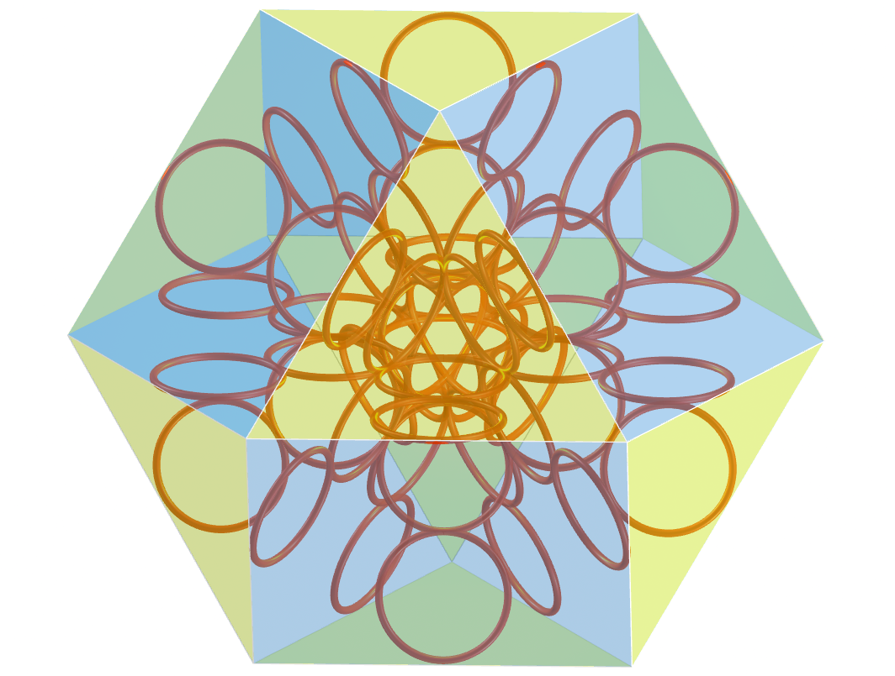
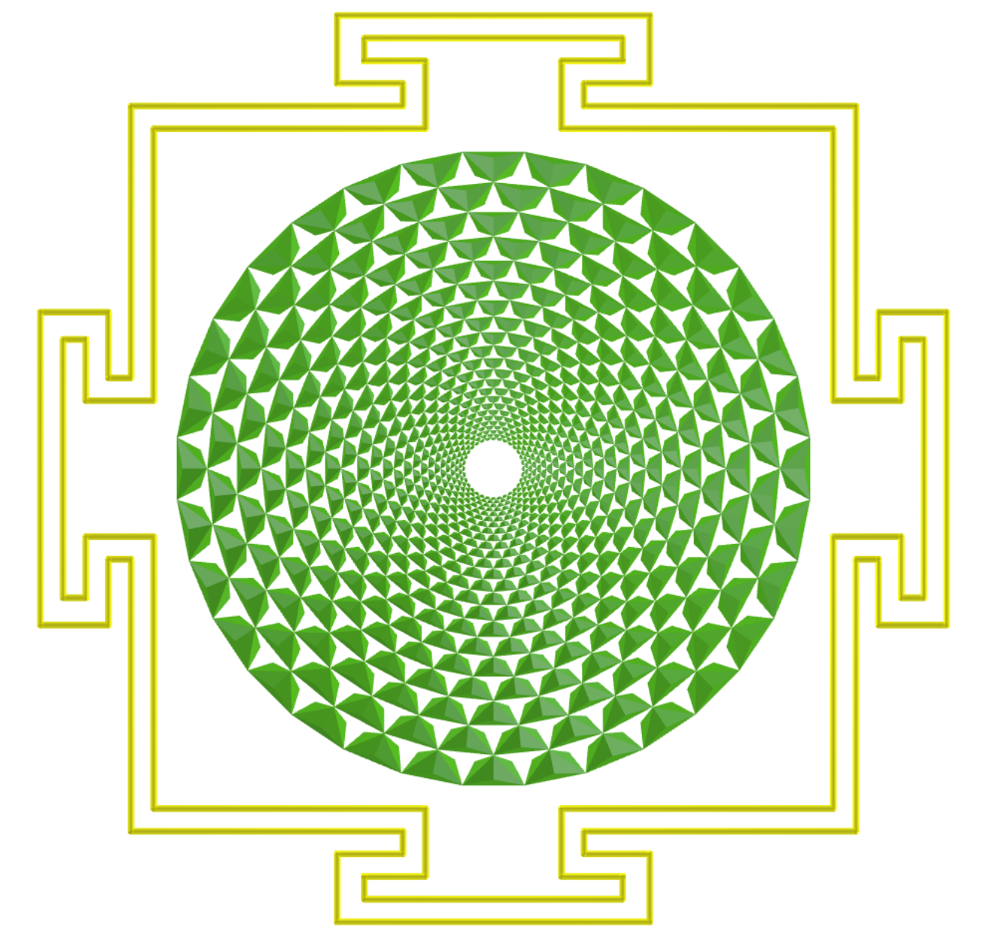

<link rel="stylesheet" href="scripts/style.css">
<meta charset="utf-8">
<link rel="icon" type="image/png" href="ArchimedeanCatalanHulls/vr/salas/imagens/icone.png">
<h2>Visualization of Sacred Geometry symbols with Augmented Reality (AR) and Virtual Reality (VR) in A-frame</h2>
 <b>author:</b> Paulo Henrique Siqueira - Universidade Federal do Paraná
  <b>contact:</b> <a href="#">paulohscwb@gmail.com</a>
  <a href="https://paulohscwb.github.io/SacredGeometry/pt-br/">versão em português</a>
   Sacred Geometry is considered the universal design language of the cosmos. It is an ancient science that explores and explains the energy patterns that serve to create and unify all things.
The mathematical structures used in Sacred Geometry can be found in the arts, architecture and even in our DNA. These structures are everywhere, and serve as a link between analytical thinking and the intuitive side, or between science and spirituality.
This work shows Sacred Geometry symbols modeled in 2D and 3D, with views that can be accessed with Augmented Reality resources and also in immersive Virtual Reality rooms.

<h3 style="margin-top:3px"><a target="_blank" href="symbols/"> Sacred Geometry symbols</a></h3>
<h3 style="margin-top:3px"><a target="_blank" href="flower/"> Flower of life and the polyhedra of Plato and Archimedes</a></h3>
<h3 style="margin-top:3px"><a target="_blank" href="fruit/"> Fruit of life and the polyhedra of Plato and Archimedes</a></h3>
<h3 style="margin-top:3px"><a target="_blank" href="grid/"> Grid of life and the polyhedra of Plato and Archimedes</a></h3>
<h3 style="margin-top:3px"><a target="_blank" href="metatron/"> Metatron Cube and the polyhedra of Plato and Archimedes</a></h3>
<h3 style="margin-top:3px"><a target="_blank" href="merkaba/"> Merkaba Star</a></h3>
<h3 style="margin-top:3px"><a target="_blank" href="sahasrarayantra/"> Sahasrara Yantra</a></h3>

<h3 style="margin-top:3px"><a target="_blank" href="https://paulohscwb.github.io/grid-of-life/"> The Grid of Life symbol and other polyhedrons</a></h3>
<h3 style="margin-top:3px"><a target="_blank" href="https://paulohscwb.github.io/metatron/"> The Metatron's cube symbol and other polyhedrons</a></h3>

<h3 align="center">Immersive rooms</h3>

<h3 align="center">Augmented Reality and 3D models</h3>

 The Augmented Reality environments were created with the <b>Jerome Etienne</b> scripts: <a href="https://github.com/jeromeetienne/AR.js" target="_blank">AR.js - Augmented Reality for the Web</a>.
 The orbit scripts developed by <b>Kevin Ngo</b> were used in the Virtual Reality pages of the 3D models: <a href="https://github.com/supermedium/superframe/tree/master/components/orbit-controls/" target="_blank"> Orbit controls for A-Frame</a>.
 The immersive rooms use the physical properties of 3D objects developed by <b>Micah Blumberg</b>: <a  href="https://github.com/c-frame/aframe-physics-system" target="_blank"> Physics for A-Frame VR</a>
 The interaction controls used in the immersive rooms were developed by <b>Will Murphy</b>: <a  href="https://github.com/c-frame/aframe-super-hands-component" target="_blank"> Super Hands</a>
 

  Sacred Geometry: Visualization of symbols with Augmented Reality and Virtual Reality by <a xmlns:cc="http://creativecommons.org/ns#" href="https://paulohscwb.github.io/SacredGeometry/" property="cc:attributionName" rel="cc:attributionURL">Paulo Henrique Siqueira</a> is licensed with a license <a rel="license" href="http://creativecommons.org/licenses/by-nc-nd/4.0/">Creative Commons Attribution-NonCommercial-NoDerivatives 4.0 International</a>.

<h4>How to cite this work:</h4> 

Siqueira, P.H., "Sacred Geometry: Visualization of Sacred Geometry symbols with Augmented Reality and Virtual Reality". Available in: <https://paulohscwb.github.io/SacredGeometry/>, May 2024.

  <b>References:</b>
 Pardesco. "Sacred Geometry Art, Symbols & Meanings". <a href="https://pardesco.com/blogs/news/sacred-geometry-art-symbols-meanings" target="_blank">https://pardesco.com/blogs/news/sacred-geometry-art-symbols-meanings</a>
 Weisstein, Eric W. "Platonic Solid" From MathWorld-A Wolfram Web Resource. <a href="http://mathworld.wolfram.com/PlatonicSolid.html" target="_blank">http://mathworld.wolfram.com/PlatonicSolid.html</a>
 Weisstein, Eric W. "Polyhedra" From MathWorld-A Wolfram Web Resource. <a href="https://mathworld.wolfram.com/topics/Polyhedra.html" target="_blank">https://mathworld.wolfram.com/topics/Polyhedra.html</a>
 Solar System Scope. "Solar Textures: Stars and Milky Way". <a href="https://www.solarsystemscope.com/textures/" target="_blank">https://www.solarsystemscope.com/textures/</a>
 McCooey, D. I. "Visual Polyhedra". <a href="http://dmccooey.com/polyhedra/" target="_blank">http://dmccooey.com/polyhedra/</a>
