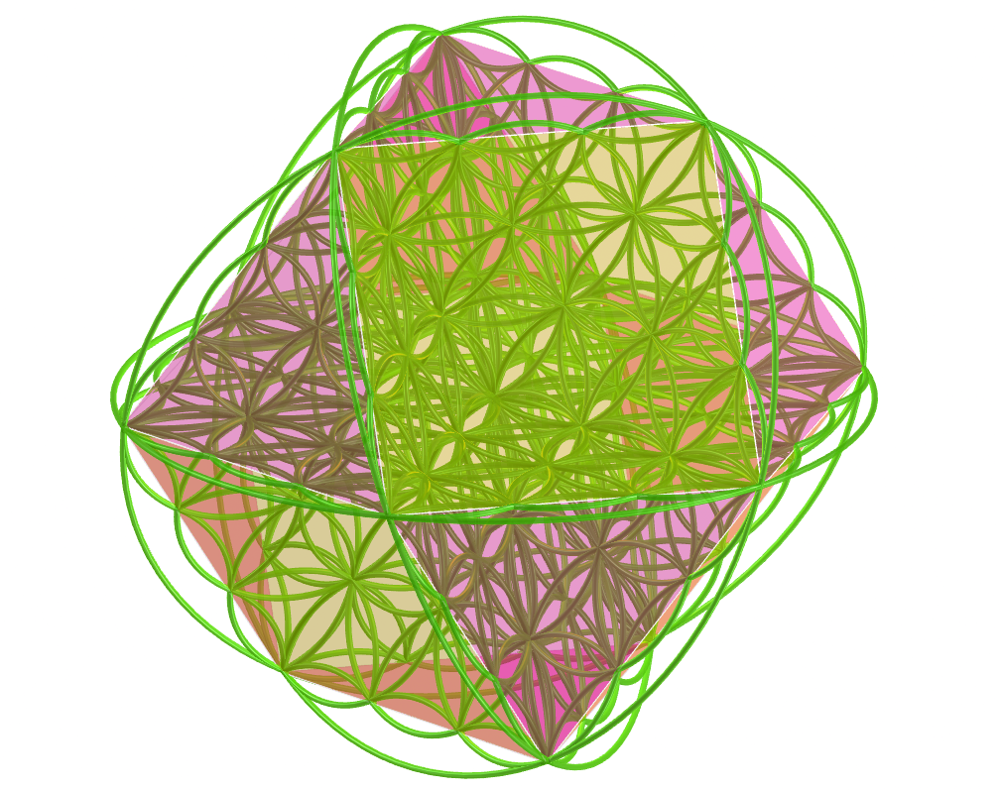

<link rel="stylesheet" href="../scripts/style.css">
<meta charset="utf-8">
<link rel="icon" type="image/png" href="vr/salas/imagens/icone.png">
<h2>Sacred Geometry: visualization of symbols with Augmented Reality (AR) and Virtual Reality (VR) in A-frame</h2>
 <b>author:</b> Paulo Henrique Siqueira - Universidade Federal do Paraná
  <b>contact:</b> <a href="#">paulohscwb@gmail.com</a>
  <a href="https://paulohscwb.github.io/SacredGeometry/flower/pt-br/">versão em português</a>
 <form style="margin: 0 auto; float:right; text-align:right; width:100%; margin-bottom:15px;">
	<select id="url" onchange="urlHandler(this.value)" style="color:royalblue;">
		<option disabled selected value>More symbols:</option>
		<option value="../symbols/">Sacred Geometry symbols</option>
		<option disabled value="../flower/">Flower of life and the polyhedra of Plato and Archimedes</option>
		<option value="../fruit/">Fruit of life and the polyhedra of Plato and Archimedes</option>
		<!--<option value="../grid/">Grid of life and the polyhedra of Plato and Archimedes</option>
		<option value="../metatron/">Metatron and the polyhedra of Plato and Archimedes</option>-->
	</select>
</form>

  <h2 align="center"> Flower of life and the polyhedra of Plato and Archimedes</h2>
Sacred geometry assigns symbolic and sacred meanings to some geometric shapes and geometric proportions. There is an association of Sacred Geometry objects with a divine creator of the universal geometer. On this page we have Plato's polyhedra and Archimedes' cuboctahedron arising from the Flower of Life symbol.
This work shows Sacred Geometry symbols modeled in 2D and 3D, with views that can be accessed with Augmented Reality resources and also in immersive Virtual Reality rooms.

<a href="#ra">Augmented Reality</a>&nbsp;&nbsp;|&nbsp;&nbsp;<a href="#m3d">3D Models</a>&nbsp;&nbsp;|&nbsp;&nbsp;<a href="../">Home</a>

  

 <h3 align="center">Immersive room</h3>
  
<iframe width="100%" src="sala.htm" title="Sala Imersiva dos símbolos da Geometria Sagrada" frameborder="0" loading="lazy"></iframe>

  
<a href="sala.htm" target="_blank">&#x1f517; room link</a>
 
  

  <h3 id="ra" align="center">Augmented Reality</h3>
  To view the polyhedra and models of the Flower of Life in AR, simply visit:

<a href="ra.html" class="raAR" target="_blank">https://paulohscwb.github.io/SacredGeometry/flower/ra.html</a>
 
with any browser with a webcam device (smartphone, tablet or notebook). 
 Access to the VR pages is done by clicking on the blue circle that appears on top of the marker.

<h3 id="m3d" align="center">3D models</h3>
<iframe width="560" height="315" style="max-width:100%" src="https://www.youtube.com/embed/videoseries?list=PLy0I_lGW8HxUFFS5qIXC2KozRYcu06Jaq" title="YouTube video player" frameborder="0" allow="accelerometer; autoplay; clipboard-write; encrypted-media; gyroscope; picture-in-picture; web-share" allowfullscreen></iframe>
<h4>1. Cylindrical Flower of Life</h4>

    The Flower of Life symbolizes creation and reminds us of the unity of everything. We are all built from the same blueprint. In this model, we have the Flower of Life modeled with overlapping circles in a straight circular cylinder. In this way, we have the cylindrical Flower of Life.
   
 

<h4>2. Flower of Life in a truncated icosahedron</h4>

    There is a belief that the Flower of Life is a key that can unlock the hidden knowledge of time and space within its petal-like structures. In this model, we have the Flower of Life modeled with circles superimposed on the faces of a Archimedean truncated icosahedron.
   
 

<h4>3. Flower of life - tetrahedron</h4>

    Plato conceived the world as being composed of four basic elements: Earth, Fire, Air and Water. Furthermore, Plato established a mystical association between these elements and the Platonic solids. Thus, the tetrahedron is associated with Fire and corresponds to the first circumference of the Seed of Life symbol. The vertices of the regular tetrahedron appear on some circumferences of the Flower of Life symbol.
   
  
 

<h4>4. Flower of life - cube</h4>

    According to Plato's mystical correspondence, the cube is associated with the Earth and corresponds to the second circumference of the Seed of Life symbol. The vertices of the cube appear on some circumferences of the Flower of Life symbol.
   
 

<h4>5. Flower of life - octahedron</h4>

    According to Plato's mystical correspondence, the octahedron is associated with Air and corresponds to the third circumference of the Seed of Life symbol. The vertices of the regular octahedron appear on some circumferences of the Flower of Life symbol.
   
 
 

<h4>6. Flower of life - icosahedron</h4>

    According to Plato's mystical correspondence, the icosahedron is associated with Water and corresponds to the fourth circumference of the Seed of Life symbol. The vertices of the regular icosahedron appear overlapping or correspondingly associated with some circumferences of the Flower of Life symbol.
   
 

<h4>7. Flower of life - dodecahedron</h4>

    According to Plato's mystical correspondence, the dodecahedron is associated with the Universe and corresponds to the fifth circumference of the Seed of Life symbol. The vertices of the regular dodecahedron appear overlapping or correspondingly associated with some circumferences of the Flower of Life symbol.
   
  
 

<h4>8. Flower of life - star tetrahedron</h4>

    The Merkabah or Star tetrahedron or Star of Davi is the geometric figure that represents male and female energy  Heaven and Earth. The Star tetrahedron corresponds to the sixth circumference of the Seed of Life symbol and the vertices of this solid appear overlapping with some circumferences of the Flower of Life symbol.
   
 
 

<h4>9. Flower of life - cuboctahedron</h4>

    The Archimedes cuboctahedron represents the Energy Vector of Equilibrium. The cuboctahedron corresponds to the seventh circumference of the Seed of Life symbol and the vertices of this solid appear overlapping or in correspondence with some circumferences of the Flower of Life symbol.
   
  
 

<h4>10. Flower of Life 3D - cuboctahedron</h4>

    In this representation we have the 3D model of the Flower of Life symbol built with 3 rotations around one of the symbols. Combining the intersections of the larger circles, we obtain an Archimedean cuboctahedron.
   
 
 
<a href="#p1" class="topo">back to top</a>

  Flower of life and the polyhedra of Plato and Archimedes - Visualization of symbols with Augmented Reality and Virtual Reality by <a xmlns:cc="http://creativecommons.org/ns#" href="https://paulohscwb.github.io/SacredGeometry/flower/" property="cc:attributionName" rel="cc:attributionURL">Paulo Henrique Siqueira</a> is licensed with a license <a rel="license" href="http://creativecommons.org/licenses/by-nc-nd/4.0/">Creative Commons Attribution-NonCommercial-NoDerivatives 4.0 International</a>.

<h4>How to cite this work:</h4> 

Siqueira, P.H., "Flower of life and the polyhedra of Plato and Archimedes: Visualization of symbols with Augmented Reality and Virtual Reality". Available in: <https://paulohscwb.github.io/SacredGeometry/flower/>, June 2024.

<!---->
  <b>References:</b>
 Pardesco. "Sacred Geometry Art, Symbols & Meanings". <a href="https://pardesco.com/blogs/news/sacred-geometry-art-symbols-meanings" target="_blank">https://pardesco.com/blogs/news/sacred-geometry-art-symbols-meanings</a>
 Weisstein, Eric W. "Platonic Solid" From MathWorld-A Wolfram Web Resource. <a href="http://mathworld.wolfram.com/PlatonicSolid.html" target="_blank">http://mathworld.wolfram.com/PlatonicSolid.html</a>
 Wikipedia <a href="https://en.wikipedia.org/wiki/en.wikipedia.org/wiki/Platonic_solid" target="_blank">https://en.wikipedia.org/wiki/Platonic_solid</a>
 Solar System Scope. "Solar Textures: Stars and Milky Way". <a href="http://dmccooey.com/polyhedra/" target="_blank">https://www.solarsystemscope.com/textures/</a>
