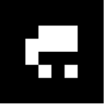
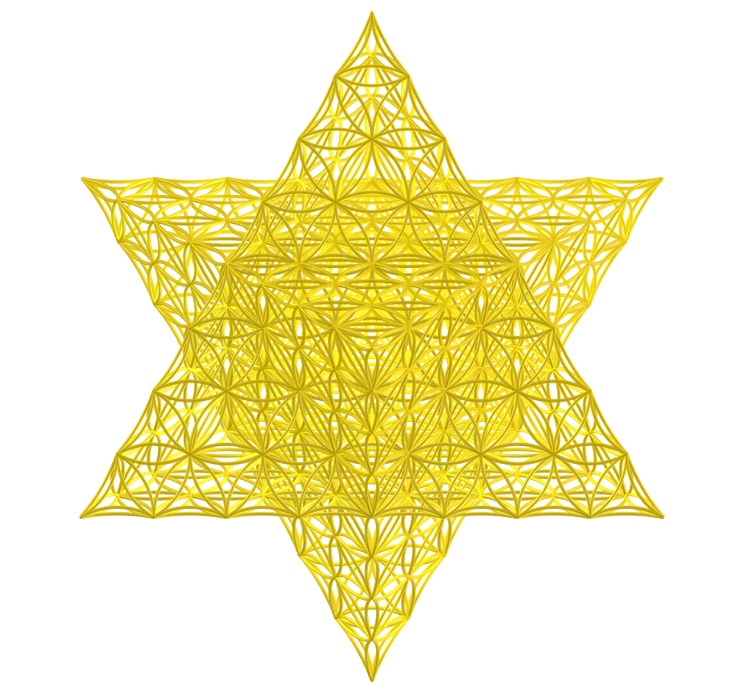
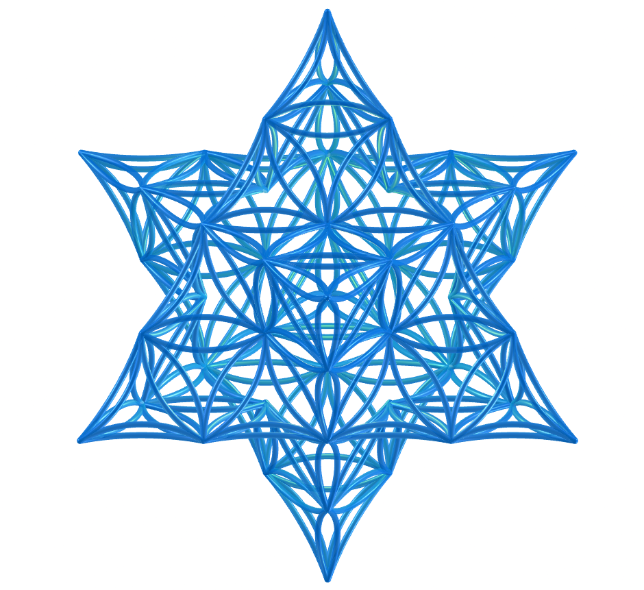
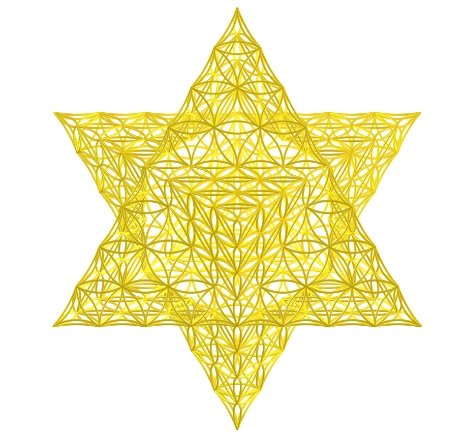
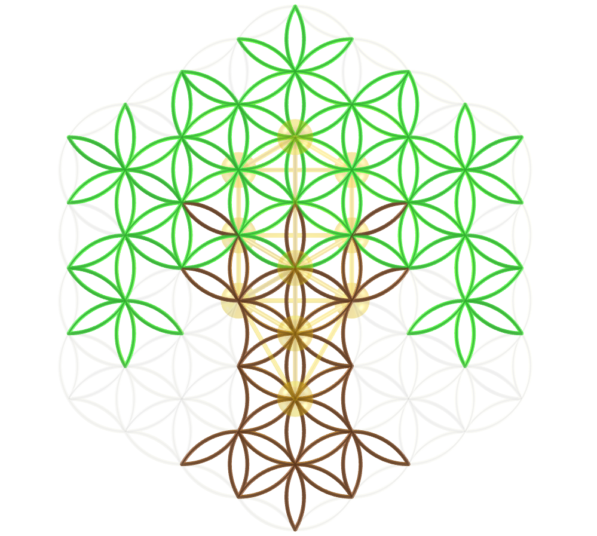

<link rel="stylesheet" href="../scripts/style.css">
<meta charset="utf-8">
<link rel="icon" type="image/png" href="vr/salas/imagens/icone.png">
<h2>Sacred Geometry: visualization of symbols with Augmented Reality (AR) and Virtual Reality (VR) in A-frame</h2>
 <b>author:</b> Paulo Henrique Siqueira - Universidade Federal do Paraná
  <b>contact:</b> <a href="#">paulohscwb@gmail.com</a>
  <a href="https://paulohscwb.github.io/SacredGeometry/flower/pt-br/">versão em português</a>
 <form style="margin: 0 auto; float:right; text-align:right; width:100%; margin-bottom:15px;">
	<select id="url" onchange="urlHandler(this.value)" style="color:royalblue;">
		<option disabled selected value>More symbols:</option>
		<option value="../symbols/">Sacred Geometry symbols</option>
		<option disabled value="../flower/">Flower of life and the polyhedra of Plato and Archimedes</option>
		<option value="../fruit/">Fruit of life and the polyhedra of Plato and Archimedes</option>
		<option value="../grid/">Grid of life and the poyhedra of Plato and Archimedes</option>
		<option value="../metatron/">Metatron and the polyhedra of Plato and Archimedes</option>
		<option value="../merkaba/">Merkaba star</option>
		<option value="../sahasrarayantra/">Sahasrara Yantra</option>
	</select>
</form>

  <h2 align="center"> Flower of life and the polyhedra of Plato and Archimedes</h2>
Sacred geometry assigns symbolic and sacred meanings to some geometric shapes and geometric proportions. There is an association of Sacred Geometry objects with a divine creator of the universal geometer. On this page we have Plato's polyhedra and Archimedes' cuboctahedron arising from the Flower of Life symbol.
This work shows Sacred Geometry symbols modeled in 2D and 3D, with views that can be accessed with Augmented Reality resources and also in immersive Virtual Reality rooms.

<a href="#ra">Augmented Reality</a>&nbsp;&nbsp;|&nbsp;&nbsp;<a href="#m3d">3D Models</a>&nbsp;&nbsp;|&nbsp;&nbsp;<a href="../">Home</a>

  

 <h3 align="center">Immersive rooms</h3>
  
<iframe width="100%" src="sala.htm" title="Sala Imersiva dos símbolos da Geometria Sagrada" frameborder="0" loading="lazy"></iframe>

  
<a href="sala.htm" target="_blank">&#x1f517; room link</a>
 
  

  
Inside a flower of life: choose a room

  <form style="margin: 0 auto; width:100%; margin-bottom:15px;">
	<select id="url" onchange="document.getElementById('sim').src = this.options[this.selectedIndex].value" style="color:royalblue;">
		<option selected value="../merkaba/sala4.htm">Flower of life in a truncated icosahedron</option>
		<option value="../merkaba/sala3.htm">Cylindrical flower of life</option>
		<option value="../merkaba/sala16.htm">Flower of life in Merkaba symbol</option>
		<option value="../merkaba/sala17.htm">Flower of life in Merkaba symbol v2</option>
	</select>
</form>
  
<iframe width="100%" id="sim" src="../merkaba/sala4.htm" title="Sala Imersiva dos símbolos da Geometria Sagrada" frameborder="0" loading="lazy"></iframe>

  

  <h3 id="ra" align="center">Augmented Reality</h3>
  To view the polyhedra and models of the Flower of Life in AR, simply visit:

<a href="ra.html" class="raAR" target="_blank">https://paulohscwb.github.io/SacredGeometry/flower/ra.html</a>
 
with any browser with a webcam device (smartphone, tablet or notebook). 
 Access to the VR pages is done by clicking on the blue circle that appears on top of the marker.

<h3 id="m3d" align="center">3D models</h3>
<iframe width="560" height="315" style="max-width:100%" src="https://www.youtube.com/embed/videoseries?list=PLy0I_lGW8HxUFFS5qIXC2KozRYcu06Jaq" title="YouTube video player" frameborder="0" allow="accelerometer; autoplay; clipboard-write; encrypted-media; gyroscope; picture-in-picture; web-share" allowfullscreen></iframe>
<h4>1. Cylindrical Flower of Life</h4>

    The Flower of Life symbolizes creation and reminds us of the unity of everything. We are all built from the same blueprint. In this model, we have the Flower of Life modeled with overlapping circles in a straight circular cylinder. In this way, we have the cylindrical Flower of Life.
   
 

<h4>2. Flower of Life in a truncated icosahedron</h4>

    There is a belief that the Flower of Life is a key that can unlock the hidden knowledge of time and space within its petal-like structures. In this model, we have the Flower of Life modeled with circles superimposed on the faces of a Archimedean truncated icosahedron.
   
 

<h4>3. Flower of life - tetrahedron</h4>

    Plato conceived the world as being composed of four basic elements: Earth, Fire, Air and Water. Furthermore, Plato established a mystical association between these elements and the Platonic solids. Thus, the tetrahedron is associated with Fire and corresponds to the first circumference of the Seed of Life symbol. The vertices of the regular tetrahedron appear on some circumferences of the Flower of Life symbol.
   
  
 

<h4>4. Flower of life - cube</h4>

    According to Plato's mystical correspondence, the cube is associated with the Earth and corresponds to the second circumference of the Seed of Life symbol. The vertices of the cube appear on some circumferences of the Flower of Life symbol.
   
 

<h4>5. Flower of life - octahedron</h4>

    According to Plato's mystical correspondence, the octahedron is associated with Air and corresponds to the third circumference of the Seed of Life symbol. The vertices of the regular octahedron appear on some circumferences of the Flower of Life symbol.
   
 
 

<h4>6. Flower of life - icosahedron</h4>

    According to Plato's mystical correspondence, the icosahedron is associated with Water and corresponds to the fourth circumference of the Seed of Life symbol. The vertices of the regular icosahedron appear overlapping or correspondingly associated with some circumferences of the Flower of Life symbol.
   
 

<h4>7. Flower of life - dodecahedron</h4>

    According to Plato's mystical correspondence, the dodecahedron is associated with the Universe and corresponds to the fifth circumference of the Seed of Life symbol. The vertices of the regular dodecahedron appear overlapping or correspondingly associated with some circumferences of the Flower of Life symbol.
   
  
 

<h4>8. Flower of life - star tetrahedron</h4>

    The Merkabah or Star tetrahedron or Star of Davi is the geometric figure that represents male and female energy  Heaven and Earth. The Star tetrahedron corresponds to the sixth circumference of the Seed of Life symbol and the vertices of this solid appear overlapping with some circumferences of the Flower of Life symbol.
   
 
 

<h4>9. Flower of life - cuboctahedron</h4>

    The Archimedes cuboctahedron represents the Energy Vector of Equilibrium. The cuboctahedron corresponds to the seventh circumference of the Seed of Life symbol and the vertices of this solid appear overlapping or in correspondence with some circumferences of the Flower of Life symbol.
   
  
 

<h4>10. Flower of Life 3D - cuboctahedron</h4>

    In this representation we have the 3D model of the Flower of Life symbol built with 3 rotations around one of the symbols. Combining the intersections of the larger circles, we obtain an Archimedean cuboctahedron.
   
 
 

  
<a href="#p1" class="topo">back to top</a>

<h4>11. Flower of Life in Merkaba symbol</h4>

     In this representation we have the Flower of Life symbol in Merkaba 3D symbol. The Merkabah or Star tetrahedron or Star of Davi is the geometric figure that represents male and female energy  Heaven and Earth. The Star tetrahedron corresponds to the sixth circumference of the Seed of Life symbol and the vertices of this solid appear overlapping with some circumferences of the Flower of Life symbol.
     
 

<h4>12. Flower of Life in Merkaba symbol v2</h4>

     In this representation we have the Flower of Life symbol in Merkaba 3D symbol. The Merkabah or Star tetrahedron or Star of Davi is the geometric figure that represents male and female energy  Heaven and Earth. The Star tetrahedron corresponds to the sixth circumference of the Seed of Life symbol and the vertices of this solid appear overlapping with some circumferences of the Flower of Life symbol.
     
 

<h4>13. Flower of Life in Merkaba symbol v3</h4>

     In this representation we have the Flower of Life symbol in Merkaba 3D symbol. The Merkabah or Star tetrahedron or Star of Davi is the geometric figure that represents male and female energy  Heaven and Earth. The Star tetrahedron corresponds to the sixth circumference of the Seed of Life symbol and the vertices of this solid appear overlapping with some circumferences of the Flower of Life symbol.
     
 

<h4>14. Flower of Life in Merkaba symbol v4</h4>

     In this representation we have the Flower of Life symbol in Merkaba 3D symbol. The Merkabah or Star tetrahedron or Star of Davi is the geometric figure that represents male and female energy  Heaven and Earth. The Star tetrahedron corresponds to the sixth circumference of the Seed of Life symbol and the vertices of this solid appear overlapping with some circumferences of the Flower of Life symbol.
     
 

<h4>15. Grid of life with Flower of life symbol</h4>

      The Flower of Life is believed to be a key that can unlock the hidden knowledge of time and space within its petal-like structures. In this representation, we see the Flower of Life symbol forming the 3D symbol of the Grid of Life.
      
 

<h4>16. Yin and Yang</h4>

     Yin and Yang describe fundamental opposing and complementary forces found in all things. Yin is the principle of absorption, night, and the moon, representing passivity. Yang is the principle of light, day, and the sun, representing activity. These Taoist concepts refer to the duality of everything in the universe. This model represents the Yin and Yang symbol using the Flower of Life symbol.
    

<h4>17. Flower of life with the Tree of life</h4>

    The Tree of Life symbol represents a connection with everything, including the things we cannot see, reminding us that we are not alone in the universe. The 10 spheres of this symbol are called “Sephiroth”, they mean emanation and are connected by different paths. The bottom Sephira represents the material world and the top Sephira represents cosmic consciousness. The other Sephiras represent the qualities of the soul and are divided into three pillars: severity, gentleness and mercy. This model represents the Tree of life symbol using the Flower of Life symbol.
   
 

<h4>18. Flower of life with the Forbidden Fruit symbol</h4>
<a href="../symbols/vr/FlowerOfLifeForbidden.htm" target="_blank" title="3D model" class="fotoA">Flower of life with the Forbidden Fruit symbol"></a>
    The geometry of an apple, considered a "forbidden fruit," reveals the pentagram and the torus. The torus is responsible for morphology in nature and determines the shapes and dynamics of the natural world (from atoms, molecules, plants, to astronomical structures). The golden ratio is not only a mathematical notion, but also a symbol of beauty, harmony, and perfection in art, science, and nature. The apple can be considered "forbidden" because it encodes the torus and the pentagram, which contain the golden ratio within their construction. This model represents the Forbidden Fruit symbol combined with the Flower of Life symbol.
   
 

<h4>19. Flower of life with the Ichthys symbol</h4>

    The Ichthys symbol, also called the Jesus Fish, is related to Sacred Geometry because it is formed from the Vesica Piscis symbol. These symbols are represented by the intersection of two overlapping circles. This shape represents the union of beliefs, and its geometric structure, with its symbolism of connection and creation, aligns with the principles of Sacred Geometry, which considers certain geometric shapes to have divine and cosmic symbolism. This model represents the Ichthys symbol using the Flower of Life symbol.
   
 

<h4>20. Flower of life with the Menorah symbol</h4>

    The Menorah symbol can be associated with Sacred Geometry through its symmetrical design and geometric patterns that utilize elements of the Hexagram (Merkabah star). In artistic representations, Menorah symbols appear in cosmic settings, with spiraling Hebrew letters and geometric patterns blending with galaxies, demonstrating the connection between this symbol and the geometric structure of the universe. In this model, we have a representation of the Menorah symbol made with the Flower of Life symbol.
   
 

 
<a href="#p1" class="topo">back to top</a>

<h4>21. Flower of life with the Hexagram</h4>

    In Sacred Geometry, the Hexagram (six-pointed star) symbolizes the harmonious union of opposites, representing spiritual balance and cosmic interconnection. It is represented as two intertwined equilateral triangles representing the following elements: masculine and feminine, earth and sky, or the divine and human realms. This symbol can be found in various cultures and religions and represents a fundamental cosmic balance and the cyclical flow of life and energy. In this model, we have a representation of the Hexagram made with the symbol of the Flower of Life.
   
 

<h4>22. Flower of life with the snowflake symbol</h4>

    Snowflake symbols are part of Sacred Geometry because they have a hexagonal structure, resulting from the molecular symmetry of water molecules and hydrogen bonds. This symmetry reflects the order and harmony of the universe, which are fundamental concepts of Sacred Geometry. The mathematical precision found in the snowflake's structure contrasts with the great variety of individual shapes, which arise from small differences in temperature, humidity, and other environmental factors. As a snowflake grows, its branches create self-similar patterns on decreasing scales, similar to Fractal Geometry. In this model, we have a representation of a snowflake symbol made with the Flower of Life symbol.
   
 

<h4>23. Flower of life with the Caduceus symbol</h4>

    The Caduceus is often incorporated into Sacred Geometry designs to represent balance and harmony. Although the Caduceus symbolizes healing, balance, and the union of opposing forces, its connection to Sacred Geometry emerges through its integration with geometric patterns such as mandalas, the Flower of Life, or DNA helices. The intertwined serpents and winged staff of the Caduceus represent the integration of opposites, such as spirit and matter, masculine and feminine, which represents an important theme of Sacred Geometry. In this model, we have a representation of the Caduceus symbol combined with the Flower of Life symbol.
   
 

<h4>24. Flower of life fractal</h4>

    A fractal Flower of Life combines the traditional Flower of Life symbol with Fractal Geometry, representing the patterns of the universe through self-similar patterns that repeat at different scales, similar to the hexagonal patterns of the Flower of Life symbol itself. This Sacred Geometry symbol is considered a blueprint for all creation, containing fundamental patterns and structures of the universe within its overlapping circles and hexagonal symmetry. In this model, we have the representation of the fractal Flower of Life symbol with three stages (iterations).
   
 

<h4>25. Flower of life with a labyrinth</h4>

    A labyrinth embodies Sacred Geometry through its winding path designed for spiritual walks, meditation, and personal transformation, symbolizing a spiritual journey and connection with the universe. Labyrinths use geometric shapes, numerology, and spiral designs to create a purposeful, harmonious, and symbolic path that connects the walker to the universal principles of order and chaos. The combination of circles and spirals in a labyrinth's design embodies the concept of interconnection. This model depicts a labyrinth made with the symbol of the Flower of Life.
   
 

<h4>26. Flower of Life in Merkaba symbol v5</h4>

     In this representation we have the Flower of Life symbol in Merkaba 3D symbol. The Merkabah or Star tetrahedron or Star of Davi is the geometric figure that represents male and female energy  Heaven and Earth. The Star tetrahedron corresponds to the sixth circumference of the Seed of Life symbol and the vertices of this solid appear overlapping with some circumferences of the Flower of Life symbol.
     
 

<h4>27. Flower of Life in Merkaba symbol v6</h4>

     In this representation we have the Flower of Life symbol in Merkaba 3D symbol. The Merkabah or Star tetrahedron or Star of Davi is the geometric figure that represents male and female energy  Heaven and Earth. The Star tetrahedron corresponds to the sixth circumference of the Seed of Life symbol and the vertices of this solid appear overlapping with some circumferences of the Flower of Life symbol.
     
 

<h4>28. Flower of Life in Merkaba symbol v7</h4>

     In this representation we have the Flower of Life symbol in Merkaba 3D symbol. The Merkabah or Star tetrahedron or Star of Davi is the geometric figure that represents male and female energy  Heaven and Earth. The Star tetrahedron corresponds to the sixth circumference of the Seed of Life symbol and the vertices of this solid appear overlapping with some circumferences of the Flower of Life symbol.
     
 

<h4>29. Grid of life with Flower of life symbol v2</h4>

      The Flower of Life is believed to be a key that can unlock the hidden knowledge of time and space within its petal-like structures. In this representation, we see the Flower of Life symbol forming the 3D symbol of the Grid of Life.
      
 

<h4>30. Grid of life with Flower of life symbol v3</h4>

      The Flower of Life is believed to be a key that can unlock the hidden knowledge of time and space within its petal-like structures. In this representation, we see the Flower of Life symbol forming the 3D symbol of the Grid of Life.
      
 

 
<a href="#p1" class="topo">back to top</a>

<h4>31. Grid of life with Flower of life symbol v4</h4>

      The Flower of Life is believed to be a key that can unlock the hidden knowledge of time and space within its petal-like structures. In this representation, we see the Flower of Life symbol forming the 3D symbol of the Grid of Life.
      
 
<a href="#p1" class="topo">back to top</a>

  Flower of life and the polyhedra of Plato and Archimedes - Visualization of symbols with Augmented Reality and Virtual Reality by <a xmlns:cc="http://creativecommons.org/ns#" href="https://paulohscwb.github.io/SacredGeometry/flower/" property="cc:attributionName" rel="cc:attributionURL">Paulo Henrique Siqueira</a> is licensed with a license <a rel="license" href="http://creativecommons.org/licenses/by-nc-nd/4.0/">Creative Commons Attribution-NonCommercial-NoDerivatives 4.0 International</a>.

<h4>How to cite this work:</h4> 

Siqueira, P.H., "Flower of life and the polyhedra of Plato and Archimedes: Visualization of symbols with Augmented Reality and Virtual Reality". Available in: <https://paulohscwb.github.io/SacredGeometry/flower/>, June 2024.

  <b>References:</b>
 Pardesco. "Sacred Geometry Art, Symbols & Meanings". <a href="https://pardesco.com/blogs/news/sacred-geometry-art-symbols-meanings" target="_blank">https://pardesco.com/blogs/news/sacred-geometry-art-symbols-meanings</a>
 Weisstein, Eric W. "Platonic Solid" From MathWorld-A Wolfram Web Resource. <a href="http://mathworld.wolfram.com/PlatonicSolid.html" target="_blank">http://mathworld.wolfram.com/PlatonicSolid.html</a>
 Weisstein, Eric W. "Polyhedra" From MathWorld-A Wolfram Web Resource. <a href="https://mathworld.wolfram.com/topics/Polyhedra.html" target="_blank">https://mathworld.wolfram.com/topics/Polyhedra.html</a>
 Solar System Scope. "Solar Textures: Stars and Milky Way". <a href="https://www.solarsystemscope.com/textures/" target="_blank">https://www.solarsystemscope.com/textures/</a>
 McCooey, D. I. "Visual Polyhedra". <a href="http://dmccooey.com/polyhedra/" target="_blank">http://dmccooey.com/polyhedra/</a>
