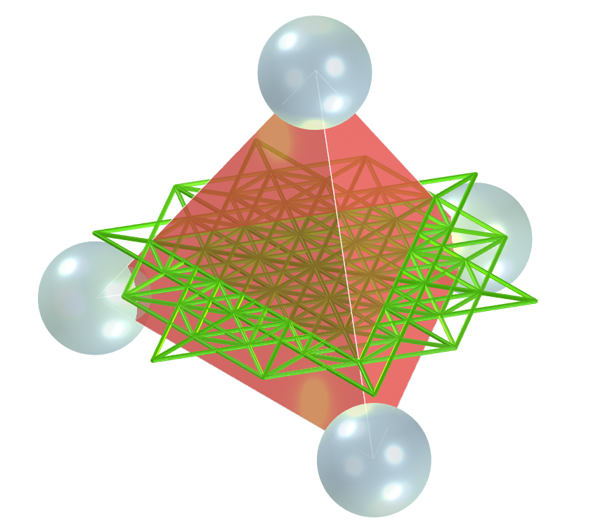
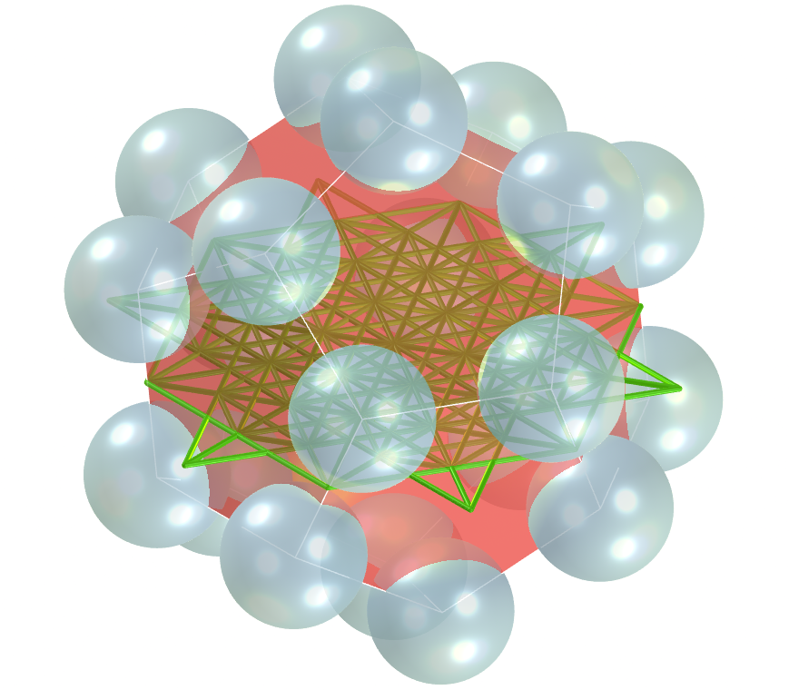
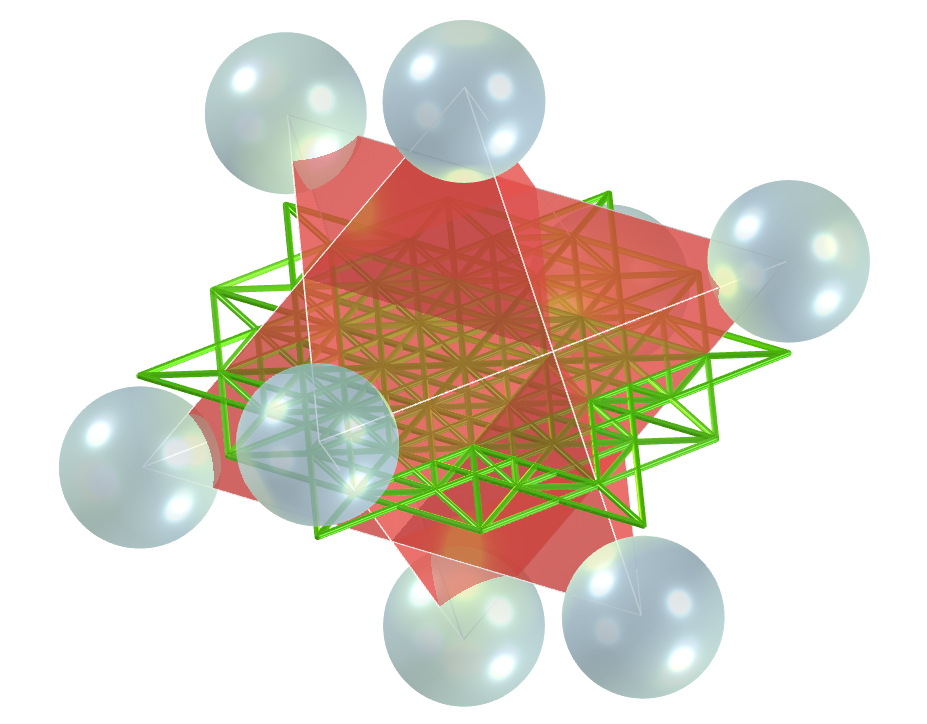
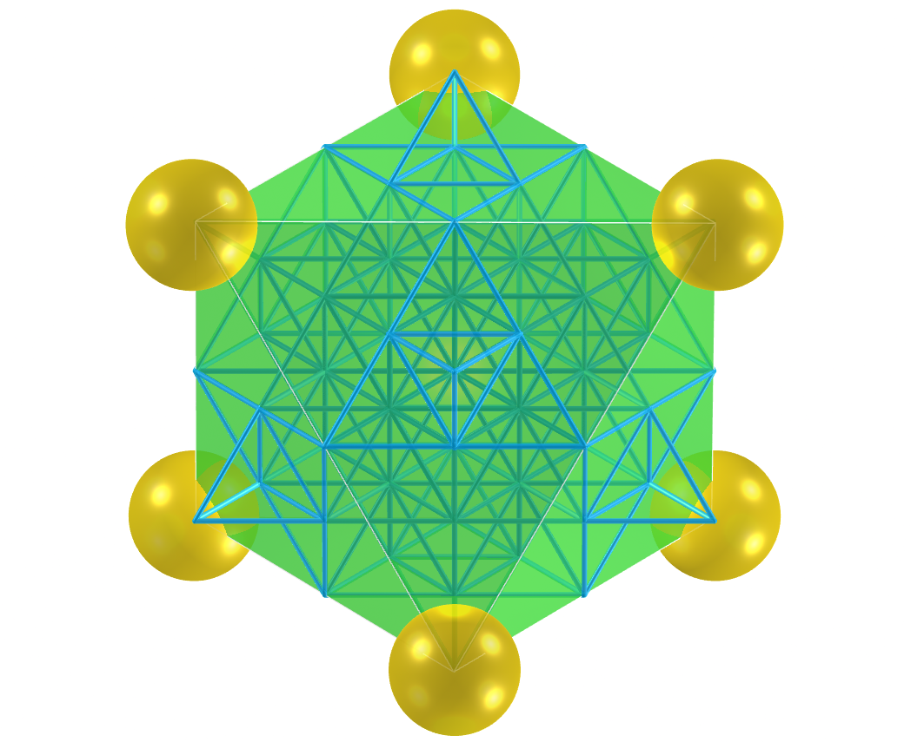

<link rel="stylesheet" href="../../scripts/style.css">
<meta charset="utf-8">
<link rel="icon" type="image/png" href="../vr/salas/imagens/icone.png">
<h2>Geometria Sagrada: visualização de símbolos com Realidade Aumentada (RA) e Realidade Virtual (RV) em A-frame</h2>
<b>autor:</b> Paulo Henrique Siqueira - Universidade Federal do Paraná
 <b>contato:</b> <a href="#"> paulohscwb@gmail.com </a>
 <a href="https://paulohscwb.github.io/SacredGeometry/grid/">english version</a>
<form style="margin: 0 auto; float:right; text-align:right; width:100%; margin-bottom:15px;">
	<select id="url" onchange="urlHandler(this.value)" style="color:royalblue;">
		<option disabled selected>Mais símbolos:</option>
		<option value="../../symbols/pt-br/">Símbolos da Geometria Sagrada</option>
		<option value="../../flower/pt-br/">Flor da vida e os poliedros de Platão e de Arquimedes</option>
		<option value="../../fruit/pt-br/">Fruto da vida e os poliedros de Platão e de Arquimedes</option>
		<option disabled value="../../grid/pt-br/">Grade da vida e os poliedros de Platão e de Arquimedes</option>
		<option value="../../metatron/pt-br/">Metatron e os poliedros de Platão e de Arquimedes</option>
		<option value="../../merkaba/pt-br/">Estrela Merkaba</option>
		<option value="../../sahasrarayantra/pt-br/">Sahasrara Yantra</option>
	</select>
</form>

  <h2 align="center"> Grade da vida e os poliedros de Platão e de Arquimedes</h2>
  A geometria sagrada atribui significados simbólicos e sagrados a algumas formas geométricas e proporções geométricas. Existe uma associação dos objetos da Geometria Sagrada com um criador divino do geômetra universal. Nesta página temos os poliedros de Platão e o cuboctaedro de Arquimedes surgindo do símbolo Grade da Vida.
Este trabalho mostra os símbolos da Geometria Sagrada modelados em 2D e 3D, com as visualizações que podem ser acessadas com os recursos de Realidade Aumentada e também em salas imersivas de Realidade Virtual.

 
<a href="#ra">Realidade Aumentada</a>&nbsp;&nbsp;|&nbsp;&nbsp;<a href="#m3d">Modelos 3D</a>&nbsp;&nbsp;|&nbsp;&nbsp;<a href="../../pt-br/">Página Inicial</a>

 <h3 align="center">Salas imersivas</h3>
  
<iframe width="100%" src="../sala2.htm" title="Sala Imersiva dos símbolos da Geometria Sagrada" frameborder="0" loading="lazy"></iframe>

  
<a href="../sala1.htm" target="_blank">&#x1f517; sala 1</a>&nbsp;&nbsp;|&nbsp;&nbsp;<a href="../sala2.htm" target="_blank">&#x1f517; sala 2</a>

  

  

  <h3 id="ra" align="center">Realidade Aumentada</h3>
  Para visualizar os símbolos da Geometria Sagrada em RA, visite as páginas indicadas nos modelos 3D dos sólidos utilizando qualquer navegador com um dispositivo de webcam (smartphone, tablet ou notebook).
O acesso às páginas de RV é feito clicando no círculo azul que aparece em cima de cada marcador.
 O acesso às páginas de RV é feito clicando no círculo azul que aparece em cima de cada marcador.

<h3 id="m3d" align="center">Modelos 3D</h3>
<iframe width="560" height="315" style="max-width:100%" src="https://www.youtube.com/embed/videoseries?list=PLy0I_lGW8HxVJx0ZNW6Uxk3XaE3vNuT9q" title="YouTube video player" frameborder="0" allow="accelerometer; autoplay; clipboard-write; encrypted-media; gyroscope; picture-in-picture; web-share" allowfullscreen></iframe>
<h4>1. Grade da vida - tetraedro</h4>

    Platão concebeu o mundo como sendo composto por quatro elementos básicos: Terra, Fogo, Ar e Água. Além disso, Platão estabeleceu uma associação mística entre estes elementos e os sólidos Platônicos. Assim, o tetraedro está associado ao Fogo e corresponde à primeira circunferência do símbolo da Semente da Vida. Os vértices do tetraedro regular aparecem em algumas interseções das linhas do símbolo da Grade da Vida.
    

<h4>2. Grade da vida - cubo</h4>

    De acordo com a correspondência mística de Platão, o cubo está associado à Terra e corresponde à segunda circunferência do símbolo da Semente da Vida. Os vértices do cubo aparecem em algumas interseções das linhas do símbolo da Grade da Vida.
    

<h4>3. Grade da vida - octaedro</h4>

    De acordo com a correspondência mística de Platão, o octaedro está associado ao Ar e corresponde à terceira circunferência do símbolo da Semente da Vida. Os vértices do octaedro regular aparecem em algumas interseções das linhas do símbolo da Grade da Vida.
    

<h4>4. Grade da vida - icosaedro</h4>

    De acordo com a correspondência mística de Platão, o icosaedro está associado à Água e corresponde à quarta circunferência do símbolo da Semente da Vida. Os vértices do icosaedro regular aparecem sobrepostos ou com correspondência associada a algumas interseções das linhas do símbolo da Grade da Vida.
    

<h4>5. Grade da vida - dodecaedro</h4>

    De acordo com a correspondência mística de Platão, o dodecaedro está associado ao Universo e corresponde à quinta circunferência do símbolo da Semente da Vida. Os vértices do dodecaedro regular aparecem sobrepostos ou com correspondência associada a algumas interseções das linhas do símbolo da Grade da Vida.
    

<h4>6. Grade da vida - tetraedro estrelado</h4>

    A Merkabah ou tetraedro estrelado ou Estrela de Davi é a figura geométrica que representa a energia masculina e feminina do Céu e da Terra. O tetraedro estrelado corresponde à sexta circunferência do símbolo da Semente da Vida e os vértices deste sólido aparecem sobrepostos em algumas interseções das linhas do símbolo da Grade da Vida.
    

<h4>7. Grade da vida - cuboctaedro</h4>

    O cuboctaedro de Arquimedes representa o Vetor de Equilíbrio de energia. O cuboctaedro corresponde à sétima circunferência do símbolo da Semente da Vida e os vértices deste sólido aparecem sobrepostos ou com correspondência a algumas interseções das linhas do símbolo da Grade da Vida.
    

<h4>8. Grade da vida 3D - cuboctaedro v1</h4>

    Nesta representação temos o modelo em 3D do símbolo da Grade da Vida construído com 3 rotações em torno de um dos símbolos. Unindo-se as interseções das linhas externas, obtemos um cuboctaedro de Arquimedes.
    

<h4>9. Grade da vida 3D - tetraedro</h4>

    Os vértices do tetraedro regular aparecem em algumas interseções das linhas do símbolo da Grade da Vida. Na representação em 3D, o tetratedro fica inscrito ao símbolo da Grade da Vida.
    

<h4>10. Grade da vida 3D - cubo</h4>

    Os vértices do cubo aparecem em algumas interseções das linhas do símbolo da Grade da Vida. Na representação em 3D, o cubo fica inscrito ao símbolo da Grade da Vida.
    

<a href="#p1" class="topo">voltar ao topo</a>

<h4>11. Grade da vida 3D - octaedro</h4>

    Os vértices do octaedro regular aparecem em algumas interseções das linhas do símbolo da Grade da Vida. Na representação em 3D, o octatedro fica inscrito ao símbolo da Grade da Vida.
    

<h4>12. Grade da vida 3D - icosaedro</h4>

    Os vértices do icosaedro regular aparecem sobrepostos ou com correspondência associada a algumas interseções das linhas do símbolo da Grade da Vida. Na representação em 3D, o icosaedro fica inscrito ao símbolo da Grade da Vida.
    

<h4>13. Grade da vida 3D - dodecaedro</h4>

    Os vértices do dodecaedro regular aparecem sobrepostos ou com correspondência associada a algumas interseções das linhas do símbolo da Grade da Vida. Na representação em 3D, o dodecaedro fica circunscrito ao símbolo da Grade da Vida.
    

<h4>14. Grade da vida 3D - tetraedro estrelado</h4>

    Os vértices do tetraedro estrelado aparecem em algumas interseções das linhas do símbolo da Grade da Vida. Na representação em 3D, o tetraedro estrelado fica inscrito ao símbolo da Grade da Vida.
    

<h4>15. Grade da vida 3D - cuboctaedro</h4>

    Os vértices do cuboctaedro de Arquimedes aparecem em algumas interseções das linhas do símbolo da Grade da Vida. Na representação em 3D, o cuboctaedro fica inscrito ao símbolo da Grade da Vida.
    

<h4>16. Grade da vida 3D - tetraedro fractal</h4>

    Os vértices do tetraedro fractal aparecem em algumas interseções das linhas do símbolo da Grade da Vida. Na representação em 3D, o tetraedro fractal fica inscrito ao símbolo da Grade da Vida.
    

<h4>17. Grade da vida com o símbolo da Flor da vida</h4>

      Existe a crença de que a Flor da Vida é uma chave que pode desbloquear o conhecimento oculto do tempo e do espaço dentro das suas estruturas semelhantes a pétalas. Nesta representação temos o símbolo da Flor da vida formando o símbolo 3D da Grade da Vida.
      

<a href="#p1" class="topo">voltar ao topo</a>

  Grid of life and the polyhedra of Plato and Archimedes - Visualization of symbols with Augmented Reality and Virtual Reality de <a xmlns:cc="http://creativecommons.org/ns#" href="https://paulohscwb.github.io/SacredGeometry/grid/pt-br/" property="cc:attributionName" rel="cc:attributionURL">Paulo Henrique Siqueira</a> está licenciado com uma Licença <a rel="license" href="http://creativecommons.org/licenses/by-nc-nd/4.0/">Creative Commons Atribuição-NãoComercial-SemDerivações 4.0 Internacional</a>.

<h4>Como citar este trabalho:</h4> 

Siqueira, P.H., "Grid of life and the polyhedra of Plato and Archimedes: Visualization of symbols with Augmented Reality and Virtual Reality". Disponível em: <https://paulohscwb.github.io/SacredGeometry/grid/pt-br/>, Agosto de 2024.

  <b>Referências:</b>
 Pardesco. "Sacred Geometry Art, Symbols & Meanings". <a href="https://pardesco.com/blogs/news/sacred-geometry-art-symbols-meanings" target="_blank">https://pardesco.com/blogs/news/sacred-geometry-art-symbols-meanings</a>
 Weisstein, Eric W. "Platonic Solid" From MathWorld-A Wolfram Web Resource. <a href="http://mathworld.wolfram.com/PlatonicSolid.html" target="_blank">http://mathworld.wolfram.com/PlatonicSolid.html</a>
 Weisstein, Eric W. "Polyhedra" From MathWorld-A Wolfram Web Resource. <a href="https://mathworld.wolfram.com/topics/Polyhedra.html" target="_blank">https://mathworld.wolfram.com/topics/Polyhedra.html</a>
 Solar System Scope. "Solar Textures: Stars and Milky Way". <a href="https://www.solarsystemscope.com/textures/" target="_blank">https://www.solarsystemscope.com/textures/</a>
 McCooey, D. I. "Visual Polyhedra". <a href="http://dmccooey.com/polyhedra/" target="_blank">http://dmccooey.com/polyhedra/</a>
