<link rel="stylesheet" href="../scripts/style.css">
<meta charset="utf-8">
<link rel="icon" type="image/png" href="vr/salas/imagens/icone.png">
<h2>Sacred Geometry: visualization of symbols with Augmented Reality (AR) and Virtual Reality (VR) in A-frame</h2>
 <b>author:</b> Paulo Henrique Siqueira - Universidade Federal do Paraná
  <b>contact:</b> <a href="#">paulohscwb@gmail.com</a>
  <a href="https://paulohscwb.github.io/SacredGeometry/merkaba/pt-br/">versão em português</a>
 <form style="margin: 0 auto; float:right; text-align:right; width:100%; margin-bottom:15px;">
	<select id="url" onchange="urlHandler(this.value)" style="color:royalblue;">
		<option disabled selected value>More symbols:</option>
		<option value="../symbols/">Sacred Geometry symbols</option>
		<option value="../flower/">Flower of life and the polyhedra of Plato and Archimedes</option>
		<option value="../fruit/">Fruit of life and the polyhedra of Plato and Archimedes</option>
		<option value="../grid/">Grid of life and the polyhedra of Plato and Archimedes</option>
		<option value="../metatron/">Metatron and the polyhedra of Plato and Archimedes</option>
		<option disabled value="../merkaba/">Merkaba star</option>
	</select>
</form>

  <h2 align="center"> Merkaba Star</h2>
The mathematical structures used in Sacred Geometry can be found in the arts, architecture and even in our DNA. These structures are everywhere, and serve as a link between analytical thinking and the intuitive side, or between science and spirituality.
This work shows Sacred Geometry symbols modeled in 2D and 3D, with views that can be accessed with Augmented Reality resources and also in immersive Virtual Reality rooms.

<a href="#ra">Augmented Reality</a>&nbsp;&nbsp;|&nbsp;&nbsp;<a href="#m3d">3D Models</a>&nbsp;&nbsp;|&nbsp;&nbsp;<a href="../">Home</a>

  

 <h3 align="center">Immersive rooms</h3>
  
<iframe width="100%" src="sala.htm" title="Sala Imersiva dos símbolos da Geometria Sagrada" frameborder="0" loading="lazy"></iframe>

  
<a href="sala.htm" target="_blank">&#x1f517; room 1</a>&nbsp;&nbsp;|&nbsp;&nbsp;<a href="sala1.htm" target="_blank">&#x1f517; room 2</a>

  

  

  
Inside a merkaba: choose a room

  <form style="margin: 0 auto; width:100%; margin-bottom:15px;">
	<select id="url" onchange="document.getElementById('sim').src = this.options[this.selectedIndex].value" style="color:royalblue;">
		<option selected value="sala2.htm">Merkaba of tetrahedra</option>
		<option value="sala5.htm">Merkaba of fractal tetrahedra</option>
		<option value="sala6.htm">Merkaba of fractal triakis tetrahedra</option>
		<option value="sala7.htm">Merkaba of fractal joined tetrahedra</option>
		<option value="sala8.htm">Merkaba of fractal tristetrahedra</option>
		<option value="sala9.htm">Merkaba of fractal hexakis tetrahedra</option>
		<option value="sala10.htm">Merkaba of fractal hexakis tetrahedra 2</option>
		<option value="sala11.htm">Merkaba of fractal hexakis tetrahedra 3</option>
		<option value="sala12.htm">Merkaba of fractal hexakis tetrahedra 4</option>
		<option value="sala13.htm">Merkaba of fractal tristetrahedra 2</option>
		<option value="sala14.htm">Merkaba of fractal Möbius deltahedra</option>
	</select>
</form>
  
<iframe width="100%" id="sim" src="sala2.htm" title="Sala Imersiva dos símbolos da Geometria Sagrada" frameborder="0" loading="lazy"></iframe>

  

  <h3 id="ra" align="center">Augmented Reality</h3>
  To view Sacred Geometry symbols in AR, simply visit the pages indicated in the 3D solid models using any browser with a webcam device (smartphone, tablet or notebook). 
 Access to the VR pages is done by clicking on the blue circle that appears on top of the marker.

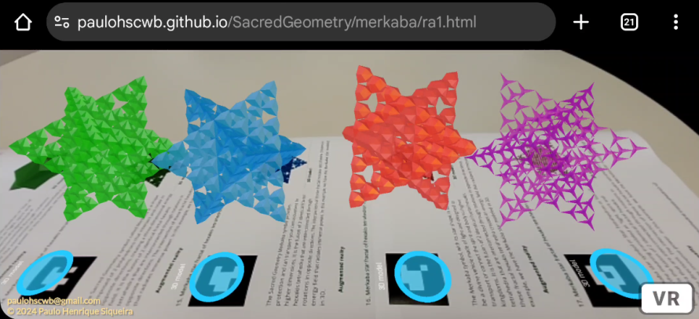

<h3 id="m3d" align="center">3D models</h3>
<iframe width="560" height="315" style="max-width:100%" src="https://www.youtube.com/embed/playlist?list=PLy0I_lGW8HxV2q8H2rBEwUCKKzW9V7gJC" title="YouTube video player" frameborder="0" allow="accelerometer; autoplay; clipboard-write; encrypted-media; gyroscope; picture-in-picture; web-share" allowfullscreen></iframe>
<h4>1. Merkaba star</h4>

    The Merkaba star symbol or Star Tetrahedron or Star of Davi has the meaning translated as "light, spirit and body". It is the fusion of 2 identical tetrahedra that are interconnected through rotations in opposite directions. The intersection of these tetrahedra creates an energy field that radiates immense power. In this example, we have the Merkaba star modeled in 3D.
   
 

<h4>2. Merkaba star fractal</h4>
<a href="vr/Merkaba5.htm" target="_blank" title="3D model" class="fotoA">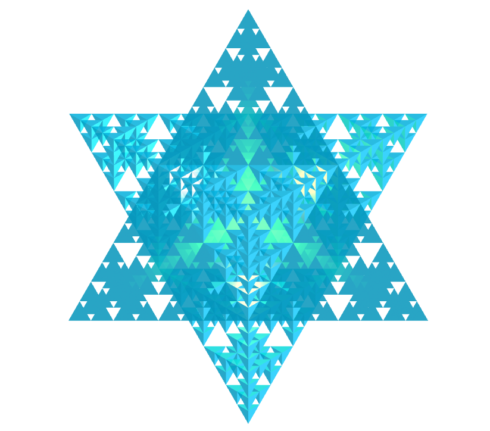</a>
    The Sacred Geometry symbol called Merkaba is a shape composed of 2 polyhedrons that intersect and rotate in opposite directions, creating a three-dimensional energy field. It is the fusion of 2 identical fractal tetrahedra that are interconnected through rotations in opposite directions. The intersection of these fractal tetrahedra creates an energy field that radiates immense power. In this example, we have the Merkaba star modeled in 3D.
   
 
 

<h4>3. Merkaba star of triakis tetrahedra</h4>

    The Sacred Geometry Merkaba symbol provides protection and can transport your consciousness to higher dimensions. It is the fusion of 2 identical Catalan triakis tetrahedra that are interconnected through rotations in opposite directions. The intersection of these triakis tetrahedra creates an energy field that radiates immense power. In this example, we have the Merkaba star modeled in 3D.
   
 
 

<h4>4. Merkaba star of joined truncated tetrahedra</h4>
<a href="vr/Merkaba3.htm" target="_blank" title="3D model" class="fotoA">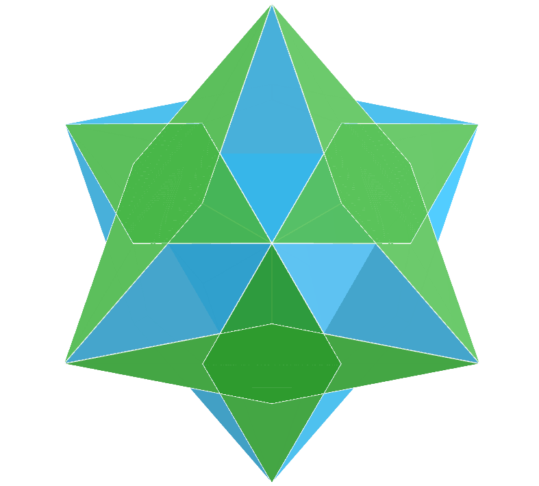</a>
    The Merkaba symbol, with its star shape, is believed to be a divine vehicle made of light and designed to transport or connect the spirit and body to higher kingdoms. It is the fusion of 2 identical joined truncated tetrahedra that are interconnected through rotations in opposite directions. The intersection of these joined truncated tetrahedra creates an energy field that radiates immense power. In this example, we have the Merkaba star modeled in 3D.
   
 

<h4>5. Merkaba star of trapezohedral tristetrahedra</h4>

    The Merkaba star symbol or Star Tetrahedron or Star of Davi has the meaning translated as "light, spirit and body". It is the fusion of 2 identical trapezohedral tristetrahedra that are interconnected through rotations in opposite directions. The intersection of these trapezohedral tristetrahedra creates an energy field that radiates immense power. In this example, we have the Merkaba star modeled in 3D.
   
 
 

<h4>6. Merkaba star fractal of triakis tetrahedra</h4>
<a href="vr/Merkaba6.htm" target="_blank" title="3D model" class="fotoA">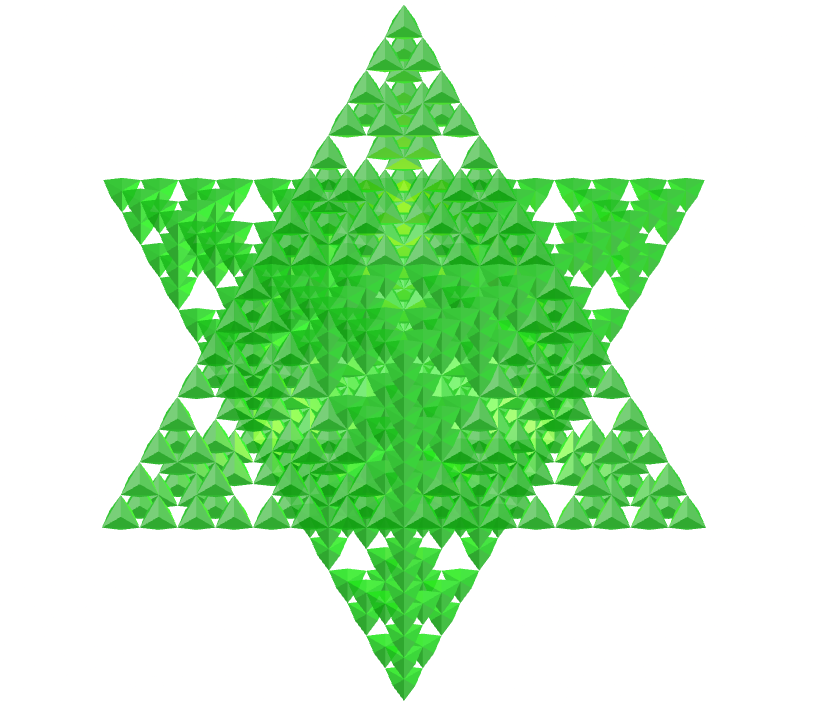</a>
    The Sacred Geometry symbol called Merkaba is a shape composed of 2 polyhedrons that intersect and rotate in opposite directions, creating a three-dimensional energy field. The intersection of these fractal triakis tetrahedra creates an energy field that radiates immense power. In this example, we have the Merkaba star modeled in 3D.
   
 
 

<h4>7. Merkaba star fractal of joined truncated tetrahedra</h4>

    The Sacred Geometry Merkaba symbol provides protection and can transport your consciousness to higher dimensions. It is the fusion of 2 identical fractal joined truncated tetrahedra that are interconnected through rotations in opposite directions. The intersection of these fractal joined truncated tetrahedra creates an energy field that radiates immense power. In this example, we have the Merkaba star modeled in 3D.
   
 
 

<h4>8. Merkaba star fractal of trapezohedral tristetrahedra</h4>
<a href="vr/Merkaba8.htm" target="_blank" title="3D model" class="fotoA">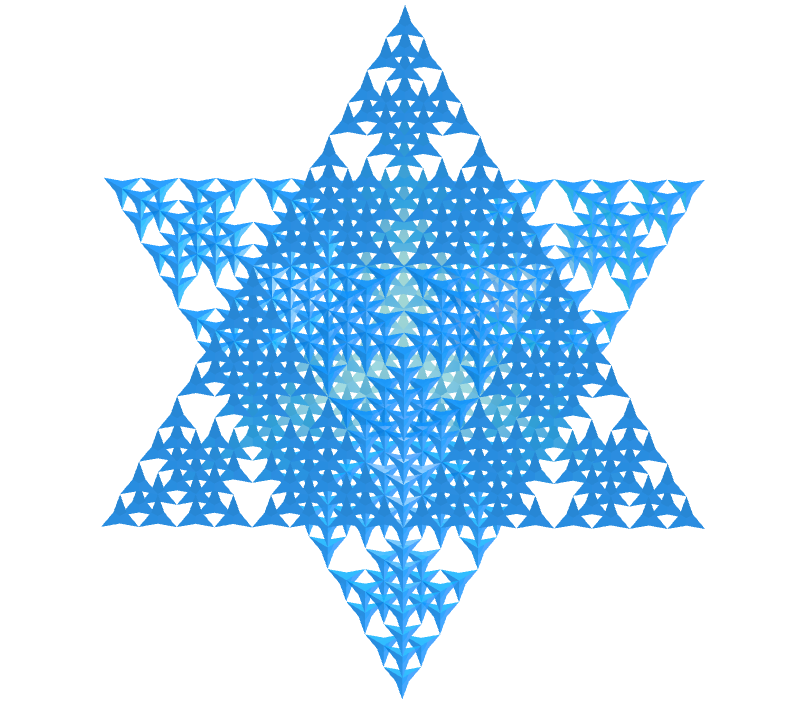</a>
    The Merkaba symbol, with its star shape, is believed to be a divine vehicle made of light and designed to transport or connect the spirit and body to higher kingdoms. It is the fusion of 2 identical fractal trapezohedral tristetrahedra that are interconnected through rotations in opposite directions. The intersection of these fractal trapezohedral tristetrahedra creates an energy field that radiates immense power. In this example, we have the Merkaba star modeled in 3D.
   
 
 

<h4>9. Merkaba star of hexakis tetrahedron</h4>
<a href="vr/Merkaba9.htm" target="_blank" title="3D model" class="fotoA">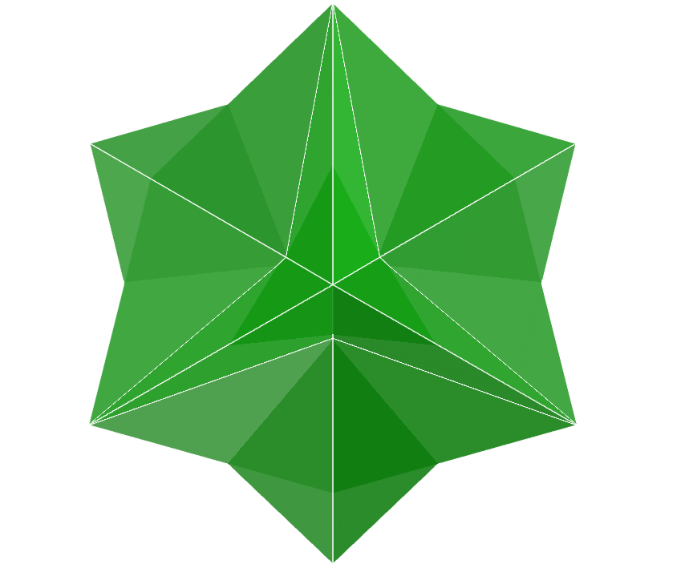</a>
    The Merkaba star symbol or Star Tetrahedron or Star of Davi has the meaning translated as "light, spirit and body". It is the fusion of 2 identical hexakis tetrahedra that are interconnected through rotations in opposite directions. The intersection of these hexakis tetrahedra creates an energy field that radiates immense power. In this example, we have the Merkaba star modeled in 3D.
   
 
 

<h4>10. Merkaba star of hexakis tetrahedron v2</h4>
<a href="vr/Merkaba10.htm" target="_blank" title="3D model" class="fotoA">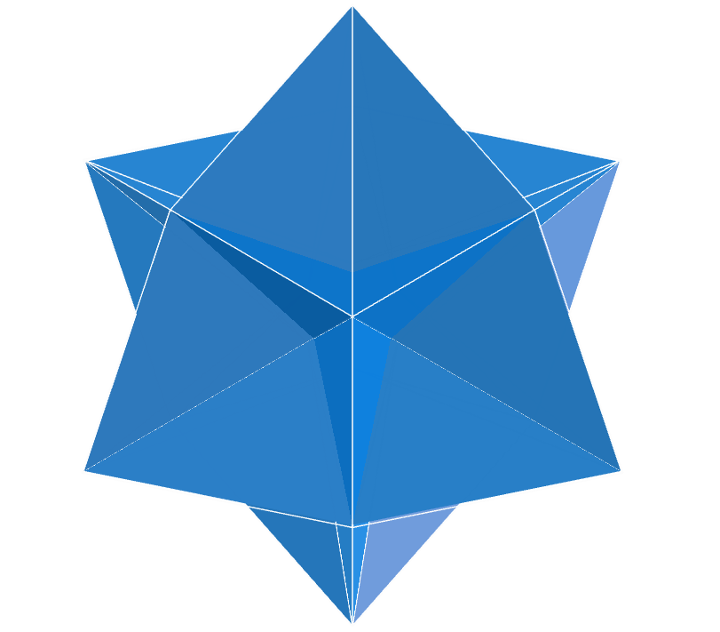</a>
    The Sacred Geometry symbol called Merkaba is a shape composed of 2 polyhedrons that intersect and rotate in opposite directions, creating a three-dimensional energy field. It is the fusion of 2 identical hexakis tetrahedra that are interconnected through rotations in opposite directions. The intersection of these hexakis tetrahedra creates an energy field that radiates immense power. In this example, we have the Merkaba star modeled in 3D.
   
 
 
<a href="#p1" class="topo">back to top</a>

 

<h4>11. Merkaba star of hexakis tetrahedron v3</h4>
<a href="vr/Merkaba11.htm" target="_blank" title="3D model" class="fotoA">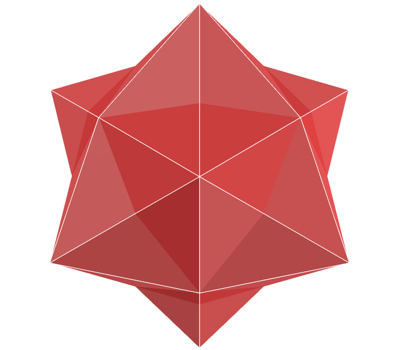</a>
    The Sacred Geometry Merkaba symbol provides protection and can transport your consciousness to higher dimensions. It is the fusion of 2 identical hexakis tetrahedra that are interconnected through rotations in opposite directions. The intersection of these hexakis tetrahedra creates an energy field that radiates immense power. In this example, we have the Merkaba star modeled in 3D.
   
 
 

<h4>12. Merkaba star of hexakis tetrahedron v4</h4>
<a href="vr/Merkaba12.htm" target="_blank" title="3D model" class="fotoA">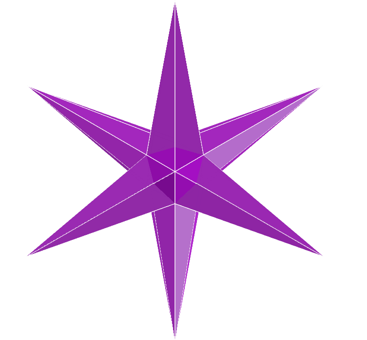</a>
    The Merkaba symbol, with its star shape, is believed to be a divine vehicle made of light and designed to transport or connect the spirit and body to higher kingdoms. It is the fusion of 2 identical hexakis tetrahedra that are interconnected through rotations in opposite directions. The intersection of these hexakis tetrahedra creates an energy field that radiates immense power. In this example, we have the Merkaba star modeled in 3D.
   
 
 

<h4>13. Merkaba star of trapezohedral tristetrahedron v2</h4>

    The Merkaba star symbol or Star Tetrahedron or Star of Davi has the meaning translated as "light, spirit and body". It is the fusion of 2 identical trapezohedral tristetrahedra that are interconnected through rotations in opposite directions. The intersection of these trapezohedral tristetrahedra creates an energy field that radiates immense power. In this example, we have the Merkaba star modeled in 3D.
   
 

<h4>14. Merkaba star fractal of hexakis tetrahedron</h4>
<a href="vr/Merkaba14.htm" target="_blank" title="3D model" class="fotoA">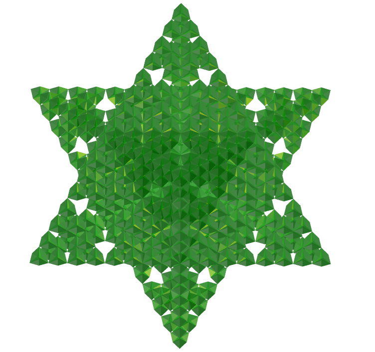</a>
    The Sacred Geometry symbol called Merkaba is a shape composed of 2 polyhedrons that intersect and rotate in opposite directions, creating a three-dimensional energy field. It is the fusion of 2 identical fractal hexakis tetrahedra that are interconnected through rotations in opposite directions. The intersection of these fractal hexakis tetrahedra creates an energy field that radiates immense power. In this example, we have the Merkaba star modeled in 3D.
   
 
 

<h4>15. Merkaba star fractal of hexakis tetrahedron v2</h4>
<a href="vr/Merkaba15.htm" target="_blank" title="3D model" class="fotoA">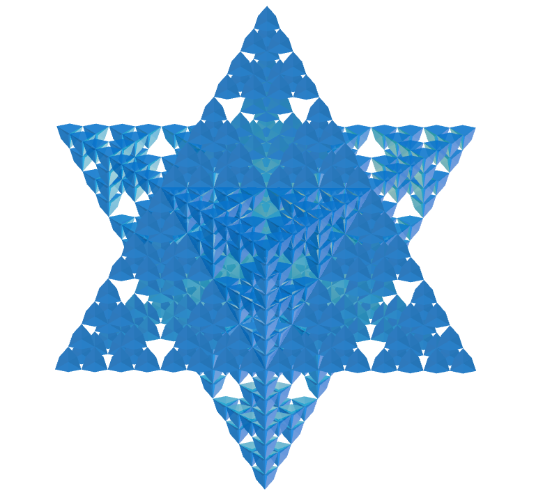</a>
    The Sacred Geometry Merkaba symbol provides protection and can transport your consciousness to higher dimensions. It is the fusion of 2 identical fractal hexakis tetrahedra that are interconnected through rotations in opposite directions. The intersection of these fractal hexakis tetrahedra creates an energy field that radiates immense power. In this example, we have the Merkaba star modeled in 3D.
   
 
 

<h4>16. Merkaba star fractal of hexakis tetrahedron v3</h4>
<a href="vr/Merkaba16.htm" target="_blank" title="3D model" class="fotoA">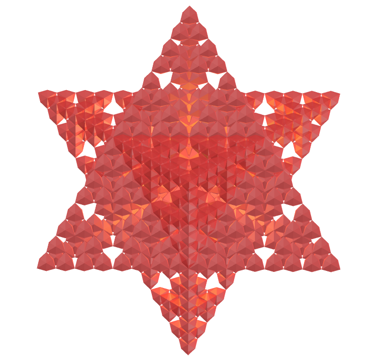</a>
    The Merkaba symbol, with its star shape, is believed to be a divine vehicle made of light and designed to transport or connect the spirit and body to higher kingdoms. It is the fusion of 2 identical fractal hexakis tetrahedra that are interconnected through rotations in opposite directions. The intersection of these fractal hexakis tetrahedra creates an energy field that radiates immense power. In this example, we have the Merkaba star modeled in 3D.
   
 
 

<h4>17. Merkaba star fractal of hexakis tetrahedron v4</h4>

    The Merkaba star symbol or Star Tetrahedron or Star of Davi has the meaning translated as "light, spirit and body". It is the fusion of 2 identical fractal hexakis tetrahedra that are interconnected through rotations in opposite directions. The intersection of these fractal hexakis tetrahedra creates an energy field that radiates immense power. In this example, we have the Merkaba star modeled in 3D.
   
 
 

<h4>18. Merkaba star fractal of trapezohedral tristetrahedron v2</h4>
<a href="vr/Merkaba18.htm" target="_blank" title="3D model" class="fotoA">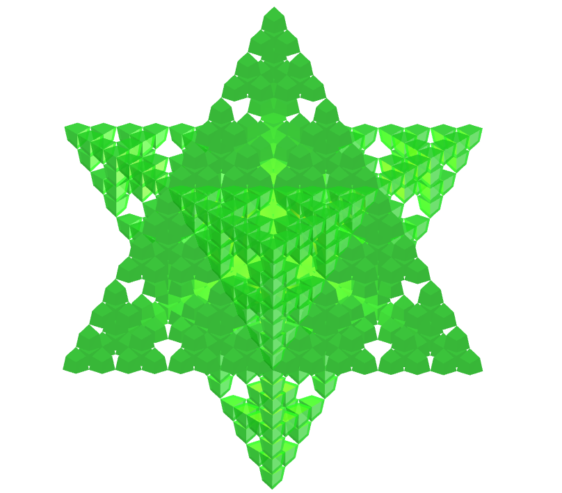</a>
    The Sacred Geometry symbol called Merkaba is a shape composed of 2 polyhedrons that intersect and rotate in opposite directions, creating a three-dimensional energy field. It is the fusion of 2 identical fractal trapezohedral tristetrahedra that are interconnected through rotations in opposite directions. The intersection of these fractal trapezohedral tristetrahedra creates an energy field that radiates immense power. In this example, we have the Merkaba star modeled in 3D.
   
 
 

<h4>19. Merkaba star of Möbius deltahedron</h4>
<a href="vr/Merkaba19.htm" target="_blank" title="3D model" class="fotoA">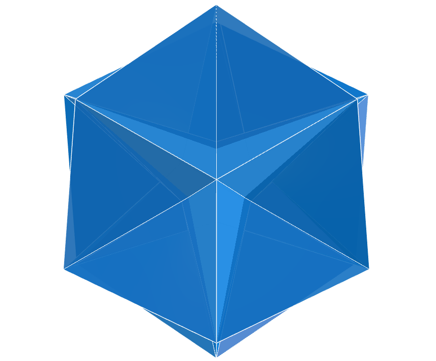</a>
    The Sacred Geometry Merkaba symbol provides protection and can transport your consciousness to higher dimensions. It is the fusion of 2 identical Möbius deltahedra that are interconnected through rotations in opposite directions. The intersection of these Möbius deltahedra creates an energy field that radiates immense power. In this example, we have the Merkaba star modeled in 3D.
   
 
 

<h4>20. Merkaba star fractal of Möbius deltahedron</h4>
<a href="vr/Merkaba20.htm" target="_blank" title="3D model" class="fotoA">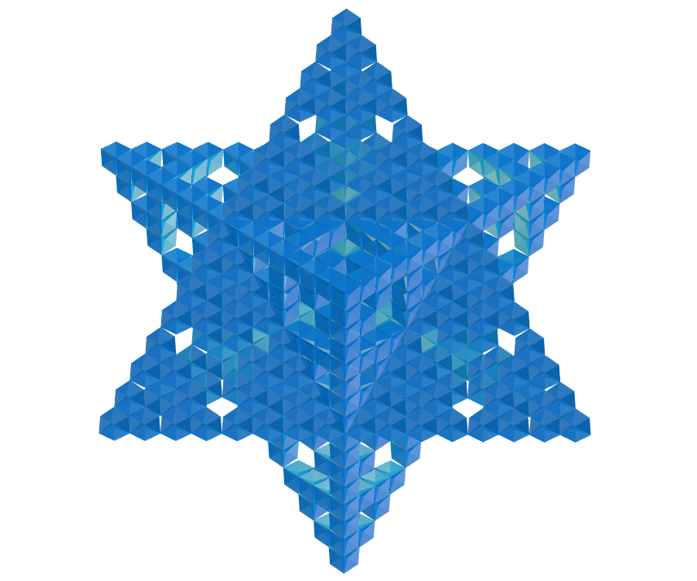</a>
    The Merkaba symbol, with its star shape, is believed to be a divine vehicle made of light and designed to transport or connect the spirit and body to higher kingdoms. It is the fusion of 2 identical fractal Möbius deltahedra that are interconnected through rotations in opposite directions. The intersection of these fractal Möbius deltahedra creates an energy field that radiates immense power. In this example, we have the Merkaba star modeled in 3D.
   
 

<a href="#p1" class="topo">back to top</a>

  Merkaba star - Visualization of symbols with Augmented Reality and Virtual Reality by <a xmlns:cc="http://creativecommons.org/ns#" href="https://paulohscwb.github.io/SacredGeometry/merkaba/" property="cc:attributionName" rel="cc:attributionURL">Paulo Henrique Siqueira</a> is licensed with a license <a rel="license" href="http://creativecommons.org/licenses/by-nc-nd/4.0/">Creative Commons Attribution-NonCommercial-NoDerivatives 4.0 International</a>.

<h4>How to cite this work:</h4> 

Siqueira, P.H., "Merkaba star: Visualization of symbols with Augmented Reality and Virtual Reality". Available in: <https://paulohscwb.github.io/SacredGeometry/merkaba/>, October 2024.

  <b>References:</b>
 Pardesco. "Sacred Geometry Art, Symbols & Meanings". <a href="https://pardesco.com/blogs/news/sacred-geometry-art-symbols-meanings" target="_blank">https://pardesco.com/blogs/news/sacred-geometry-art-symbols-meanings</a>
 Weisstein, Eric W. "Platonic Solid" From MathWorld-A Wolfram Web Resource. <a href="http://mathworld.wolfram.com/PlatonicSolid.html" target="_blank">http://mathworld.wolfram.com/PlatonicSolid.html</a>
 Wikipedia <a href="https://en.wikipedia.org/wiki/en.wikipedia.org/wiki/Platonic_solid" target="_blank">https://en.wikipedia.org/wiki/Platonic_solid</a>
 Solar System Scope. "Solar Textures: Stars and Milky Way". <a href="http://dmccooey.com/polyhedra/" target="_blank">https://www.solarsystemscope.com/textures/</a>
