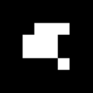
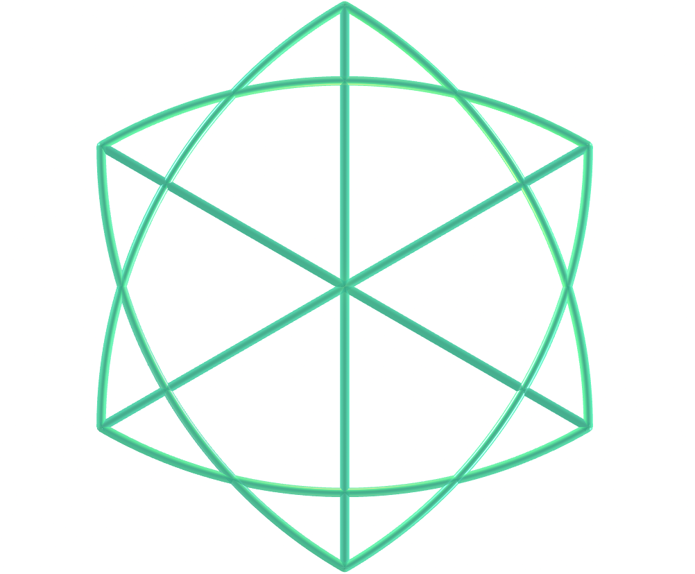
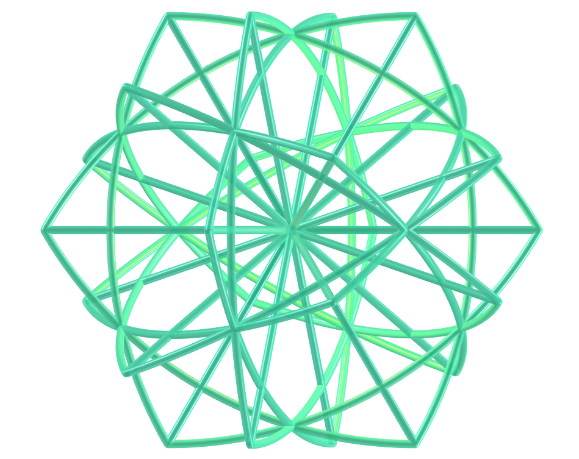
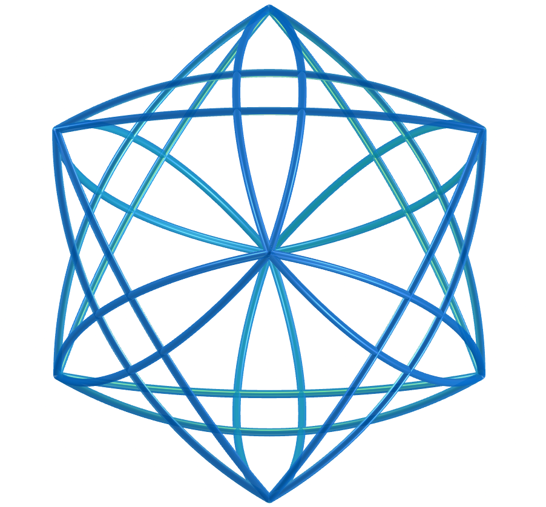

<link rel="stylesheet" href="../../scripts/style.css">
<meta charset="utf-8">
<link rel="icon" type="image/png" href="../vr/salas/imagens/icone.png">
<h2>Geometria Sagrada: visualização de símbolos com Realidade Aumentada (RA) e Realidade Virtual (RV) em A-frame</h2>
<b>autor:</b> Paulo Henrique Siqueira - Universidade Federal do Paraná
 <b>contato:</b> <a href="#"> paulohscwb@gmail.com </a>
 <a href="https://paulohscwb.github.io/SacredGeometry/merkaba/">english version</a>
<form style="margin: 0 auto; float:right; text-align:right; width:100%; margin-bottom:15px;">
	<select id="url" onchange="urlHandler(this.value)" style="color:royalblue;">
		<option disabled selected>Mais símbolos:</option>
		<option value="../../symbols/pt-br/">Símbolos da Geometria Sagrada</option>
		<option value="../../flower/pt-br/">Flor da vida e os poliedros de Platão e de Arquimedes</option>
		<option value="../../fruit/pt-br/">Fruto da vida e os poliedros de Platão e de Arquimedes</option>
		<option value="../../grid/pt-br/">Grade da vida e os poliedros de Platão e de Arquimedes</option>
		<option value="../../metatron/pt-br/">Metatron e os poliedros de Platão e de Arquimedes</option>
		<option disabled value="../../merkaba/pt-br/">Estrela Merkaba</option>
		<option value="../../sahasrarayantra/pt-br/">Sahasrara Yantra</option>
	</select>
</form>

  <h2 align="center"> Estrela Merkaba</h2>
  As estruturas matemáticas utilizadas na Geometria Sagrada podem ser encontradas nas artes, arquitetura e até em nosso DNA. Estas estruturas estão em toda parte, e servem de ligação entre o pensamento analítico e o lado intuitivo, ou então entre a ciência e a espiritualidade.
Este trabalho mostra os símbolos da Geometria Sagrada modelados em 2D e 3D, com as visualizações que podem ser acessadas com os recursos de Realidade Aumentada e também em salas imersivas de Realidade Virtual.

 
<a href="#ra">Realidade Aumentada</a>&nbsp;&nbsp;|&nbsp;&nbsp;<a href="#m3d">Modelos 3D</a>&nbsp;&nbsp;|&nbsp;&nbsp;<a href="../../pt-br/">Página Inicial</a>

 <h3 align="center">Salas imersivas</h3>
  
<iframe width="100%" src="../sala.htm" title="Sala Imersiva dos símbolos da Geometria Sagrada" frameborder="0" loading="lazy"></iframe>

 
<a href="../sala.htm" target="_blank">&#x1f517; sala 1</a>&nbsp;&nbsp;|&nbsp;&nbsp;<a href="../sala1.htm" target="_blank">&#x1f517; sala 2</a>

  

  

  
Dentro da merkaba: escolha uma sala

  <form style="margin: 0 auto; width:100%; margin-bottom:15px;">
	<select id="url" onchange="document.getElementById('sim').src = this.options[this.selectedIndex].value" style="color:royalblue;">
		<option selected value="../sala2.htm">Merkaba de tetraedros</option>
		<option value="../sala5.htm">Merkaba de fractais de tetraedros</option>
		<option value="../sala6.htm">Merkaba de fractais de tetraedros triakis</option>
		<option value="../sala7.htm">Merkaba de fractais tetraedros combinados</option>
		<option value="../sala8.htm">Merkaba de fractais tristetraedros</option>
		<option value="../sala9.htm">Merkaba de fractais de tetraedros hexakis</option>
		<option value="../sala10.htm">Merkaba de fractais de tetraedros hexakis 2</option>
		<option value="../sala11.htm">Merkaba de fractais de tetraedros hexakis 3</option>
		<option value="../sala12.htm">Merkaba de fractais de tetraedros hexakis 4</option>
		<option value="../sala13.htm">Merkaba de fractais tristetraedros 2</option>
		<option value="../sala14.htm">Merkaba de fractais de deltaedros de Möbius</option>
		<option value="../sala15.htm">Merkaba de fractais de revestimentos de Cairo</option>
	</select>
</form>
  
<iframe width="100%" id="sim" src="../sala2.htm" title="Sala Imersiva dos símbolos da Geometria Sagrada" frameborder="0" loading="lazy"></iframe>

  

  <h3 id="ra" align="center">Realidade Aumentada</h3>
  Para visualizar os símbolos da Geometria Sagrada em RA, visite as páginas indicadas nos modelos 3D dos sólidos utilizando qualquer navegador com um dispositivo de webcam (smartphone, tablet ou notebook).
 O acesso às páginas de RV é feito clicando no círculo azul que aparece em cima de cada marcador.

<h3 id="m3d" align="center">Modelos 3D</h3>
<iframe width="560" height="315" style="max-width:100%" src="https://www.youtube.com/embed/playlist?list=PLy0I_lGW8HxV2q8H2rBEwUCKKzW9V7gJC" title="YouTube video player" frameborder="0" allow="accelerometer; autoplay; clipboard-write; encrypted-media; gyroscope; picture-in-picture; web-share" allowfullscreen></iframe>
<h4>1. Estrela Merkaba</h4>

    O símbolo da estrela Merkaba ou Tetraedro estrelado ou Estrela de Davi tem o significado traduzido como "luz, espírito e corpo". Trata-se da fusão de 2 tetraedros idênticos que são interligados por meio de rotações em direções opostas. A interseção destes tetraedros origina um campo de energia que irradia imenso poder. Neste exemplo, temos a estrela Merkaba modelada em 3D.
    

<h4>2. Estrela Merkaba fractal</h4>

    O símbolo da Geometria Sagrada chamado Merkaba é uma forma composta por 2 poliedros que se cruzam e giram em direções opostas, criando um campo de energia tridimensional. Trata-se da fusão de 2 fractais de tetraedros idênticos que são interligados por meio de rotações em direções opostas. A interseção destes fractais de tetraedros origina um campo de energia que irradia imenso poder. Neste exemplo, temos a estrela Merkaba modelada em 3D.
    

<h4>3. Estrela Merkaba de tetraedros triakis</h4>

    O símbolo Merkaba da Geometria Sagrada fornece proteção e pode transportar sua consciência para dimensões superiores. Trata-se da fusão de 2 tetraedros triakis de Catalan idênticos que são interligados por meio de rotações em direções opostas. A interseção destes tetraedros triakis origina um campo de energia que irradia imenso poder. Neste exemplo, temos a estrela Merkaba modelada em 3D.
    

<h4>4. Estrela Merkaba de tetraedros truncados combinados</h4>

    Acredita-se que o símbolo Merkaba, com sua forma de estrela, é um veículo divino feito de luz e projetado para transportar ou conectar o espírito e o corpo a reinos superiores. Trata-se da fusão de 2 tetraedros truncados combinados idênticos que são interligados por meio de rotações em direções opostas. A interseção destes tetraedros truncados combinados origina um campo de energia que irradia imenso poder. Neste exemplo, temos a estrela Merkaba modelada em 3D.
    

<h4>5. Estrela Merkaba de tristetraedros trapezoédricos</h4>

    O símbolo da estrela Merkaba ou Tetraedro estrelado ou Estrela de Davi tem o significado traduzido como "luz, espírito e corpo". Trata-se da fusão de 2 tristetraedros trapezoédricos idênticos que são interligados por meio de rotações em direções opostas. A interseção destes tristetraedros trapezoédricos origina um campo de energia que irradia imenso poder. Neste exemplo, temos a estrela Merkaba modelada em 3D.
    

<h4>6. Estrela Merkaba fractal de tetraedros triakis</h4>

    O símbolo da estrela Merkaba ou Tetraedro estrelado ou Estrela de Davi tem o significado traduzido como "luz, espírito e corpo". Trata-se da fusão de 2 fractais de tetraedros triakis idênticos que são interligados por meio de rotações em direções opostas. A interseção destes fractais de tetraedros triakis origina um campo de energia que irradia imenso poder. Neste exemplo, temos a estrela Merkaba modelada em 3D.
    

<h4>7. Estrela Merkaba fractal de tetraedros truncados combinados</h4>

    O símbolo da estrela Merkaba ou Tetraedro estrelado ou Estrela de Davi tem o significado traduzido como "luz, espírito e corpo". Trata-se da fusão de 2 fractais de tetraedros truncados combinados idênticos que são interligados por meio de rotações em direções opostas. A interseção destes fractais de tetraedros truncados combinados origina um campo de energia que irradia imenso poder. Neste exemplo, temos a estrela Merkaba modelada em 3D.
    

<h4>8. Estrela Merkaba fractal de tristetraedros trapezoédricos</h4>

    O símbolo da estrela Merkaba ou Tetraedro estrelado ou Estrela de Davi tem o significado traduzido como "luz, espírito e corpo". Trata-se da fusão de 2 fractais de tristetraedros trapezoédricos idênticos que são interligados por meio de rotações em direções opostas. A interseção destes fractais de tristetraedros trapezoédricos origina um campo de energia que irradia imenso poder. Neste exemplo, temos a estrela Merkaba modelada em 3D.
    

<h4>9. Estrela Merkaba de tetraedro hexakis</h4>

    O símbolo da estrela Merkaba ou Tetraedro estrelado ou Estrela de Davi tem o significado traduzido como "luz, espírito e corpo". Trata-se da fusão de 2 tetraedros hexakis idênticos que são interligados por meio de rotações em direções opostas. A interseção destes tetraedros hexakis origina um campo de energia que irradia imenso poder. Neste exemplo, temos a estrela Merkaba modelada em 3D.
    

<h4>10. Estrela Merkaba de tetraedro hexakis v2</h4>

    O símbolo da estrela Merkaba ou Tetraedro estrelado ou Estrela de Davi tem o significado traduzido como "luz, espírito e corpo". Trata-se da fusão de 2 tetraedros hexakis idênticos que são interligados por meio de rotações em direções opostas. A interseção destes tetraedros hexakis origina um campo de energia que irradia imenso poder. Neste exemplo, temos a estrela Merkaba modelada em 3D.
    

<a href="#p1" class="topo">voltar ao topo</a>

<h4>11. Estrela Merkaba de tetraedro hexakis v3</h4>

    O símbolo da estrela Merkaba ou Tetraedro estrelado ou Estrela de Davi tem o significado traduzido como "luz, espírito e corpo". Trata-se da fusão de 2 tetraedros hexakis idênticos que são interligados por meio de rotações em direções opostas. A interseção destes tetraedros hexakis origina um campo de energia que irradia imenso poder. Neste exemplo, temos a estrela Merkaba modelada em 3D.
    

<h4>12. Estrela Merkaba de tetraedro hexakis v4</h4>

    O símbolo da estrela Merkaba ou Tetraedro estrelado ou Estrela de Davi tem o significado traduzido como "luz, espírito e corpo". Trata-se da fusão de 2 tetraedros hexakis idênticos que são interligados por meio de rotações em direções opostas. A interseção destes tetraedros hexakis origina um campo de energia que irradia imenso poder. Neste exemplo, temos a estrela Merkaba modelada em 3D.
    

<h4>13. Estrela Merkaba de tristetraedro trapezoédrico v2</h4>

    O símbolo da estrela Merkaba ou Tetraedro estrelado ou Estrela de Davi tem o significado traduzido como "luz, espírito e corpo". Trata-se da fusão de 2 tristetraedros trapezoédricos idênticos que são interligados por meio de rotações em direções opostas. A interseção destes tristetraedros trapezoédricos origina um campo de energia que irradia imenso poder. Neste exemplo, temos a estrela Merkaba modelada em 3D.
    

<h4>14. Estrela Merkaba fractal de tetraedro hexakis</h4>

    O símbolo da estrela Merkaba ou Tetraedro estrelado ou Estrela de Davi tem o significado traduzido como "luz, espírito e corpo". Trata-se da fusão de 2 fractais de tetraedros hexakis idênticos que são interligados por meio de rotações em direções opostas. A interseção destes fractais de tetraedros hexakis origina um campo de energia que irradia imenso poder. Neste exemplo, temos a estrela Merkaba modelada em 3D.
    

<h4>15. Estrela Merkaba fractal de tetraedro hexakis v2</h4>

    O símbolo da estrela Merkaba ou Tetraedro estrelado ou Estrela de Davi tem o significado traduzido como "luz, espírito e corpo". Trata-se da fusão de 2 fractais de tetraedros hexakis idênticos que são interligados por meio de rotações em direções opostas. A interseção destes fractais de tetraedros hexakis origina um campo de energia que irradia imenso poder. Neste exemplo, temos a estrela Merkaba modelada em 3D.
    

<h4>16. Estrela Merkaba fractal de tetraedro hexakis v3</h4>

    O símbolo da estrela Merkaba ou Tetraedro estrelado ou Estrela de Davi tem o significado traduzido como "luz, espírito e corpo". Trata-se da fusão de 2 fractais de tetraedros hexakis idênticos que são interligados por meio de rotações em direções opostas. A interseção destes fractais de tetraedros hexakis origina um campo de energia que irradia imenso poder. Neste exemplo, temos a estrela Merkaba modelada em 3D.
    

<h4>17. Estrela Merkaba fractal de tetraedro hexakis v4</h4>

    O símbolo da estrela Merkaba ou Tetraedro estrelado ou Estrela de Davi tem o significado traduzido como "luz, espírito e corpo". Trata-se da fusão de 2 fractais de tetraedros hexakis idênticos que são interligados por meio de rotações em direções opostas. A interseção destes fractais de tetraedros hexakis origina um campo de energia que irradia imenso poder. Neste exemplo, temos a estrela Merkaba modelada em 3D.
    

<h4>18. Estrela Merkaba fractal de tristetraedro trapezoédrico v2</h4>

    O símbolo da estrela Merkaba ou Tetraedro estrelado ou Estrela de Davi tem o significado traduzido como "luz, espírito e corpo". Trata-se da fusão de 2 fractais de tristetraedros trapezoédricos idênticos que são interligados por meio de rotações em direções opostas. A interseção destes fractais de tristetraedros trapezoédricos origina um campo de energia que irradia imenso poder. Neste exemplo, temos a estrela Merkaba modelada em 3D.
    

<h4>19. Estrela Merkaba do deltaedro de Möbius</h4>

    O símbolo da estrela Merkaba ou Tetraedro estrelado ou Estrela de Davi tem o significado traduzido como "luz, espírito e corpo". Trata-se da fusão de 2 deltaedros de Möbius idênticos que são interligados por meio de rotações em direções opostas. A interseção destes deltaedros de Möbius origina um campo de energia que irradia imenso poder. Neste exemplo, temos a estrela Merkaba modelada em 3D.
    

<h4>20. Estrela Merkaba fractal do deltaedro de Möbius</h4>

    O símbolo da estrela Merkaba ou Tetraedro estrelado ou Estrela de Davi tem o significado traduzido como "luz, espírito e corpo". Trata-se da fusão de 2 fractais de deltaedros de Möbius idênticos que são interligados por meio de rotações em direções opostas. A interseção destes fractais de deltaedros de Möbius origina um campo de energia que irradia imenso poder. Neste exemplo, temos a estrela Merkaba modelada em 3D.
    

<a href="#p1" class="topo">voltar ao topo</a>

<h4>21. Merkaba curvada</h4>

    A Merkaba é um símbolo geométrico sagrado que representa a união das energias masculina e feminina e a integração dos reinos terrestre e cósmico. É composta por dois tetraedros que giram em direções opostas, formando uma estrela tridimensional. O símbolo com a substituição de arestas por arcos que passam pelos vértices dos tetraedros representa a Merkaba curvada. A estrutura geométrica e a simetria da Merkaba capturaram a imaginação dos interessados ​​em Geometria Sagrada.
    
 

<h4>22. Merkaba curvada 3D</h4>

    O símbolo com a substituição de arestas por arcos que passam pelos vértices dos tetraedros representa a Merkaba curvada. A estrutura geométrica e a simetria da Merkaba capturaram a imaginação dos interessados ​​em Geometria Sagrada. A Merkaba é um símbolo geométrico sagrado que representa a união das energias masculina e feminina e a integração dos reinos terrestre e cósmico. É composta por dois tetraedros que giram em direções opostas, formando uma estrela tridimensional.
    
 

<h4>23. Merkaba curvada v2</h4>

    A Merkaba é um símbolo geométrico sagrado que representa a união das energias masculina e feminina e a integração dos reinos terrestre e cósmico. É composta por dois tetraedros que giram em direções opostas, formando uma estrela tridimensional. O símbolo com a substituição de arestas por arcos que passam pelos vértices dos tetraedros representa a Merkaba curvada. A estrutura geométrica e a simetria da Merkaba capturaram a imaginação dos interessados ​​em Geometria Sagrada.
    
 

<h4>24. Merkaba curvada 3D v2</h4>

    O símbolo com a substituição de arestas por arcos que passam pelos vértices dos tetraedros representa a Merkaba curvada. A estrutura geométrica e a simetria da Merkaba capturaram a imaginação dos interessados ​​em Geometria Sagrada. A Merkaba é um símbolo geométrico sagrado que representa a união das energias masculina e feminina e a integração dos reinos terrestre e cósmico. É composta por dois tetraedros que giram em direções opostas, formando uma estrela tridimensional.
    
 

<h4>25. Merkaba curvada 3D v3</h4>

    A estrutura geométrica e a simetria da Merkaba capturaram a imaginação dos interessados ​​em Geometria Sagrada. A Merkaba é um símbolo geométrico sagrado que representa a união das energias masculina e feminina e a integração dos reinos terrestre e cósmico. É composta por dois tetraedros que giram em direções opostas, formando uma estrela tridimensional. O símbolo com a substituição de arestas por arcos que passam pelos vértices dos tetraedros representa a Merkaba curvada.
    
 

<h4>26. Merkaba curvada 3D v4</h4>

    A Merkaba é um símbolo geométrico sagrado que representa a união das energias masculina e feminina e a integração dos reinos terrestre e cósmico. É composta por dois tetraedros que giram em direções opostas, formando uma estrela tridimensional. O símbolo com a substituição de arestas por arcos que passam pelos vértices dos tetraedros representa a Merkaba curvada. A estrutura geométrica e a simetria da Merkaba capturaram a imaginação dos interessados ​​em Geometria Sagrada.
    
 

<h4>27. Estrela Merkaba do revestimento de Cairo</h4>

    O símbolo da estrela Merkaba ou Tetraedro estrelado ou Estrela de Davi tem o significado traduzido como "luz, espírito e corpo". Trata-se da fusão de 2 revestimentos de Cairo idênticos que são interligados por meio de rotações em direções opostas. A interseção destes revestimentos de Cairo origina um campo de energia que irradia imenso poder. Neste exemplo, temos a estrela Merkaba modelada em 3D.
    

<h4>28. Estrela Merkaba fractal do revestimento de Cairo</h4>

    O símbolo da estrela Merkaba ou Tetraedro estrelado ou Estrela de Davi tem o significado traduzido como "luz, espírito e corpo". Trata-se da fusão de 2 fractais de revestimentos de Cairo idênticos que são interligados por meio de rotações em direções opostas. A interseção destes fractais de revestimentos de Cairo origina um campo de energia que irradia imenso poder. Neste exemplo, temos a estrela Merkaba modelada em 3D.
    

 
<a href="#p1" class="topo">voltar ao topo</a>

  Merkaba star - Visualization of symbols with Augmented Reality and Virtual Reality de <a xmlns:cc="http://creativecommons.org/ns#" href="https://paulohscwb.github.io/SacredGeometry/merkaba/pt-br/" property="cc:attributionName" rel="cc:attributionURL">Paulo Henrique Siqueira</a> está licenciado com uma Licença <a rel="license" href="http://creativecommons.org/licenses/by-nc-nd/4.0/">Creative Commons Atribuição-NãoComercial-SemDerivações 4.0 Internacional</a>.

<h4>Como citar este trabalho:</h4> 

Siqueira, P.H., "Merkaba star: Visualization of symbols with Augmented Reality and Virtual Reality". Disponível em: <https://paulohscwb.github.io/SacredGeometry/merkaba/pt-br/>, Outubro de 2024.

  <b>Referências:</b>
 Pardesco. "Sacred Geometry Art, Symbols & Meanings". <a href="https://pardesco.com/blogs/news/sacred-geometry-art-symbols-meanings" target="_blank">https://pardesco.com/blogs/news/sacred-geometry-art-symbols-meanings</a>
 Weisstein, Eric W. "Platonic Solid" From MathWorld-A Wolfram Web Resource. <a href="http://mathworld.wolfram.com/PlatonicSolid.html" target="_blank">http://mathworld.wolfram.com/PlatonicSolid.html</a>
 Weisstein, Eric W. "Polyhedra" From MathWorld-A Wolfram Web Resource. <a href="https://mathworld.wolfram.com/topics/Polyhedra.html" target="_blank">https://mathworld.wolfram.com/topics/Polyhedra.html</a>
 Solar System Scope. "Solar Textures: Stars and Milky Way". <a href="https://www.solarsystemscope.com/textures/" target="_blank">https://www.solarsystemscope.com/textures/</a>
 McCooey, D. I. "Visual Polyhedra". <a href="http://dmccooey.com/polyhedra/" target="_blank">http://dmccooey.com/polyhedra/</a>
