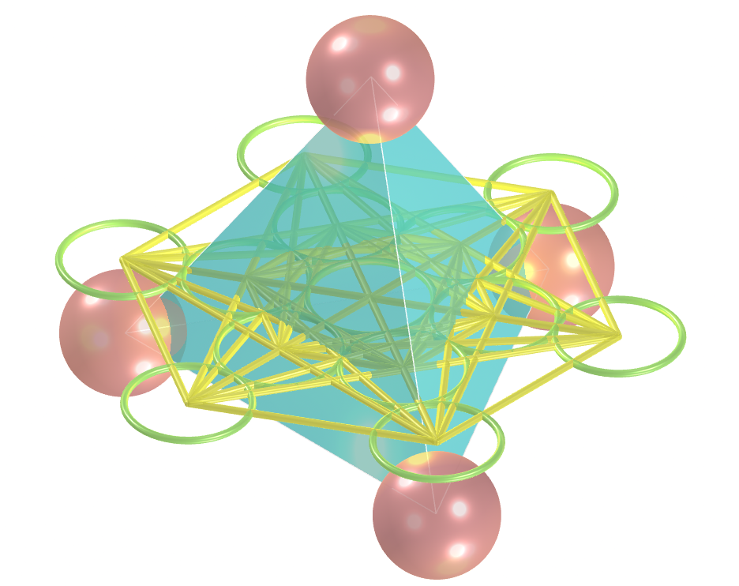
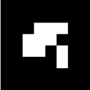

<link rel="stylesheet" href="../scripts/style.css">
<meta charset="utf-8">
<link rel="icon" type="image/png" href="vr/salas/imagens/icone.png">
<h2>Sacred Geometry: visualization of symbols with Augmented Reality (AR) and Virtual Reality (VR) in A-frame</h2>
 <b>author:</b> Paulo Henrique Siqueira - Universidade Federal do Paraná
  <b>contact:</b> <a href="#">paulohscwb@gmail.com</a>
  <a href="https://paulohscwb.github.io/SacredGeometry/metatron/pt-br/">versão em português</a>
 <form style="margin: 0 auto; float:right; text-align:right; width:100%; margin-bottom:15px;">
	<select id="url" onchange="urlHandler(this.value)" style="color:royalblue;">
		<option disabled selected value>More symbols:</option>
		<option value="../symbols/">Sacred Geometry symbols</option>
		<option value="../flower/">Flower of life and the polyhedra of Plato and Archimedes</option>
		<option value="../fruit/">Fruit of life and the polyhedra of Plato and Archimedes</option>
		<option value="../grid/">Grid of life and the polyhedra of Plato and Archimedes</option>
		<option disabled value="../metatron/">Metatron cube and the polyhedra of Plato and Archimedes</option>
	</select>
</form>

  <h2 align="center"> Metatron cube and the polyhedra of Plato and Archimedes</h2>
Sacred geometry assigns symbolic and sacred meanings to some geometric shapes and geometric proportions. There is an association of Sacred Geometry objects with a divine creator of the universal geometer. On this page we have Plato's polyhedra and Archimedes' cuboctahedron arising from the Grid of Life symbol.
This work shows Sacred Geometry symbols modeled in 2D and 3D, with views that can be accessed with Augmented Reality resources and also in immersive Virtual Reality rooms.

<a href="#ra">Augmented Reality</a>&nbsp;&nbsp;|&nbsp;&nbsp;<a href="#m3d">3D Models</a>&nbsp;&nbsp;|&nbsp;&nbsp;<a href="../">Home</a>

  

 <h3 align="center">Immersive rooms</h3>
  
<iframe width="100%" src="sala1.htm" title="Sala Imersiva dos símbolos da Geometria Sagrada" frameborder="0" loading="lazy"></iframe>

  
<a href="sala1.htm" target="_blank">&#x1f517; room 1</a>&nbsp;&nbsp;|&nbsp;&nbsp;<a href="sala2.htm" target="_blank">&#x1f517; room 2</a>

  

  

  <h3 id="ra" align="center">Augmented Reality</h3>
  To view Sacred Geometry symbols in AR, simply visit the pages indicated in the 3D solid models using any browser with a webcam device (smartphone, tablet or notebook).
 Access to the VR pages is done by clicking on the blue circle that appears on top of the marker.

<h3 id="m3d" align="center">3D models</h3>
<!--<iframe width="560" height="315" style="max-width:100%" src="https://www.youtube.com/embed/videoseries?list=PLy0I_lGW8HxUFFS5qIXC2KozRYcu06Jaq" title="YouTube video player" frameborder="0" allow="accelerometer; autoplay; clipboard-write; encrypted-media; gyroscope; picture-in-picture; web-share" allowfullscreen></iframe>-->
<h4>1. Metatron cube - tetrahedron</h4>

    Plato conceived the world as being composed of four basic elements: Earth, Fire, Air and Water. Furthermore, Plato established a mystical association between these elements and the Platonic solids. Thus, the tetrahedron is associated with Fire and corresponds to the first circumference of the Seed of Life symbol. The vertices of the regular tetrahedron appear on some circumferences of the Metatron cube symbol.
   
  
 

<h4>2. Metatron cube - cube</h4>

    According to Plato's mystical correspondence, the cube is associated with the Earth and corresponds to the second circumference of the Seed of Life symbol. The vertices of the cube appear on some circumferences of the Metatron cube symbol.
   
 

<h4>3. Metatron cube - octahedron</h4>

    According to Plato's mystical correspondence, the octahedron is associated with Air and corresponds to the third circumference of the Seed of Life symbol. The vertices of the regular octahedron appear on some circumferences of the Metatron cube symbol.
   
 
 

<h4>4. Metatron cube - icosahedron</h4>

    According to Plato's mystical correspondence, the icosahedron is associated with Water and corresponds to the fourth circumference of the Seed of Life symbol. The vertices of the regular icosahedron appear overlapping or correspondingly associated with some circumferences of the Metatron cube symbol.
   
 

<h4>5. Metatron cube - dodecahedron</h4>

    According to Plato's mystical correspondence, the dodecahedron is associated with the Universe and corresponds to the fifth circumference of the Seed of Life symbol. The vertices of the regular dodecahedron appear overlapping or correspondingly associated with some circumferences of the Metatron cube symbol.
   
  
 

<h4>6. Metatron cube - star tetrahedron</h4>

    The Merkabah or Star tetrahedron or Star of Davi is the geometric figure that represents male and female energy  Heaven and Earth. The Star tetrahedron corresponds to the sixth circumference of the Seed of Life symbol and the vertices of this solid appear overlapping with some circumferences of the Metatron cube symbol.
   
 
 

<h4>7. Metatron cube - cuboctahedron</h4>

    The Archimedes cuboctahedron represents the Energy Vector of Equilibrium. The cuboctahedron corresponds to the seventh circumference of the Seed of Life symbol and the vertices of this solid appear overlapping or in correspondence with some circumferences of the Metatron cube symbol.
   
  
 

<h4>8. Metatron cube 3D - cuboctahedron v1</h4>

    In this representation we have the 3D model of the Metatron cube symbol built with 3 rotations around one of the symbols. Joining the intersections of the external lines, we obtain an Archimedean cuboctahedron.
   
 
 

<h4>9. Metatron cube 3D - tetrahedron</h4>

    The tetrahedron is associated with Fire and corresponds to the first circumference of the Seed of Life symbol. The regular tetrahedron appears inscribed in the 3D Metatron cube symbol.
   
 
 

<h4>10. Metatron cube 3D - cube</h4>

    The cube is associated with the Earth and corresponds to the second circumference of the Seed of Life symbol. The cube appears inscribed in the 3D Metatron cube symbol.
   
 
 
<a href="#p1" class="topo">back to top</a>

 

<h4>11. Metatron cube 3D - octahedron</h4>

    The octahedron is associated with the Air and corresponds to the third circumference of the Seed of Life symbol. The regular octahedron appears inscribed in the 3D Metatron cube symbol.
   
 
 

<h4>12. Metatron cube 3D - icosahedron</h4>

    The icosahedron is associated with Water and corresponds to the fourth circumference of the Seed of Life symbol. The regular icosahedron appears circumscribed in the 3D Metatron cube symbol.
   
 
 

<h4>13. Metatron cube 3D - dodecahedron</h4>

    The dodecahedron is associated with the Universe and corresponds to the fifth circumference of the Seed of Life symbol. The regular dodecahedron appears circumscribed in the 3D Metatron cube symbol.
   
 
 

<h4>14. Metatron cube 3D - star tetrahedron</h4>

    The Merkabah or Star tetrahedron or Star of Davi corresponds to the sixth circumference of the Seed of Life symbol. The star tetrahedron appears inscribed in the 3D Metatron cube symbol.
   
 
 

<h4>15. Metatron cube 3D - cuboctahedron v2</h4>

    The Archimedes cuboctahedron represents the Energy Vector of Equilibrium and corresponds to the seventh circumference of the Seed of Life symbol. The cuboctahedron appears inscribed in the 3D Metatron cube symbol.
   
 
 
<a href="#p1" class="topo">back to top</a>

  Metatron cube and the polyhedra of Plato and Archimedes - Visualization of symbols with Augmented Reality and Virtual Reality by <a xmlns:cc="http://creativecommons.org/ns#" href="https://paulohscwb.github.io/SacredGeometry/metatron/" property="cc:attributionName" rel="cc:attributionURL">Paulo Henrique Siqueira</a> is licensed with a license <a rel="license" href="http://creativecommons.org/licenses/by-nc-nd/4.0/">Creative Commons Attribution-NonCommercial-NoDerivatives 4.0 International</a>.

<h4>How to cite this work:</h4> 

Siqueira, P.H., "Metatron cube and the polyhedra of Plato and Archimedes: Visualization of symbols with Augmented Reality and Virtual Reality". Available in: <https://paulohscwb.github.io/SacredGeometry/metatron/>, November 2024.

<!---->
  <b>References:</b>
 Pardesco. "Sacred Geometry Art, Symbols & Meanings". <a href="https://pardesco.com/blogs/news/sacred-geometry-art-symbols-meanings" target="_blank">https://pardesco.com/blogs/news/sacred-geometry-art-symbols-meanings</a>
 Weisstein, Eric W. "Platonic Solid" From MathWorld-A Wolfram Web Resource. <a href="http://mathworld.wolfram.com/PlatonicSolid.html" target="_blank">http://mathworld.wolfram.com/PlatonicSolid.html</a>
 Wikipedia <a href="https://en.wikipedia.org/wiki/en.wikipedia.org/wiki/Platonic_solid" target="_blank">https://en.wikipedia.org/wiki/Platonic_solid</a>
 Solar System Scope. "Solar Textures: Stars and Milky Way". <a href="http://dmccooey.com/polyhedra/" target="_blank">https://www.solarsystemscope.com/textures/</a>
