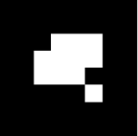
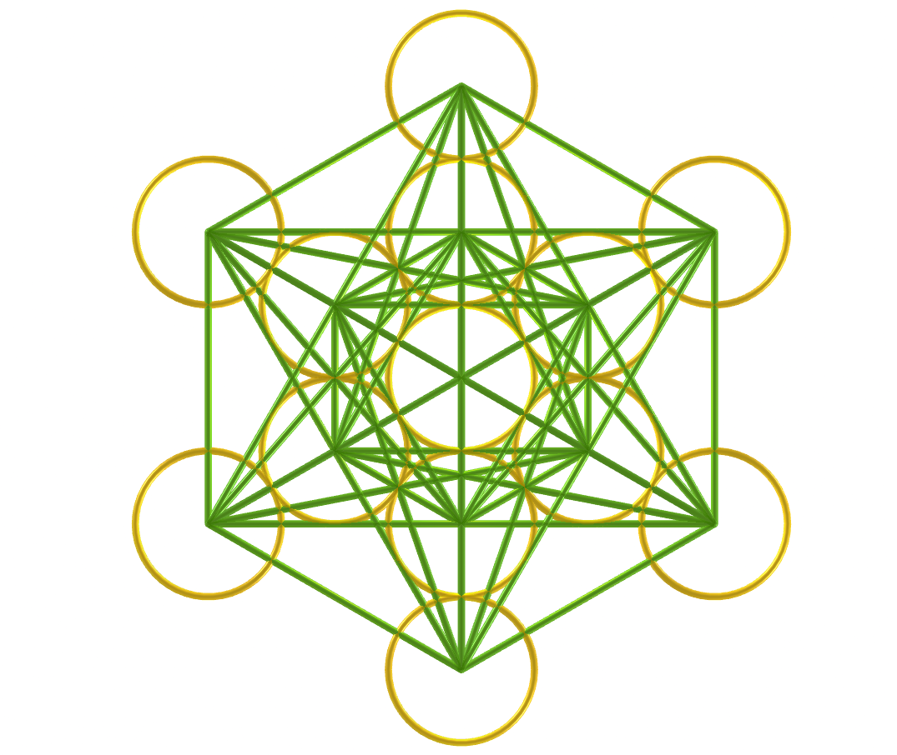
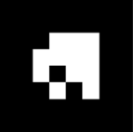
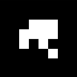

<link rel="stylesheet" href="../scripts/style.css">
<meta charset="utf-8">
<link rel="icon" type="image/png" href="vr/salas/imagens/icone.png">
<h2>Sacred Geometry: visualization of symbols with Augmented Reality (AR) and Virtual Reality (VR) in A-frame</h2>
 <b>author:</b> Paulo Henrique Siqueira - Universidade Federal do Paraná
  <b>contact:</b> <a href="#">paulohscwb@gmail.com</a>
  <a href="https://paulohscwb.github.io/SacredGeometry/symbols/pt-br/">versão em português</a>
 <form style="margin: 0 auto; float:right; text-align:right; width:100%; margin-bottom:15px;">
	<select id="url" onchange="urlHandler(this.value)" style="color:royalblue;">
		<option disabled selected value>More symbols:</option>
		<option disabled value="../symbols/">Sacred Geometry symbols</option>
		<option value="../flower/">Flower of life and the polyhedra of Plato and Archimedes</option>
		<option value="../fruit/">Fruit of life and the polyhedra of Plato and Archimedes</option>
		<!--<option value="../grid/">Grid of life and the polyhedra of Plato and Archimedes</option>
		<option value="../metatron/">Metatron and the polyhedra of Plato and Archimedes</option>-->
	</select>
</form>

  <h2 align="center"> Sacred Geometry symbols</h2>
The mathematical structures used in Sacred Geometry can be found in the arts, architecture and even in our DNA. These structures are everywhere, and serve as a link between analytical thinking and the intuitive side, or between science and spirituality.
This work shows Sacred Geometry symbols modeled in 2D and 3D, with views that can be accessed with Augmented Reality resources and also in immersive Virtual Reality rooms.

<a href="#ra">Augmented Reality</a>&nbsp;&nbsp;|&nbsp;&nbsp;<a href="#m3d">3D Models</a>&nbsp;&nbsp;|&nbsp;&nbsp;<a href="../">Home</a>

  

 <h3 align="center">Immersive rooms</h3>
  
<iframe width="100%" src="sala.htm" title="Sala Imersiva dos símbolos da Geometria Sagrada" frameborder="0" loading="lazy"></iframe>

  
<a href="sala.htm" target="_blank">&#x1f517; room 1</a>&nbsp;&nbsp;|&nbsp;&nbsp;<a href="sala1.htm" target="_blank">&#x1f517; room 2</a>&nbsp;&nbsp;|&nbsp;&nbsp;<a href="sala2.htm" target="_blank">&#x1f517; room 3</a>&nbsp;&nbsp;|&nbsp;&nbsp;<a href="sala3.htm" target="_blank">&#x1f517; room 4</a>

  

  

  <h3 id="ra" align="center">Augmented Reality</h3>
  To view Sacred Geometry symbols in AR, simply visit the pages indicated in the 3D solid models using any browser with a webcam device (smartphone, tablet or notebook). 
 Access to the VR pages is done by clicking on the blue circle that appears on top of the marker.

<h3 id="m3d" align="center">3D models</h3>
<iframe width="560" height="315" style="max-width:100%" src="https://www.youtube.com/embed/videoseries?list=PLy0I_lGW8HxXqLmyaITBm0flxwtDvgTFT" title="YouTube video player" frameborder="0" allow="accelerometer; autoplay; clipboard-write; encrypted-media; gyroscope; picture-in-picture; web-share" allowfullscreen></iframe>
<h4>1. Vesica Piscis</h4>

    It is a geometric form created by the intersection of two identical circles, where the center of each circle lies on the perimeter of the other. The Vesica Piscis is used in Venn Diagrams and emblematic seals and has symbolic meanings such as the "Jesus fish", the intricate Triquetra that appears in Celtic art, the Reuleaux triangle and the Mandorla that symbolizes the opposites union and the intersection of terrestrial and celestial kingdoms.
   
 

<h4>2. Vesica Piscis 3D</h4>

    In this 3D representation we have the model with 8 circles around the smallest circle. These circles represent plane sections of the spheres that symbolize the extension of the Vesica Piscis into 3 dimensions.
   
 

<h4>3. Seed of Life</h4>

    Sacred Geometry is centered on the symbol made up of 7 intertwined circles, called the Seed of Life. It is a representation that signifies the 7 days in which the world was created, and that appears in many buildings and religious texts. Each overlapping circle means a cycle or cell interconnecting vital processes.
   
  
 

<h4>4. Seed of Life 3D</h4>

    This symbol has been used reverently and its design gives a sense of protection. Many use it as jewelry or decoration, believing that it brings positivity, warding off negative things. In this representation we have the 3D model built with 3 rotations around one of the models.
   
 

<h4>5. Seed of Life 3D v2</h4>

    This symbol also appears on some tapestries and ruins of ancient temples, signifying the design of the universe. In this representation we have the 3D model built with circles forming 2 spherical caps.
   
 
 

<h4>6. Seed of Life 3D v3</h4>

    Each overlapping circle of this symbol signifies a cycle or cell interconnecting vital processes. In this representation we have the 3D model built with 6 circles rotated around axes that pass through the central circle.
   
 

<h4>7. Egg of Life</h4>

    It is considered a central stage in the transformative sequence of evolution and is associated with the notions of rebirth and fertility. The Egg of Life is an evolution of the Seed of Life: adding 6 circles to the Fundamental Seed we have the symbol of the Egg of Life.
   
  
 

<h4>8. Egg of Life 3D</h4>

    Analyzing another dimension in its formation, the Egg of Life can be visualized through the eight tangent spheres of Metatron's Cube. This connection shows the versatility and intertwined relationships of Sacred Geometric symbols.
   
 
 

<h4>9. Flower of Life</h4>

    The Flower of Life symbol is constructed of 19 interlocking circles, surrounded by a larger circle. It is a well-known representation that appears in the pyramids of Egypt and in buildings in Greece, China, England, Tibet and Israel. The Flower of Life is believed to represent the cosmic blueprint, which encodes the design of each atomic structure.
   
  
 

<h4>10. Flower of Life 3D</h4>

    Within the design of the Flower of Life symbol are other Sacred Geometry patterns: the Egg of Life, the Seed of Life, and the Tree of Life. In this representation we have the 3D model built with 3 rotations around one of the models.
   
 
 
<a href="#p1" class="topo">back to top</a>

<h4>11. Flower of Life v2</h4>

    The Flower of Life symbol can be extended and constructed with 37 interlocking circles, surrounded by a larger circle. Several circles of this symbol extend beyond the border, and another Sacred Geometry symbol emerges from this extended version: the Fruit of Life.
   
  
 

<h4>12. Flower of Life 3D v2</h4>

    Within the design of the Flower of Life symbol are other Sacred Geometry patterns: the Egg of Life, the Seed of Life, and the Tree of Life. In this representation we have the 3D model built with 3 rotations around one of the models.
   
 
 

<h4>13. Tree of Life</h4>

    The Tree of Life symbol represents a connection with everything, including the things we cannot see, reminding us that we are not alone in the universe. The 10 spheres of this symbol are called "Sephiroth", they mean emanation and are connected by different paths. The bottom Sephira represents the material world and the top Sephira represents cosmic consciousness. The other Sephiras represent the qualities of the soul and are divided into three pillars: severity, gentleness and mercy.
   
 
 

<h4>14. Fruit of Life</h4>

    The symbol of the Fruit of Life is formed by 13 interconnected spheres and can be considered one of the most powerful in Sacred Geometry. It appears hidden within the Flower of Life symbol and can be used to create the 78 lines of the Metatron's Cube symbol.
   
  
 

<h4>15. Fruit of Life 3D</h4>

    The 13 spheres of the Fruit of Life symbol symbolize feminine aspects of creation, which provide the basis for the 78 masculine rays of creation. It is considered a harmonious interaction that gives rise to existence. In this representation we have the symbol of the Fruit of Life in 3D.
   
 
 

 <h4>16. Golden spiral</h4>

    We define that the numbers <b>a</b> and <b>b</b> are in the golden ratio when <b>(a + b) / a = a / b = &Phi;</b>. Putting this ratio in two dimensions, we can construct golden rectangles (or triangles), where their sides are in the golden ratio. This proportion is not just a mathematical notion, but also a symbol of beauty, harmony and perfection in art, science and nature. This term was introduced by Leonardo da Vinci as a proportion of "ideal perfect body" and appears in the petals of various flowers, sunflower seed arrangements, pine cone patterns and romanesco broccoli.
   
 
 

<h4>17. Metatron's Cube</h4>

    Metatron is a seraphim archangel of medieval Islamic, Jewish and Christian tradition. Artistic depictions almost always depict Archangel Metatron holding or near a mysterious cube. The construction of Metatron's Cube involves 13 circles housed within a larger circle. The lines that join the centers of these circles define the Metaton Cube.
   
  
 

<h4>18. Metatron's Cube 3D</h4>

    Within the geometric shape defined by the Metatron Cube we can find the five Platonic solids, positioning the Metatron Cube as a fundamental bridge that transforms two-dimensional realities into three-dimensional realms. In this representation we have the Metaton cube in 3D.
   
 
 

<h4>19. Grid of life</h4>

    The symbol of the Grid of Life, also called tetrahedron 64, contrasts the Star Tetrahedron with the Flower of Life. We have 64 tetrahedra that form the Grid of Life symbol, which can be overlayed on the Flower of Life symbol, with the circles symbolizing the vastness of space and the interconnected lines indicating where space converges over time.
   
  
 

<h4>20. Grid of life 3D</h4>

    Much of the fascination of the Grid of Life symbol comes from the number 64, which appears recurrently in nature, constructions and mysticism. Some examples that we can cite are: in computing, where the number of 64 bits of memory is essential; in the classic games of chess or checkers, which have 64 squares on their boards; or in sacred texts of Hinduism, which references 64 tantras. In this example, we have the Grid of life modeled in 3D.
   
 
 
<a href="#p1" class="topo">back to top</a>

  

<h4>21. Torus</h4>

    The structure of a torus, similar to a vortex, is considered to be the initial form emanating from the Genesis pattern. The representation of the torus in Sacred Geometry reflects the spiral flow of energy. This flow is not unidirectional, oscillating on the torus surface and spiraling within its core.
   
 

<h4>22. Ring torus</h4>

    The ring torus represents the classic donut shape, which embodies continuity and wholeness. This symbol represents the cycles of life, which maintain their form and vitality regardless of where they begin or end.
   
 

<h4>23. Spindle torus</h4>

    The spindle torus represents an invisible force acting at opposite ends. It is a powerful symbol of balance, tension and duality, which represents what exists in the universe and within ourselves.
   
 

<a href="#p1" class="topo">back to top</a>

 

<h4>24. Merkaba star</h4>

    The Merkaba star symbol or Star Tetrahedron or Star of Davi has the meaning translated as "light, spirit and body". It is the fusion of 2 identical tetrahedra that are interconnected through rotations in opposite directions. The intersection of these tetrahedra creates an energy field that radiates immense power. In this example, we have the Merkaba star modeled in 3D.
   
 

<h4>25. Vector Equilibrium</h4>

    Vector Equilibrium is considered the initial reference of energetic mathematics and the zero pulsation of vector balance. This is the underlying structure of the Torus, considered the geometric shape capable of transforming energy into matter.
   
 
 

<h4>26. Vector Equilibrium 3D</h4>

    Vector Equilibrium energy lines have equal length and strength and can be considered the only geometric shape that has all equal and balanced forces. In this representation we have the Vector Equilibrium modeled in 3D, which represents a set formed by the edges and main diagonals of the Archimedean Cuboctahedron.
   
 
 

<h4>27. Vector Equilibrium 3D v2</h4>

    According to Buckminster Fuller, Vector Equilibrium is the closest form we will ever know to God and eternity. In this representation we have the Vector Equilibrium modeled in 3D, which represents a set formed by the main diagonals and the circles circumscribed by the hexagonal sections of the Archimedes Cuboctahedron.
   
 
 

<h4>28. Vector Equilibrium 3D v3</h4>

    Vector Equilibrium is considered as the underlying structure of the Torus, also known as the geometric shape capable of transforming energy into matter. In this representation we have the 3D model built with 3 rotations around one of the models.
   
 

<a href="#p1" class="topo">back to top</a>

  Sacred Geometry - Visualization of symbols with Augmented Reality and Virtual Reality by <a xmlns:cc="http://creativecommons.org/ns#" href="https://paulohscwb.github.io/SacredGeometry/symbols/" property="cc:attributionName" rel="cc:attributionURL">Paulo Henrique Siqueira</a> is licensed with a license <a rel="license" href="http://creativecommons.org/licenses/by-nc-nd/4.0/">Creative Commons Attribution-NonCommercial-NoDerivatives 4.0 International</a>.

<h4>How to cite this work:</h4> 

Siqueira, P.H., "Sacred Geometry: Visualization of symbols with Augmented Reality and Virtual Reality". Available in: <https://paulohscwb.github.io/SacredGeometry/symbols/>, May 2024.

<!---->
  <b>References:</b>
 Pardesco. "Sacred Geometry Art, Symbols & Meanings". <a href="https://pardesco.com/blogs/news/sacred-geometry-art-symbols-meanings" target="_blank">https://pardesco.com/blogs/news/sacred-geometry-art-symbols-meanings</a>
 Weisstein, Eric W. "Platonic Solid" From MathWorld-A Wolfram Web Resource. <a href="http://mathworld.wolfram.com/PlatonicSolid.html" target="_blank">http://mathworld.wolfram.com/PlatonicSolid.html</a>
 Wikipedia <a href="https://en.wikipedia.org/wiki/en.wikipedia.org/wiki/Platonic_solid" target="_blank">https://en.wikipedia.org/wiki/Platonic_solid</a>
 Solar System Scope. "Solar Textures: Stars and Milky Way". <a href="http://dmccooey.com/polyhedra/" target="_blank">https://www.solarsystemscope.com/textures/</a>
