<link rel="stylesheet" href="../scripts/style.css">
<meta charset="utf-8">
<link rel="icon" type="image/png" href="vr/salas/imagens/icone.png">
<h2>Sacred Geometry: visualization of symbols with Augmented Reality (AR) and Virtual Reality (VR) in A-frame</h2>
 <b>author:</b> Paulo Henrique Siqueira - Universidade Federal do Paraná
  <b>contact:</b> <a href="#">paulohscwb@gmail.com</a>
  <a href="https://paulohscwb.github.io/SacredGeometry/symbols/pt-br/">versão em português</a>
 <form style="margin: 0 auto; float:right; text-align:right; width:100%; margin-bottom:15px;">
	<select id="url" onchange="urlHandler(this.value)" style="color:royalblue;">
		<option disabled selected value>More symbols:</option>
		<option disabled value="../symbols/">Sacred Geometry symbols</option>
		<option value="../flower/">Flower of life and the polyhedra of Plato and Archimedes</option>
		<option value="../fruit/">Fruit of life and the polyhedra of Plato and Archimedes</option>
		<option value="../grid/">Grid of life and the polyhedra of Plato and Archimedes</option>
		<option value="../metatron/">Metatron and the polyhedra of Plato and Archimedes</option>
		<option value="../merkaba/">Merkaba star</option>
	</select>
</form>

  <h2 align="center"> Sacred Geometry symbols</h2>
The mathematical structures used in Sacred Geometry can be found in the arts, architecture and even in our DNA. These structures are everywhere, and serve as a link between analytical thinking and the intuitive side, or between science and spirituality.
This work shows Sacred Geometry symbols modeled in 2D and 3D, with views that can be accessed with Augmented Reality resources and also in immersive Virtual Reality rooms.

<a href="#ra">Augmented Reality</a>&nbsp;&nbsp;|&nbsp;&nbsp;<a href="#m3d">3D Models</a>&nbsp;&nbsp;|&nbsp;&nbsp;<a href="../">Home</a>

  

 <h3 align="center">Immersive rooms</h3>
  
<iframe width="100%" src="sala.htm" title="Sala Imersiva dos símbolos da Geometria Sagrada" frameborder="0" loading="lazy"></iframe>

  
<a href="sala.htm" target="_blank">&#x1f517; room 1</a>&nbsp;&nbsp;|&nbsp;&nbsp;<a href="sala1.htm" target="_blank">&#x1f517; room 2</a>&nbsp;&nbsp;|&nbsp;&nbsp;<a href="sala2.htm" target="_blank">&#x1f517; room 3</a>&nbsp;&nbsp;|&nbsp;&nbsp;<a href="sala3.htm" target="_blank">&#x1f517; room 4</a>

  

  

  <h3 id="ra" align="center">Augmented Reality</h3>
  To view Sacred Geometry symbols in AR, simply visit the pages indicated in the 3D solid models using any browser with a webcam device (smartphone, tablet or notebook). 
 Access to the VR pages is done by clicking on the blue circle that appears on top of the marker.

<h3 id="m3d" align="center">3D models</h3>
<iframe width="560" height="315" style="max-width:100%" src="https://www.youtube.com/embed/videoseries?list=PLy0I_lGW8HxXqLmyaITBm0flxwtDvgTFT" title="YouTube video player" frameborder="0" allow="accelerometer; autoplay; clipboard-write; encrypted-media; gyroscope; picture-in-picture; web-share" allowfullscreen></iframe>
<h4>1. Vesica Piscis</h4>

    It is a geometric form created by the intersection of two identical circles, where the center of each circle lies on the perimeter of the other. The Vesica Piscis is used in Venn Diagrams and emblematic seals and has symbolic meanings such as the "Jesus fish", the intricate Triquetra that appears in Celtic art, the Reuleaux triangle and the Mandorla that symbolizes the opposites union and the intersection of terrestrial and celestial kingdoms.
   
 

<h4>2. Vesica Piscis 3D</h4>

    In this 3D representation we have the model with 8 circles around the smallest circle. These circles represent plane sections of the spheres that symbolize the extension of the Vesica Piscis into 3 dimensions.
   
 

<h4>3. Seed of Life</h4>

    Sacred Geometry is centered on the symbol made up of 7 intertwined circles, called the Seed of Life. It is a representation that signifies the 7 days in which the world was created, and that appears in many buildings and religious texts. Each overlapping circle means a cycle or cell interconnecting vital processes.
   
  
 

<h4>4. Seed of Life 3D</h4>

    This symbol has been used reverently and its design gives a sense of protection. Many use it as jewelry or decoration, believing that it brings positivity, warding off negative things. In this representation we have the 3D model built with 3 rotations around one of the models.
   
 

<h4>5. Seed of Life 3D v2</h4>

    This symbol also appears on some tapestries and ruins of ancient temples, signifying the design of the universe. In this representation we have the 3D model built with circles forming 2 spherical caps.
   
 
 

<h4>6. Seed of Life 3D v3</h4>

    Each overlapping circle of this symbol signifies a cycle or cell interconnecting vital processes. In this representation we have the 3D model built with 6 circles rotated around axes that pass through the central circle.
   
 

<h4>7. Egg of Life</h4>

    It is considered a central stage in the transformative sequence of evolution and is associated with the notions of rebirth and fertility. The Egg of Life is an evolution of the Seed of Life: adding 6 circles to the Fundamental Seed we have the symbol of the Egg of Life.
   
  
 

<h4>8. Egg of Life 3D</h4>

    Analyzing another dimension in its formation, the Egg of Life can be visualized through the eight tangent spheres of Metatron's Cube. This connection shows the versatility and intertwined relationships of Sacred Geometric symbols.
   
 
 

<h4>9. Flower of Life</h4>

    The Flower of Life symbol is constructed of 19 interlocking circles, surrounded by a larger circle. It is a well-known representation that appears in the pyramids of Egypt and in buildings in Greece, China, England, Tibet and Israel. The Flower of Life is believed to represent the cosmic blueprint, which encodes the design of each atomic structure.
   
  
 

<h4>10. Flower of Life 3D</h4>

    Within the design of the Flower of Life symbol are other Sacred Geometry patterns: the Egg of Life, the Seed of Life, and the Tree of Life. In this representation we have the 3D model built with 3 rotations around one of the models.
   
 
 
<a href="#p1" class="topo">back to top</a>

<h4>11. Flower of Life v2</h4>

    The Flower of Life symbol can be extended and constructed with 37 interlocking circles, surrounded by a larger circle. Several circles of this symbol extend beyond the border, and another Sacred Geometry symbol emerges from this extended version: the Fruit of Life.
   
  
 

<h4>12. Flower of Life 3D v2</h4>

    Within the design of the Flower of Life symbol are other Sacred Geometry patterns: the Egg of Life, the Seed of Life, and the Tree of Life. In this representation we have the 3D model built with 3 rotations around one of the models.
   
 
 

<h4>13. Tree of Life</h4>
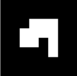
    The Tree of Life symbol represents a connection with everything, including the things we cannot see, reminding us that we are not alone in the universe. The 10 spheres of this symbol are called "Sephiroth", they mean emanation and are connected by different paths. The bottom Sephira represents the material world and the top Sephira represents cosmic consciousness. The other Sephiras represent the qualities of the soul and are divided into three pillars: severity, gentleness and mercy.
   
 
 

<h4>14. Fruit of Life</h4>

    The symbol of the Fruit of Life is formed by 13 interconnected spheres and can be considered one of the most powerful in Sacred Geometry. It appears hidden within the Flower of Life symbol and can be used to create the 78 lines of the Metatron's Cube symbol.
   
  
 

<h4>15. Fruit of Life 3D</h4>

    The 13 spheres of the Fruit of Life symbol symbolize feminine aspects of creation, which provide the basis for the 78 masculine rays of creation. It is considered a harmonious interaction that gives rise to existence. In this representation we have the symbol of the Fruit of Life in 3D.
   
 
 

 <h4>16. Golden spiral</h4>

    We define that the numbers <b>a</b> and <b>b</b> are in the golden ratio when <b>(a + b) / a = a / b = &Phi;</b>. Putting this ratio in two dimensions, we can construct golden rectangles (or triangles), where their sides are in the golden ratio. This proportion is not just a mathematical notion, but also a symbol of beauty, harmony and perfection in art, science and nature. This term was introduced by Leonardo da Vinci as a proportion of "ideal perfect body" and appears in the petals of various flowers, sunflower seed arrangements, pine cone patterns and romanesco broccoli.
   
 
 

<h4>17. Metatron's Cube</h4>

    Metatron is a seraphim archangel of medieval Islamic, Jewish and Christian tradition. Artistic depictions almost always depict Archangel Metatron holding or near a mysterious cube. The construction of Metatron's Cube involves 13 circles housed within a larger circle. The lines that join the centers of these circles define the Metaton Cube.
   
  
 

<h4>18. Metatron's Cube 3D</h4>
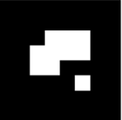
    Within the geometric shape defined by the Metatron Cube we can find the five Platonic solids, positioning the Metatron Cube as a fundamental bridge that transforms two-dimensional realities into three-dimensional realms. In this representation we have the Metaton cube in 3D.
   
 
 

<h4>19. Grid of life</h4>

    The symbol of the Grid of Life, also called tetrahedron 64, contrasts the Star Tetrahedron with the Flower of Life. We have 64 tetrahedra that form the Grid of Life symbol, which can be overlayed on the Flower of Life symbol, with the circles symbolizing the vastness of space and the interconnected lines indicating where space converges over time.
   
  
 

<h4>20. Grid of life 3D</h4>

    Much of the fascination of the Grid of Life symbol comes from the number 64, which appears recurrently in nature, constructions and mysticism. Some examples that we can cite are: in computing, where the number of 64 bits of memory is essential; in the classic games of chess or checkers, which have 64 squares on their boards; or in sacred texts of Hinduism, which references 64 tantras. In this example, we have the Grid of life modeled in 3D.
   
 
 
<a href="#p1" class="topo">back to top</a>

  

<h4>21. Torus</h4>

    The structure of a torus, similar to a vortex, is considered to be the initial form emanating from the Genesis pattern. The representation of the torus in Sacred Geometry reflects the spiral flow of energy. This flow is not unidirectional, oscillating on the torus surface and spiraling within its core.
   
 

<h4>22. Ring torus</h4>

    The ring torus represents the classic donut shape, which embodies continuity and wholeness. This symbol represents the cycles of life, which maintain their form and vitality regardless of where they begin or end.
   
 

<h4>23. Spindle torus</h4>
<a href="vr/Torus2.htm" target="_blank" title="3D model" class="fotoA">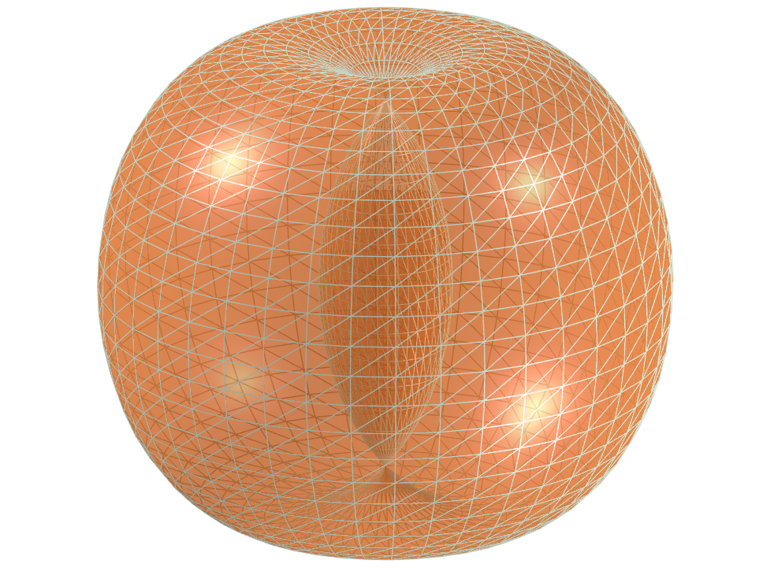</a>
    The spindle torus represents an invisible force acting at opposite ends. It is a powerful symbol of balance, tension and duality, which represents what exists in the universe and within ourselves.
   
 

<a href="#p1" class="topo">back to top</a>

 

<h4>24. Merkaba star</h4>

    The Merkaba star symbol or Star Tetrahedron or Star of Davi has the meaning translated as "light, spirit and body". It is the fusion of 2 identical tetrahedra that are interconnected through rotations in opposite directions. The intersection of these tetrahedra creates an energy field that radiates immense power. In this example, we have the Merkaba star modeled in 3D.
   
 

<h4>25. Vector Equilibrium</h4>

    Vector Equilibrium is considered the initial reference of energetic mathematics and the zero pulsation of vector balance. This is the underlying structure of the Torus, considered the geometric shape capable of transforming energy into matter.
   
 
 

<h4>26. Vector Equilibrium 3D</h4>

    Vector Equilibrium energy lines have equal length and strength and can be considered the only geometric shape that has all equal and balanced forces. In this representation we have the Vector Equilibrium modeled in 3D, which represents a set formed by the edges and main diagonals of the Archimedean Cuboctahedron.
   
 
 

<h4>27. Vector Equilibrium 3D v2</h4>

    According to Buckminster Fuller, Vector Equilibrium is the closest form we will ever know to God and eternity. In this representation we have the Vector Equilibrium modeled in 3D, which represents a set formed by the main diagonals and the circles circumscribed by the hexagonal sections of the Archimedes Cuboctahedron.
   
 
 

<h4>28. Vector Equilibrium 3D v3</h4>

    Vector Equilibrium is considered as the underlying structure of the Torus, also known as the geometric shape capable of transforming energy into matter. In this representation we have the 3D model built with 3 rotations around one of the models.
   
 
 

<h4>29. Sri Yantra</h4>

    The Sri Yantra is a geometric draw that represents the union of the masculine and feminine energies of the universe. It is one of the most complex and powerful forms of Sacred Geometry. This symbol has nine interlocking triangles that surround a central point and guide the mind to higher states of consciousness. Focusing on the central point, called the "bindu", helps to access a deep connection with universal energy. The "bindu" symbolizes the origin of the universe, the point from which all creation emanates, and around which reality is organized. The word "Sri" means wealth and prosperity, and "Yantra" means instrument.
    
 

<h4>30. Sri Yantra 3D</h4>

    The Sri Yantra consists of four triangles pointing upwards (masculine energy, Shiva) and five pointing downwards (feminine energy, Shakti). The intersections between the triangles form 43 smaller triangles, which mirror the cosmos. Each smaller triangle is related to an intelligence or archetype. The Sri Yantra is one of the most complex and powerful forms of Sacred Geometry. The word "Sri" means wealth and prosperity, and "Yantra" means instrument.
    

<a href="#p1" class="topo">back to top</a>

<h4>31. Triquetra</h4>
<a href="vr/Triquetra.htm" target="_blank" title="3D model" class="fotoA">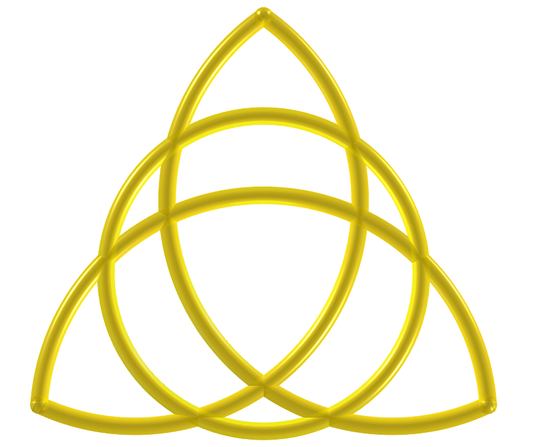</a>
    The triquetra is a geometric symbol that represents eternity, trinity and unity. It is made up of three intertwined arches, with no beginning or end. The word triquetra comes from the Latin triquætra (three points). The symbol is similar to a triskelion (a Celtic symbol that represents the three worlds: the celestial, physical and spiritual). The triquetra is present in many cultures and traditions.
    
 

<h4>32. Triquetra 3D</h4>

     The triquetra is used in Christianity, magic and the occult in general. This symbol is associated with trinity concepts, such as life, death and rebirth, or earth, sea and sky. The triquetra represents infinity in three dimensions and can be found in many works of art, monuments, films, popular series, pendants, mandalas and paintings.
    
 

<h4>33. Lotus of Life</h4>

     The Lotus of Life is a Sacred Geometry symbol derived from the Seed of Life and Flower of Life symbols. This symbol contains 12 petals, and can be obtained by rotating a Seed of Life symbol around the center at an angle of 30&ordm;. The center of the Lotus represents the zero point or center of life and creation. From this central point, all life (represented by the petals) springs forth and all life is connected to this point.
    
 

<h4>34. Lotus of Life 3D</h4>

     It is believed that by contemplating or meditating using the Lotus of Life, one can experience a sense of peace, tranquility and enlightenment. This symbol contains 12 petals, and can be obtained by rotating a Seed of Life symbol around the center at an angle of 30&ordm;. The center of the Lotus represents the zero point or center of life and creation. From this central point, all life (represented by the petals) springs forth and all life is connected to this point.
    
 

<h4>35. Lotus of Life 3D v2</h4>

     This symbol contains 12 petals, and can be obtained by rotating a Seed of Life symbol around the center at an angle of 30&ordm;. The center of the Lotus represents the zero point or center of life and creation. From this central point, all life (represented by the petals) springs forth and all life is connected to this point. It is believed that by contemplating or meditating using the Lotus of Life, one can experience a sense of peace, tranquility and enlightenment.
    
 

<h4>36. Lotus of Life 3D v3</h4>

     The center of the Lotus represents the zero point or center of life and creation. From this central point, all life (represented by the petals) springs forth and all life is connected to this point. It is believed that by contemplating or meditating using the Lotus of Life, one can experience a sense of peace, tranquility and enlightenment. This symbol contains 12 petals, and can be obtained by rotating a Seed of Life symbol around the center at an angle of 30&ordm;.
    
 

<h4>37. Unicursal Hexagram</h4>

     The unicursal hexagram is a six-pointed star that can be drawn in one continuous line. It is a symbol of Sacred Geometry that signifies unity, the continuous flow of energy and life, and the interconnectedness of all things. The unicursal hexagram is often depicted with its lines intersecting to form a knot. This symbol can be drawn inside a circle with the points touching. This is an example of a shape discussed in Blaise Pascal's work "Hexagrammum Mysticum" (1639).
    
 

<h4>38. The Lily</h4>

     The Lily has been used in Sacred Geometry to symbolize purity, fertility, motherhood, and sexuality. The petals and stamens of the lily create an organic geometry that can be seen in mandalas. The symbol for the Lily represents the flower of the same name, placed within a triangle, with its petals extending toward three points. Another triangle forms a 60&ordm; angle to the first triangle, and is formed by three smaller petals.
    
 

<h4>39. The Lily 3D</h4>

     The symbol for the Lily represents the flower of the same name, placed within a triangle, with its petals extending toward three points. Another triangle forms a 60&ordm; angle to the first triangle, and is formed by three smaller petals. The Lily has been used in Sacred Geometry to symbolize purity, fertility, motherhood, and sexuality. The petals and stamens of the lily create an organic geometry that can be seen in mandalas.
    

<h4>40. Golden Rectangles</h4>

     In Sacred Geometry, three interconnected golden rectangles represent the cosmos and the union of forces. The symbol formed by three interconnected golden rectangles can be constructed in two ways. We can define the sides of a golden rectangle as two opposite edges and the respective perpendicular diagonals of an icosahedron. The second way to construct this symbol is by choosing the lines with golden proportions that appear in the symbol of the Flower of Life.
    

<a href="#p1" class="topo">back to top</a>

 

<h4>41. Golden Rectangles v2</h4>

     The symbol formed by three interconnected golden rectangles can be constructed in two ways. We can define the sides of a golden rectangle as two opposite edges and the respective perpendicular diagonals of an icosahedron. The second way to construct this symbol is by choosing the lines with golden proportions that appear in the symbol of the Flower of Life. In Sacred Geometry, three interconnected golden rectangles represent the cosmos and the union of forces.
    
 

<h4>42. Curved Merkaba</h4>

     The Merkaba is a sacred geometric symbol that represents the union of masculine and feminine energies and the integration of the earthly and cosmic realms. It is composed of two tetrahedrons rotating in opposite directions, forming a three-dimensional star. The symbol with the replacement of edges by arcs passing through the vertices of the tetrahedrons represents the curved Merkaba. The geometric structure and symmetry of the Merkaba have captured the imagination of those interested in Sacred Geometry.
    
 

<h4>43. Curved Merkaba 3D</h4>

     The symbol with the replacement of edges by arcs passing through the vertices of the tetrahedrons represents the curved Merkaba. The geometric structure and symmetry of the Merkaba have captured the imagination of those interested in Sacred Geometry. The Merkaba is a sacred geometric symbol that represents the union of masculine and feminine energies and the integration of the earthly and cosmic realms. It is composed of two tetrahedrons rotating in opposite directions, forming a three-dimensional star.
    
 

<h4>44. Curved Merkaba v2</h4>

     The Merkaba is a sacred geometric symbol that represents the union of masculine and feminine energies and the integration of the earthly and cosmic realms. It is composed of two tetrahedrons rotating in opposite directions, forming a three-dimensional star. The symbol with the replacement of edges by arcs passing through the vertices of the tetrahedrons represents the curved Merkaba. The geometric structure and symmetry of the Merkaba have captured the imagination of those interested in Sacred Geometry.
    
 

<h4>45. Curved Merkaba 3D v2</h4>

     The symbol with the replacement of edges by arcs passing through the vertices of the tetrahedrons represents the curved Merkaba. The geometric structure and symmetry of the Merkaba have captured the imagination of those interested in Sacred Geometry. The Merkaba is a sacred geometric symbol that represents the union of masculine and feminine energies and the integration of the earthly and cosmic realms. It is composed of two tetrahedrons rotating in opposite directions, forming a three-dimensional star.
    
 

<h4>46. Curved Merkaba 3D v3</h4>

     The geometric structure and symmetry of the Merkaba have captured the imagination of those interested in Sacred Geometry. The Merkaba is a sacred geometric symbol that represents the union of masculine and feminine energies and the integration of the earthly and cosmic realms. It is composed of two tetrahedrons rotating in opposite directions, forming a three-dimensional star. The symbol with the replacement of edges by arcs passing through the vertices of the tetrahedrons represents the curved Merkaba.
    
 

<h4>47. Curved Merkaba 3D v4</h4>

     The Merkaba is a sacred geometric symbol that represents the union of masculine and feminine energies and the integration of the earthly and cosmic realms. It is composed of two tetrahedrons rotating in opposite directions, forming a three-dimensional star. The symbol with the replacement of edges by arcs passing through the vertices of the tetrahedrons represents the curved Merkaba. The geometric structure and symmetry of the Merkaba have captured the imagination of those interested in Sacred Geometry.
    
 

<h4>48. Curved Metatron's Cube</h4>

     Metatron's Cube is a sacred geometric symbol that represents the structure of creation and the energetic balance of the universe. It consists of 13 circles and lines connecting their centers. The cube is named after Archangel Metatron, who is believed to oversee the flow of energy in the cube. The symbol with the replacement of edges by arcs passing through the vertices of the tetrahedrons represents the curved Metatron's Cube.
    
 

<h4>49. Curved Metatron's Cube 3D</h4>

     The symbol with the replacement of edges by arcs passing through the vertices of the tetrahedrons represents the curved Metatron's Cube. Metatron's Cube is a sacred geometric symbol that represents the structure of creation and the energetic balance of the universe. It consists of 13 circles and lines connecting their centers. The cube is named after Archangel Metatron, who is believed to oversee the flow of energy in the cube.
    
 

<h4>50. Curved Metatron's Cube 3D v2</h4>

     Metatron's Cube is a sacred geometric symbol that represents the structure of creation and the energetic balance of the universe. It consists of 13 circles and lines connecting their centers. The cube is named after Archangel Metatron, who is believed to oversee the flow of energy in the cube. The symbol with the replacement of edges by arcs passing through the vertices of the tetrahedrons represents the curved Metatron's Cube.
    
 
<a href="#p1" class="topo">back to top</a>

 

<h4>51. Pentagram</h4>
<a href="vr/Pentagram.htm" target="_blank" title="3D model" class="fotoA">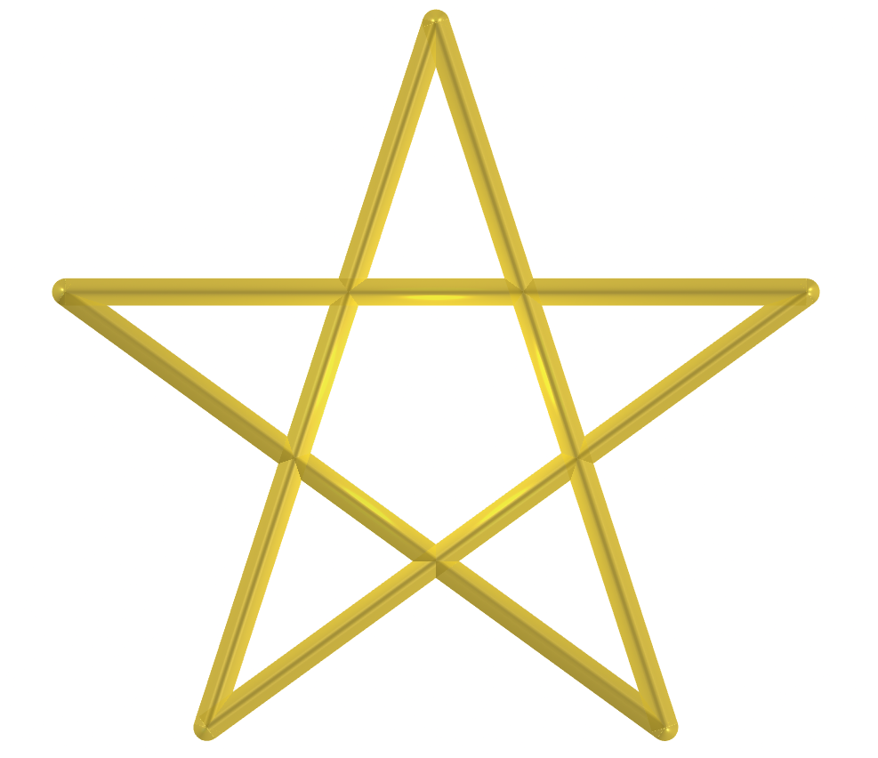</a>
     In Sacred Geometry, the pentagram (five-pointed star) represents the union of the five elements: air, fire, water, earth and spirit. This symbol is also linked to the golden ratio and is considered a symbol of balance, harmony and spiritual mastery. The golden ratio is believed to represent a divine proportion and a harmonious relationship between different parts of a whole. The pentagram and the hexagram have been used in various religious and spiritual practices, representing harmony, balance, and the union of opposites.
    
 

 <h4>52. Hexagram</h4>

     In Sacred Geometry, the hexagram (six-pointed star) symbolizes the union of opposites and cosmic balance. It's formed by two interlocking equilateral triangles, one pointing up and the other down, often representing the masculine and feminine, or earth and sky, in harmonious balance. The hexagram is found in various religious traditions, including Jewish, Islamic, and Indic (Hindu, Buddhist, Jain). The pentagram and the hexagram have been used in various religious and spiritual practices, representing harmony, balance, and the union of opposites.
    
 

<h4>53. Heptagram Grid</h4>

     The heptagram, or seven-pointed star, has many sacred meanings in various belief systems, including Christianity, Judaism, Islam, alchemy, and paganism. In Christianity, the heptagram symbolizes the seven days of creation, perfection, and God, and is considered a traditional symbol for warding off evil. In Judaism, the heptagram represents the seventh sphere of the Tree of Life of Kabbalistic Judaism. By considering the combinations of 3 by 3 and 2 by 2 vertices, we create the Heptagram Grid.
    
 

<h4>54. Octagram Grid</h4>
<a href="vr/GridOctagram.htm" target="_blank" title="3D model" class="fotoA">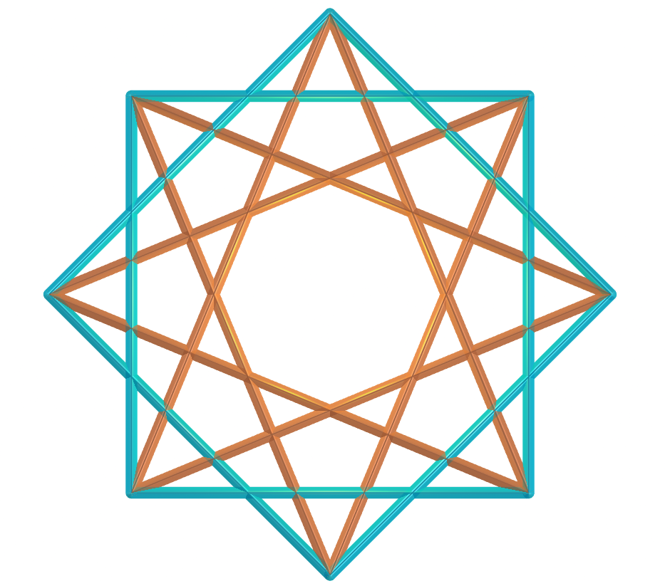</a>
     In Sacred Geometry, the octagon and the star-shaped octogram symbolize the union of the circle and the square, which represent heaven and earth, respectively. These shapes are believed to balance and unify the two entities. The octagon symbolizes protection, good fortune, and rebirth. The eight-pointed star symbolizes celestial entities such as the moon, sun, planets, stars, and comets. Considering the 3 by 3 and 2 by 2 vertex combinations, we created the Octagram Grid.
    
 

<h4>55. Enneagram Grid</h4>

     The enneagram is a symbol often considered Sacred Geometry, as it integrates geometric shapes and laws with the idea of ​​personality types. Formed by three overlapping triangles, it can represent a trinity of trinities, a symbol of holiness or spiritual wholeness. We can also use an enneagram as a symbol of universal wholeness. The enneagram is used in personal growth, therapy, spirituality, education, and business. By considering the combinations of 4 by 4, 3 by 3 and 2 by 2 vertices, we create the Enneagram Grid.
    
 

<h4>56. Decagram Grid</h4>

     In Sacred Geometry, the decagram, or 10-pointed star, symbolizes the union of opposites, new beginnings, and the ten Sephirot of Kabbalah. It is composed of two overlapping pentagrams. Geometric shapes in Sacred Geometry, such as the decagon, embody principles of mathematical harmony, proportion, and symmetry. These principles often reflect the order and balance of the universe. By considering the combinations of 4 by 4, 3 by 3 and 2 by 2 vertices, we create the Decagram Grid.
    
 

<h4>57. Undecagram Grid</h4>

     The undecagram, also called the hendecagram, is a symbol that has been used on jewelry, necklaces and other items, and can be associated with various symbolic meanings, including balance, truth, and the archangel Uriel. In this symbol, we can see pentagrams superimposed on hexagrams. While not as prominent as other shapes like the hexagon or triangle, the hendecagram's unique eleven sides can represent a sense of completeness or interconnectedness, with the number 11 often associated with enlightenment and divine guidance. By considering the combinations of 5 by 5, 4 by 4, 3 by 3 and 2 by 2 vertices, we create the Undecagram Grid.
    
 

<h4>58. Dodecagram Grid</h4>
<a href="vr/GridDodecagram.htm" target="_blank" title="3D model" class="fotoA">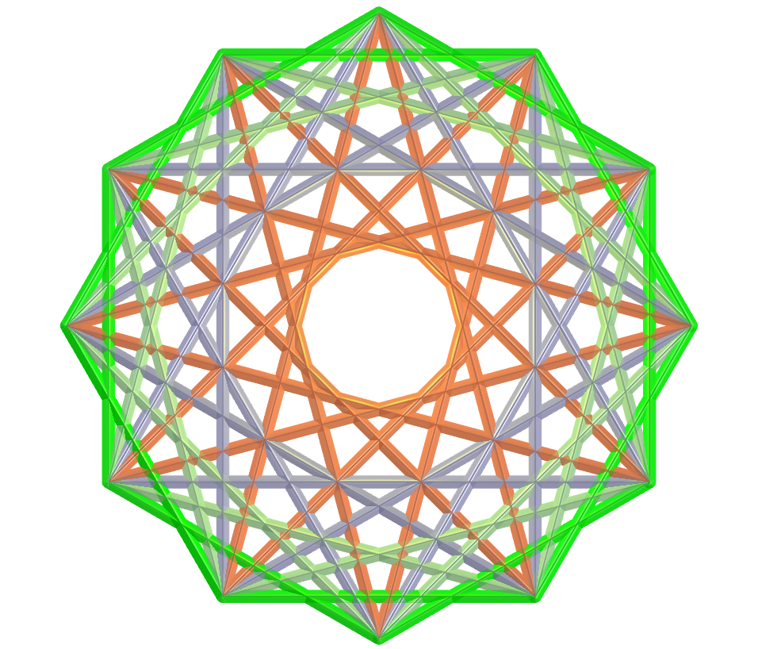</a>
     In Sacred Geometry, the dodecagram, or 12-pointed star, symbolizes creation, balance, harmony, and the cyclical nature of existence. This symbol has been used in many belief systems, including Judaism and Christianity. In Judaism, the dodecagram symbolizes the 12 tribes of Israel. In Christianity, the dodecagram symbolizes the 12 disciples. The dodecagram is an ancient symbol with many meanings. By considering the combinations of 5 by 5, 4 by 4, 3 by 3 and 2 by 2 vertices, we create the Dodecagram Grid.
    
 

<h4>59. Dodecagram Grid 3D</h4>
<a href="vr/GridDodecagramv1.htm" target="_blank" title="3D model" class="fotoA">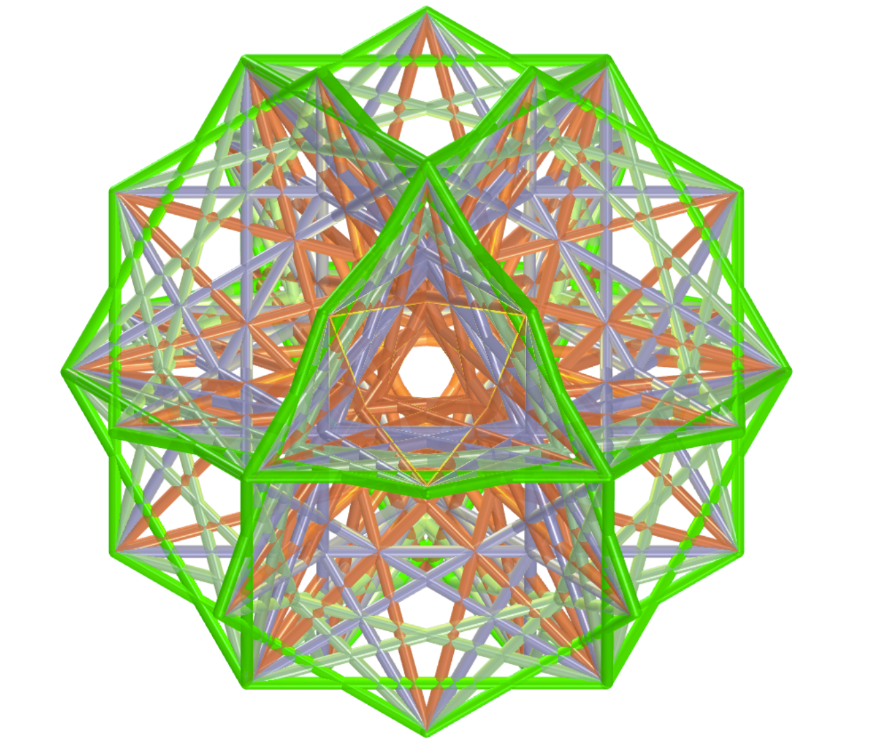</a>
     This symbol has been used in many belief systems, including Judaism and Christianity. In Judaism, the dodecagram symbolizes the 12 tribes of Israel. In Christianity, the dodecagram symbolizes the 12 disciples. The dodecagram is an ancient symbol with many meanings. By considering the combinations of 5 by 5, 4 by 4, 3 by 3 and 2 by 2 vertices, we create the Dodecagram Grid. In Sacred Geometry, the dodecagram, or 12-pointed star, symbolizes creation, balance, harmony, and the cyclical nature of existence.
    
 

<h4>60. Fractal Pentagram</h4>

     In Sacred Geometry, the pentagram (five-pointed star) represents the union of the five elements: air, fire, water, earth and spirit. This symbol is also linked to the golden ratio and is considered a symbol of balance, harmony and spiritual mastery. The golden ratio is believed to represent a divine proportion and a harmonious relationship between different parts of a whole. The pentagram and the hexagram have been used in various religious and spiritual practices, representing harmony, balance, and the union of opposites.
    
 
<a href="#p1" class="topo">back to top</a>

 

<h4>61. Fractal Pentagram v2</h4>

     The golden ratio is believed to represent a divine proportion and a harmonious relationship between different parts of a whole. The pentagram and the hexagram have been used in various religious and spiritual practices, representing harmony, balance, and the union of opposites. In Sacred Geometry, the pentagram (five-pointed star) represents the union of the five elements: air, fire, water, earth and spirit. This symbol is also linked to the golden ratio and is considered a symbol of balance, harmony and spiritual mastery.
    
 

 <h4>62. Fractal Pentagram v3</h4>

     The pentagram and the hexagram have been used in various religious and spiritual practices, representing harmony, balance, and the union of opposites. In Sacred Geometry, the pentagram (five-pointed star) represents the union of the five elements: air, fire, water, earth and spirit. This symbol is also linked to the golden ratio and is considered a symbol of balance, harmony and spiritual mastery. The golden ratio is believed to represent a divine proportion and a harmonious relationship between different parts of a whole.
    
 

<h4>63. Pentagram</h4>

     In Sacred Geometry, the pentagram (five-pointed star) represents the union of the five elements: air, fire, water, earth and spirit. This symbol is also linked to the golden ratio and is considered a symbol of balance, harmony and spiritual mastery. The golden ratio is believed to represent a divine proportion and a harmonious relationship between different parts of a whole. The pentagram and the hexagram have been used in various religious and spiritual practices, representing harmony, balance, and the union of opposites.
    
 

 <h4>64. Pentagram and the Golden Spiral</h4>

    We define that the numbers <b>a</b> and <b>b</b> are in the golden ratio when <b>(a + b) / a = a / b = &Phi;</b>. Putting this ratio in two dimensions, we can construct golden triangles (or rectangles), where their sides are in the golden ratio.  This term was introduced by Leonardo da Vinci as a proportion of "ideal perfect body" and appears in the petals of various flowers, sunflower seed arrangements, pine cone patterns and romanesco broccoli. This proportion is not just a mathematical notion, but also a symbol of beauty, harmony and perfection in art, science and nature.
   
 

<h4>65. Pentagram and the Golden Spiral</h4>

     The golden ratio is believed to represent a divine proportion and a harmonious relationship between different parts of a whole. The pentagram and the hexagram have been used in various religious and spiritual practices, representing harmony, balance, and the union of opposites. In Sacred Geometry, the pentagram (five-pointed star) represents the union of the five elements: air, fire, water, earth and spirit. This symbol is also linked to the golden ratio and is considered a symbol of balance, harmony and spiritual mastery.
    
 

<h4>66. Pentagram and the Golden Spiral v2</h4>

     In Sacred Geometry, the pentagram (five-pointed star) represents the union of the five elements: air, fire, water, earth and spirit. This symbol is also linked to the golden ratio and is considered a symbol of balance, harmony and spiritual mastery. The golden ratio is believed to represent a divine proportion and a harmonious relationship between different parts of a whole. The pentagram and the hexagram have been used in various religious and spiritual practices, representing harmony, balance, and the union of opposites. 
    

<h4>67. Fractal Pentagram and the Golden Spiral</h4>

     The pentagram and the hexagram have been used in various religious and spiritual practices, representing harmony, balance, and the union of opposites. In Sacred Geometry, the pentagram (five-pointed star) represents the union of the five elements: air, fire, water, earth and spirit. This symbol is also linked to the golden ratio and is considered a symbol of balance, harmony and spiritual mastery. The golden ratio is believed to represent a divine proportion and a harmonious relationship between different parts of a whole.
    
 

 <h4>68. Fractal Pentagram and the Golden Spiral v2</h4>
<a href="vr/Pentagram6a.htm" target="_blank" title="3D model" class="fotoA">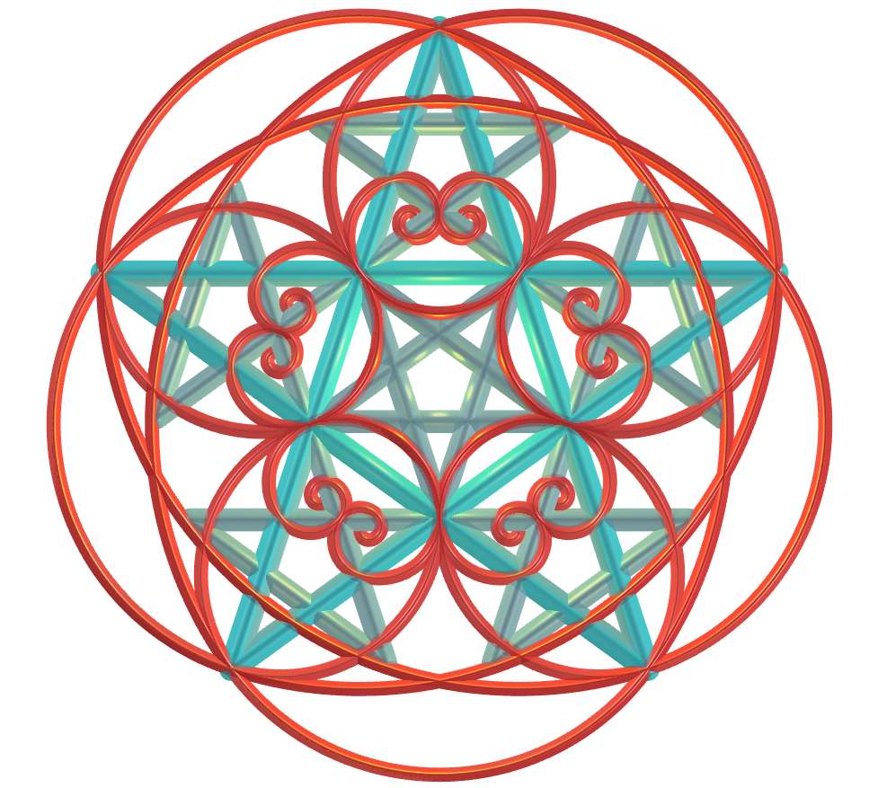</a>
     In Sacred Geometry, the pentagram (five-pointed star) represents the union of the five elements: air, fire, water, earth and spirit. The pentagram and the hexagram have been used in various religious and spiritual practices, representing harmony, balance, and the union of opposites. This symbol is also linked to the golden ratio and is considered a symbol of balance, harmony and spiritual mastery. The golden ratio is believed to represent a divine proportion and a harmonious relationship between different parts of a whole.
    
 

<h4>69. Curved Pentagram</h4>

     In Sacred Geometry, the pentagram (five-pointed star) represents the union of the five elements: air, fire, water, earth and spirit. This symbol is also linked to the golden ratio and is considered a symbol of balance, harmony and spiritual mastery. The golden ratio is believed to represent a divine proportion and a harmonious relationship between different parts of a whole. The pentagram and the hexagram have been used in various religious and spiritual practices, representing harmony, balance, and the union of opposites.
    
 

<h4>70. Pentagram</h4>

     This symbol is also linked to the golden ratio and is considered a symbol of balance, harmony and spiritual mastery. The golden ratio is believed to represent a divine proportion and a harmonious relationship between different parts of a whole. The pentagram and the hexagram have been used in various religious and spiritual practices, representing harmony, balance, and the union of opposites. In Sacred Geometry, the pentagram (five-pointed star) represents the union of the five elements: air, fire, water, earth and spirit.
    
 
<a href="#p1" class="topo">back to top</a>

 

<h4>71. Fractal Pentagram v3</h4>

     The golden ratio is believed to represent a divine proportion and a harmonious relationship between different parts of a whole. The pentagram and the hexagram have been used in various religious and spiritual practices, representing harmony, balance, and the union of opposites. In Sacred Geometry, the pentagram (five-pointed star) represents the union of the five elements: air, fire, water, earth and spirit. This symbol is also linked to the golden ratio and is considered a symbol of balance, harmony and spiritual mastery.
    
 

<h4>72. Fractal Pentagram v4</h4>

     The pentagram and the hexagram have been used in various religious and spiritual practices, representing harmony, balance, and the union of opposites. In Sacred Geometry, the pentagram (five-pointed star) represents the union of the five elements: air, fire, water, earth and spirit. This symbol is also linked to the golden ratio and is considered a symbol of balance, harmony and spiritual mastery. The golden ratio is believed to represent a divine proportion and a harmonious relationship between different parts of a whole.
    
 

<h4>73. Venus Flower</h4>
<a href="vr/VenusFlower.htm" target="_blank" title="3D model" class="fotoA">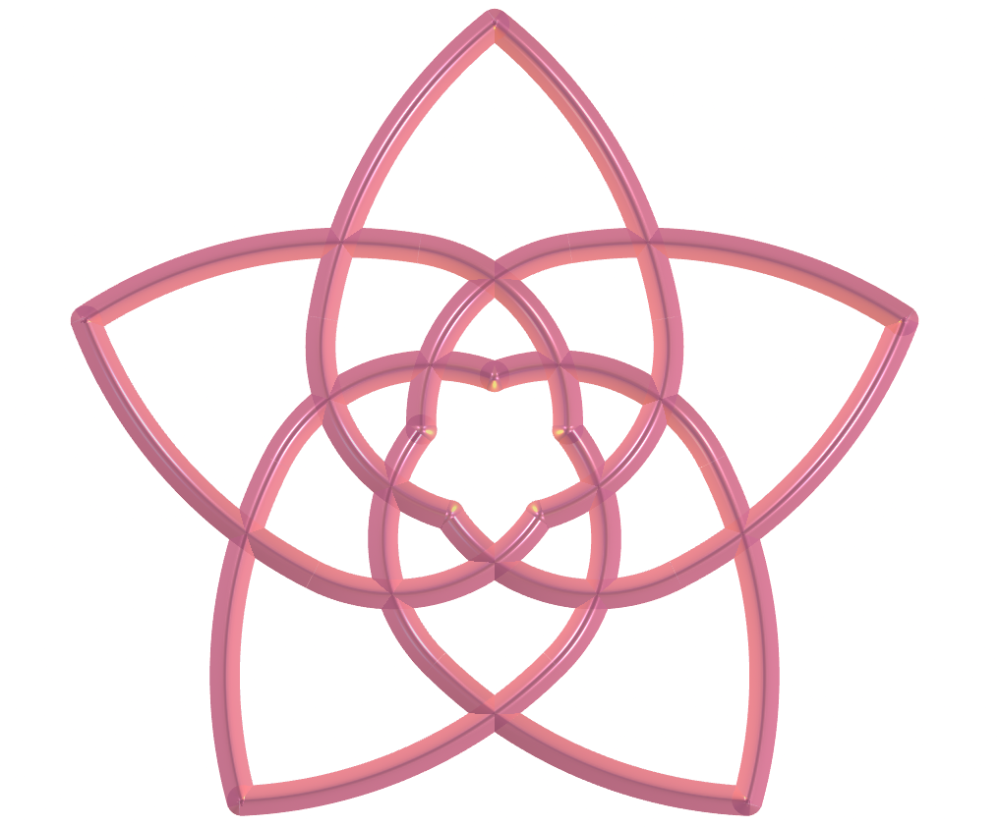</a>
     The Venus Flower, also known as the Rose of Venus or the Pentagram of Venus, is a symbol of Sacred Geometry determined by the orbits of the planets Venus and Earth around the Sun. This pattern, observable over a period of 8 years, visually resembles a five-petaled rose and is associated with love, beauty and harmony. The Venus Flower is a symbol of love, beauty, and the interconnectedness of the cosmos. Each petal is said to represent a stage on the path to all-encompassing love. 
    

<h4>74. Venus Flower v1</h4>

     Each petal is said to represent a stage on the path to all-encompassing love. The Venus Flower, also known as the Rose of Venus or the Pentagram of Venus, is a symbol of Sacred Geometry determined by the orbits of the planets Venus and Earth around the Sun. This pattern, observable over a period of 8 years, visually resembles a five-petaled rose and is associated with love, beauty and harmony. The Venus Flower is a symbol of love, beauty, and the interconnectedness of the cosmos. 
    
 

<h4>75. Venus Flower v2</h4>

     This pattern, observable over a period of 8 years, visually resembles a five-petaled rose and is associated with love, beauty and harmony. The Venus Flower is a symbol of love, beauty, and the interconnectedness of the cosmos. Each petal is said to represent a stage on the path to all-encompassing love. The Venus Flower, also known as the Rose of Venus or the Pentagram of Venus, is a symbol of Sacred Geometry determined by the orbits of the planets Venus and Earth around the Sun.
    
 

<h4>76. Pentagram</h4>
<a href="vr/Pentagram11.htm" target="_blank" title="3D model" class="fotoA">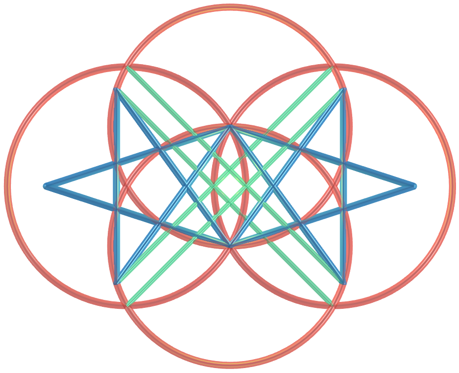</a>
     The golden ratio is believed to represent a divine proportion and a harmonious relationship between different parts of a whole. The pentagram and the hexagram have been used in various religious and spiritual practices, representing harmony, balance, and the union of opposites. In Sacred Geometry, the pentagram (five-pointed star) represents the union of the five elements: air, fire, water, earth and spirit. This symbol is also linked to the golden ratio and is considered a symbol of balance, harmony and spiritual mastery.
    
 

<h4>77. Triangles</h4>

     In Sacred Geometry, triangles represent balance, harmony, and the intersection of three principles. Upward-facing triangles symbolize the elevation of consciousness, while inverted triangles represent feminine energy and reproduction. Triangles are believed to embody divine creation and balance, often associated with the Taoist concept of unity unfolding into duality. This symbol shows a spiral made of equilateral triangles, forming a kind of hyperboloid.
    
 

<h4>78. Squares</h4>

     In Sacred Geometry, the square is considered a fundamental shape associated with stability, anchoring, and the four elements of nature. The square represents the fixed nature of matter and the foundations of physical reality. The four sides of a square are often associated with the four cardinal points, the four seasons, and the four Aristotelian elements (earth, water, air, and fire). This symbol represents a spiral composed of squares, forming a kind of hyperboloid.
    
 

<h4>79. Pentagons</h4>

     In Sacred Geometry, pentagons, particularly the pentagram (the star formed by connecting the diagonals of a pentagon), symbolize fivefold symmetry and often represent harmony, unity, and the interconnectedness of things. Pentagons are also associated with the golden ratio and the Fibonacci sequence, which are considered fundamental principles of nature and the universe. This symbol represents a spiral composed of regular pentagons, forming a kind of hyperboloid.
    
 

<h4>80. Hexagons</h4>

     In Sacred Geometry, hexagons are often seen as symbols of balance, harmony, and the potential of life. Their symmetrical shape, with six equal sides and angles, represents stability and balance. Hexagons are also associated with the Flower of Life and the six-pointed star (Merkabah), both symbols of interconnection and divine creation. This symbol represents a spiral composed of regular hexagons, forming a kind of hyperboloid.
    
 
<a href="#p1" class="topo">back to top</a>

 

<h4>81. Heptagons</h4>

     In Sacred Geometry, heptagons are associated with concepts such as the seven chakras, the seven days of the week or the seven heavens, depending on the interpretation. Heptagrams (seven-pointed stars formed by the extension of the sides of a heptagon) also have symbolic meaning, with different types of triangles and proportions related to their angles. This symbol represents a spiral composed of regular heptagons, forming a kind of hyperboloid.
    
 

<h4>82. Octagons</h4>

     In Sacred Geometry, the octagon is always seen as a symbol of unity and balance, arising from the combination of the circle (which represents the sky) and the square (which represents the earth). The octagon is believed to connect and harmonize these two elements. The octagon also has several symbolic meanings in different cultures and religions, including completeness, good luck and protection. This symbol represents a spiral composed of regular octagons, forming a kind of hyperboloid.
    
 

<h4>83. Enneagons</h4>

     In Sacred Geometry, an enneagon is a geometric shape that symbolizes unity, completeness, balance, and the culmination of a cycle. It can also be represented as a nine-pointed star, known as an enneagram. The enneagon, along with other shapes such as the centered octogram, is used in various symbolic and spiritual interpretations within Sacred Geometry. This symbol represents a spiral composed of regular enneagons, forming a kind of hyperboloid.
    
 

<h4>84. Decagons</h4>

     In Sacred Geometry, a decagon symbolizes balance, harmony, and the interconnectedness of the universe. It is a more complex shape than some others, such as the pentagon, offering a richer symbolic landscape. The ten sides of the decagon can represent the ten commandments, the ten realms of the soul, or the ten fingers and toes of the human form, suggesting a connection between the spiritual and physical worlds. This symbol represents a spiral composed of regular decagons, forming a kind of hyperboloid.
    

<h4>85. Hypercube</h4>

     A hypercube, also known as an octacoron or tesseract, is a geometric shape that can be visualized as a cube that extends beyond our three-dimensional reality. In Sacred Geometry, the hypercube is seen as a symbol of the union of matter and energy, representing the fourth dimension, the expansion of consciousness, and the connection to dimensions beyond our three-dimensional understanding. A hypercube is formed by eight interconnected cubes and can be represented by joining the vertices of two parallel cubes.
    
 

<h4>86. Hypercube 3D</h4>

     In Sacred Geometry, the hypercube is seen as a symbol of the union of matter and energy, representing the fourth dimension, the expansion of consciousness, and the connection to dimensions beyond our three-dimensional understanding. A hypercube is formed by eight interconnected cubes and can be represented by joining the vertices of two parallel cubes. A hypercube, also known as an octacoron or tesseract, is a geometric shape that can be visualized as a cube that extends beyond our three-dimensional reality.
    
 

<h4>87. Hypercube 3D v1</h4>

     A hypercube is formed by eight interconnected cubes and can be represented by joining the vertices of two parallel cubes. A hypercube, also known as an octacoron or tesseract, is a geometric shape that can be visualized as a cube that extends beyond our three-dimensional reality. In Sacred Geometry, the hypercube is seen as a symbol of the union of matter and energy, representing the fourth dimension, the expansion of consciousness, and the connection to dimensions beyond our three-dimensional understanding.
    
 

<h4>88. Hypercube 3D v2</h4>

     A hypercube, also known as an octacoron or tesseract, is a geometric shape that can be visualized as a cube that extends beyond our three-dimensional reality. In Sacred Geometry, the hypercube is seen as a symbol of the union of matter and energy, representing the fourth dimension, the expansion of consciousness, and the connection to dimensions beyond our three-dimensional understanding. A hypercube is formed by eight interconnected cubes and can be represented by joining the vertices of two parallel cubes.
    

<h4>89. Sahasrara Yantra</h4>

   The Sahasrara Yantra, often called the Crown Chakra Yantra, is a Sacred Geometry symbol that represents the Sahasrara chakra: the seventh and highest chakra in the chakra system. It is a powerful symbol that can raise energy, create sacred space, and support meditation and yoga practices. The Sahasrara Yantra is often depicted as a lotus flower with over a thousand petals, symbolizing pure consciousness and enlightenment.
  The models are represented in the following versions: <a href="vr/SahasraraYantra.htm" target="_blank">Triangle</a>&nbsp;&nbsp;|&nbsp;&nbsp;<a href="vr/SahasraraYantra3D1.htm" target="_blank">Tetrahedron</a>&nbsp;&nbsp;|&nbsp;&nbsp;<a href="vr/SahasraraYantra3D2.htm" target="_blank">Triakis Tetrahedron</a>&nbsp;&nbsp;|&nbsp;&nbsp;<a href="vr/SahasraraYantra3D3.htm" target="_blank">Chamfered Tetrahedron</a>&nbsp;&nbsp;|&nbsp;&nbsp;<a href="vr/SahasraraYantra3D4.htm" target="_blank">Hexakis Tetrahedron 1</a>&nbsp;&nbsp;|&nbsp;&nbsp;<a href="vr/SahasraraYantra3D5.htm" target="_blank">Hexakis Tetrahedron 2</a>&nbsp;&nbsp;|&nbsp;&nbsp;<a href="vr/SahasraraYantra3D6.htm" target="_blank">Hexakis Tetrahedron 3</a>&nbsp;&nbsp;|&nbsp;&nbsp;<a href="vr/SahasraraYantra3D7.htm" target="_blank">Hexakis Tetrahedron 4</a>&nbsp;&nbsp;|&nbsp;&nbsp;<a href="vr/SahasraraYantra3D8.htm" target="_blank">Joined Truncated Tetrahedron</a>&nbsp;&nbsp;|&nbsp;&nbsp;<a href="vr/SahasraraYantra3D9.htm" target="_blank">Möbius Deltahedron</a>&nbsp;&nbsp;|&nbsp;&nbsp;<a href="vr/SahasraraYantra3D10.htm" target="_blank">Möbius Deltahedron Dual</a>&nbsp;&nbsp;|&nbsp;&nbsp;<a href="vr/SahasraraYantra3D11.htm" target="_blank">Tetartoid</a>&nbsp;&nbsp;|&nbsp;&nbsp;<a href="vr/SahasraraYantra3D12.htm" target="_blank">Trapezohedral Tristetrahedron 1</a>&nbsp;&nbsp;|&nbsp;&nbsp;<a href="vr/SahasraraYantra3D13.htm" target="_blank">Trapezohedral Tristetrahedron 2</a>&nbsp;&nbsp;|&nbsp;&nbsp;<a href="vr/SahasraraYantra3D14.htm" target="_blank">Truncated Tetrahedron</a>
  
 

<h4>90. Sahasrara Yantra 3D</h4>

   The Sahasrara Yantra is often depicted as a lotus flower with over a thousand petals, symbolizing pure consciousness and enlightenment. The Sahasrara Yantra, often called the Crown Chakra Yantra, is a Sacred Geometry symbol that represents the Sahasrara chakra: the seventh and highest chakra in the chakra system. It is a powerful symbol that can raise energy, create sacred space, and support meditation and yoga practices.
  The models are represented in the following versions: <a href="vr/SahasraraYantra3D1c.htm" target="_blank">Tetrahedron</a>&nbsp;&nbsp;|&nbsp;&nbsp;<a href="vr/SahasraraYantra3D2c.htm" target="_blank">Triakis Tetrahedron</a>&nbsp;&nbsp;|&nbsp;&nbsp;<a href="vr/SahasraraYantra3D3c.htm" target="_blank">Chamfered Tetrahedron</a>&nbsp;&nbsp;|&nbsp;&nbsp;<a href="vr/SahasraraYantra3D4c.htm" target="_blank">Hexakis Tetrahedron 1</a>&nbsp;&nbsp;|&nbsp;&nbsp;<a href="vr/SahasraraYantra3D5c.htm" target="_blank">Hexakis Tetrahedron 2</a>&nbsp;&nbsp;|&nbsp;&nbsp;<a href="vr/SahasraraYantra3D6c.htm" target="_blank">Hexakis Tetrahedron 3</a>&nbsp;&nbsp;|&nbsp;&nbsp;<a href="vr/SahasraraYantra3D7c.htm" target="_blank">Hexakis Tetrahedron 4</a>&nbsp;&nbsp;|&nbsp;&nbsp;<a href="vr/SahasraraYantra3D8c.htm" target="_blank">Joined Truncated Tetrahedron</a>&nbsp;&nbsp;|&nbsp;&nbsp;<a href="vr/SahasraraYantra3D9c.htm" target="_blank">Möbius Deltahedron</a>&nbsp;&nbsp;|&nbsp;&nbsp;<a href="vr/SahasraraYantra3D10c.htm" target="_blank">Möbius Deltahedron Dual</a>&nbsp;&nbsp;|&nbsp;&nbsp;<a href="vr/SahasraraYantra3D11c.htm" target="_blank">Tetartoid</a>&nbsp;&nbsp;|&nbsp;&nbsp;<a href="vr/SahasraraYantra3D12c.htm" target="_blank">Trapezohedral Tristetrahedron 1</a>&nbsp;&nbsp;|&nbsp;&nbsp;<a href="vr/SahasraraYantra3D13c.htm" target="_blank">Trapezohedral Tristetrahedron 2</a>&nbsp;&nbsp;|&nbsp;&nbsp;<a href="vr/SahasraraYantra3D14c.htm" target="_blank">Truncated Tetrahedron</a>
  

<a href="#p1" class="topo">back to top</a>

  Sacred Geometry - Visualization of symbols with Augmented Reality and Virtual Reality by <a xmlns:cc="http://creativecommons.org/ns#" href="https://paulohscwb.github.io/SacredGeometry/symbols/" property="cc:attributionName" rel="cc:attributionURL">Paulo Henrique Siqueira</a> is licensed with a license <a rel="license" href="http://creativecommons.org/licenses/by-nc-nd/4.0/">Creative Commons Attribution-NonCommercial-NoDerivatives 4.0 International</a>.

<h4>How to cite this work:</h4> 

Siqueira, P.H., "Sacred Geometry: Visualization of symbols with Augmented Reality and Virtual Reality". Available in: <https://paulohscwb.github.io/SacredGeometry/symbols/>, May 2024.

  <b>References:</b>
 Pardesco. "Sacred Geometry Art, Symbols & Meanings". <a href="https://pardesco.com/blogs/news/sacred-geometry-art-symbols-meanings" target="_blank">https://pardesco.com/blogs/news/sacred-geometry-art-symbols-meanings</a>
 Weisstein, Eric W. "Platonic Solid" From MathWorld-A Wolfram Web Resource. <a href="http://mathworld.wolfram.com/PlatonicSolid.html" target="_blank">http://mathworld.wolfram.com/PlatonicSolid.html</a>
 Weisstein, Eric W. "Polyhedra" From MathWorld-A Wolfram Web Resource. <a href="https://mathworld.wolfram.com/topics/Polyhedra.html" target="_blank">https://mathworld.wolfram.com/topics/Polyhedra.html</a>
 Solar System Scope. "Solar Textures: Stars and Milky Way". <a href="https://www.solarsystemscope.com/textures/" target="_blank">https://www.solarsystemscope.com/textures/</a>
 McCooey, D. I. "Visual Polyhedra". <a href="http://dmccooey.com/polyhedra/" target="_blank">http://dmccooey.com/polyhedra/</a>
