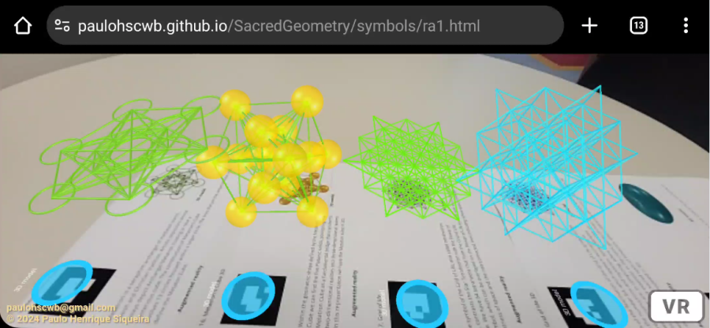
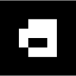
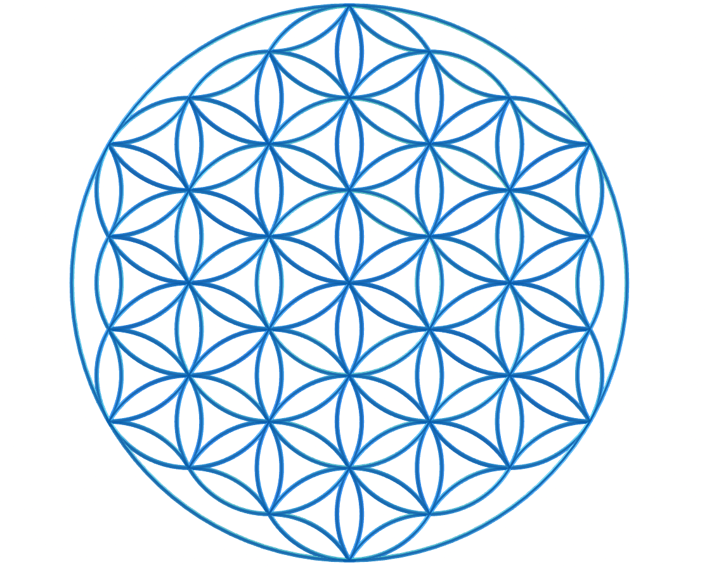
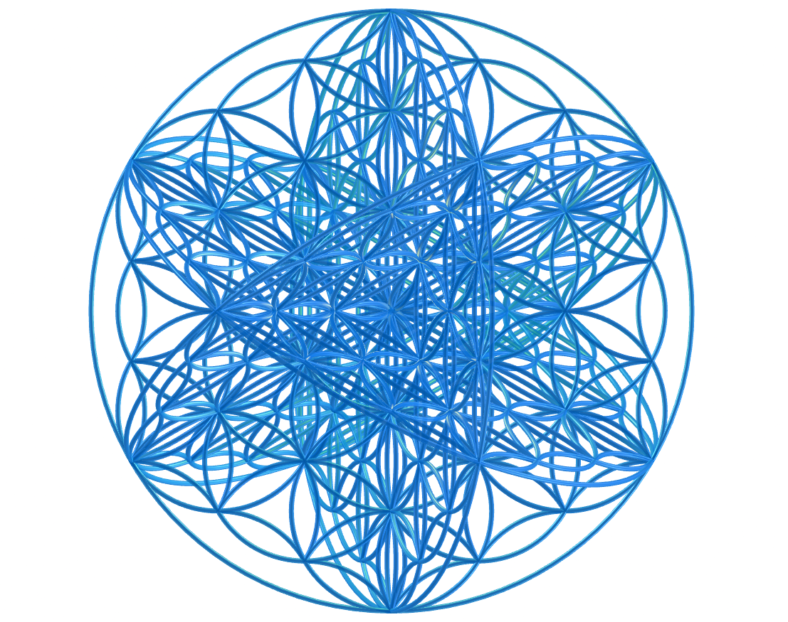
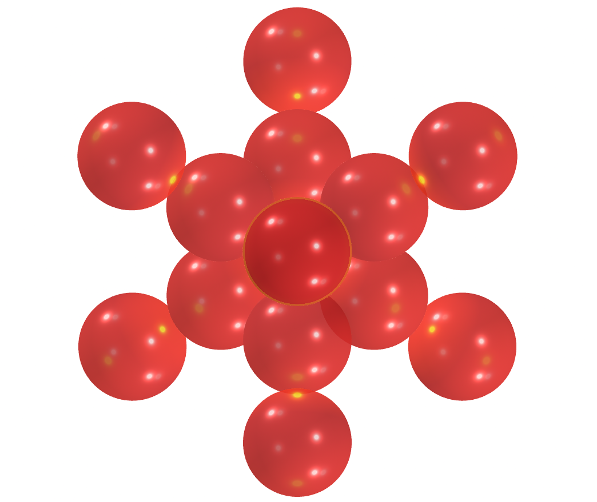
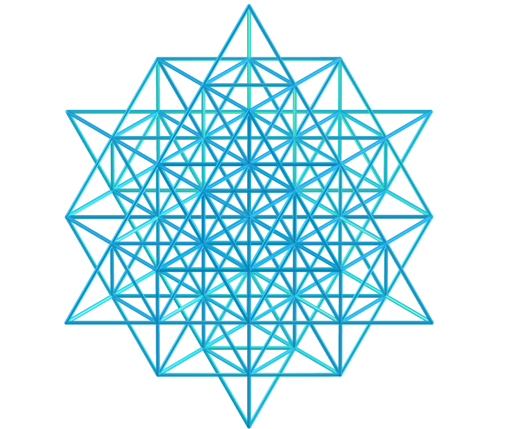
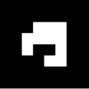
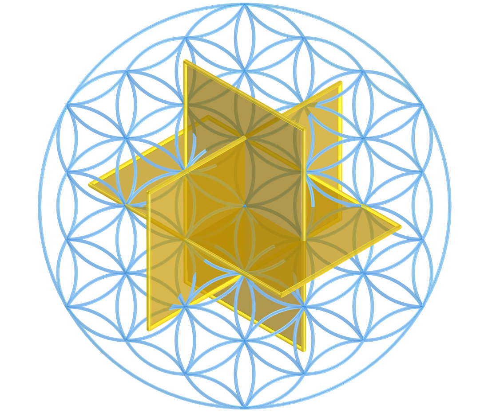
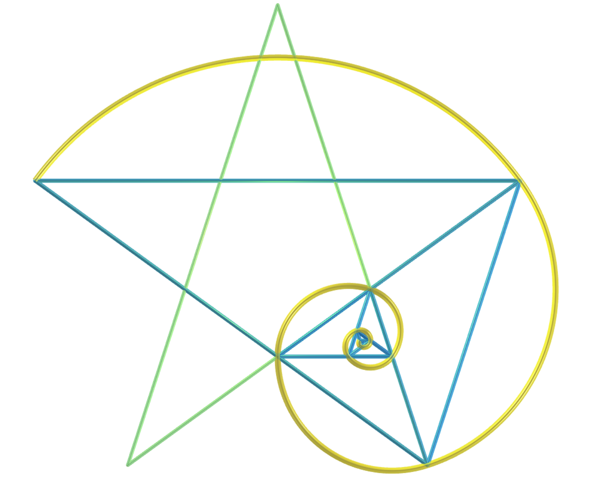
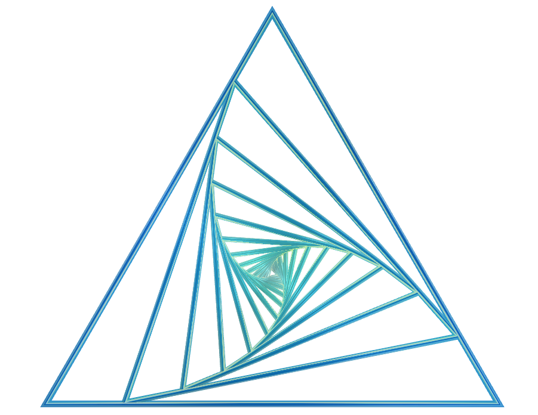

<link rel="stylesheet" href="../../scripts/style.css">
<meta charset="utf-8">
<link rel="icon" type="image/png" href="../vr/salas/imagens/icone.png">
<h2>Geometria Sagrada: visualização de símbolos com Realidade Aumentada (RA) e Realidade Virtual (RV) em A-frame</h2>
<b>autor:</b> Paulo Henrique Siqueira - Universidade Federal do Paraná
 <b>contato:</b> <a href="#"> paulohscwb@gmail.com </a>
 <a href="https://paulohscwb.github.io/SacredGeometry/symbols/">english version</a>
<form style="margin: 0 auto; float:right; text-align:right; width:100%; margin-bottom:15px;">
	<select id="url" onchange="urlHandler(this.value)" style="color:royalblue;">
		<option disabled selected>Mais símbolos:</option>
		<option disabled value="../../symbols/pt-br/">Símbolos da Geometria Sagrada</option>
		<option value="../../flower/pt-br/">Flor da vida e os poliedros de Platão e de Arquimedes</option>
		<option value="../../fruit/pt-br/">Fruto da vida e os poliedros de Platão e de Arquimedes</option>
		<option value="../../grid/pt-br/">Grade da vida e os poliedros de Platão e de Arquimedes</option>
		<option value="../../metatron/pt-br/">Metatron e os poliedros de Platão e de Arquimedes</option>
	</select>
</form>

  <h2 align="center"> Símbolos da Geometria Sagrada</h2>
  As estruturas matemáticas utilizadas na Geometria Sagrada podem ser encontradas nas artes, arquitetura e até em nosso DNA. Estas estruturas estão em toda parte, e servem de ligação entre o pensamento analítico e o lado intuitivo, ou então entre a ciência e a espiritualidade.
Este trabalho mostra os símbolos da Geometria Sagrada modelados em 2D e 3D, com as visualizações que podem ser acessadas com os recursos de Realidade Aumentada e também em salas imersivas de Realidade Virtual.

 
<a href="#ra">Realidade Aumentada</a>&nbsp;&nbsp;|&nbsp;&nbsp;<a href="#m3d">Modelos 3D</a>&nbsp;&nbsp;|&nbsp;&nbsp;<a href="../../pt-br/">Página Inicial</a>

 <h3 align="center">Salas imersivas</h3>
  
<iframe width="100%" src="../sala.htm" title="Sala Imersiva dos símbolos da Geometria Sagrada" frameborder="0" loading="lazy"></iframe>

 
<a href="../sala.htm" target="_blank">&#x1f517; sala 1</a>&nbsp;&nbsp;|&nbsp;&nbsp;<a href="../sala1.htm" target="_blank">&#x1f517; sala 2</a>&nbsp;&nbsp;|&nbsp;&nbsp;<a href="../sala2.htm" target="_blank">&#x1f517; sala 3</a>&nbsp;&nbsp;|&nbsp;&nbsp;<a href="../sala3.htm" target="_blank">&#x1f517; sala 4</a>&nbsp;&nbsp;|&nbsp;&nbsp;<a href="../sala4.htm" target="_blank">&#x1f517; sala 5</a>

  

  

  <h3 id="ra" align="center">Realidade Aumentada</h3>
  Para visualizar os símbolos da Geometria Sagrada em RA, visite as páginas indicadas nos modelos 3D dos sólidos utilizando qualquer navegador com um dispositivo de webcam (smartphone, tablet ou notebook).
 O acesso às páginas de RV é feito clicando no círculo azul que aparece em cima de cada marcador.

<h3 id="m3d" align="center">Modelos 3D</h3>
<iframe width="560" height="315" style="max-width:100%" src="https://www.youtube.com/embed/videoseries?list=PLy0I_lGW8HxXqLmyaITBm0flxwtDvgTFT" title="YouTube video player" frameborder="0" allow="accelerometer; autoplay; clipboard-write; encrypted-media; gyroscope; picture-in-picture; web-share" allowfullscreen></iframe>
<h4>1. Vesica Piscis</h4>

    Trata-se de uma forma geométrica criada pela interseção de dois círculos idênticos, onde o centro de cada círculo fica no perímetro do outro. A vesica piscis é usada em Diagramas de Venn e selos emblemáticos e possui significados simbólicos como o "peixe de Jesus", a intrincada Triquetra que aparece na arte Celta, o triângulo de Reuleaux e a Mandorla que simboliza a união dos opostos e a interseção dos reinos terrestre e celestial.
    

<h4>2. Vesica Piscis 3D</h4>

    Nesta representação em 3D temos o modelo com 8 círculos em torno do menor círculo. Estes círculos representam seções planas das esferas que simbolizam a extensão da Vesica Piscis para 3 dimensões.
    

<h4>3. Semente da vida</h4>

    A Geometria Sagrada está centrada no símbolo composto por 7 círculos entrelaçados, denominado Semente da Vida. Trata-se de uma representação que significa os 7 dias em que o mundo foi criado, e que aparece em muitas construções e em textos religiosos. Cada círculo sobreposto significa um ciclo ou uma célula interligando processos vitais.
    

<h4>4. Semente da vida 3D v1</h4>

    Este símbolo tem sido usado com reverência e seu design confere uma sensação de proteção. Muitos usam como joias ou em decoração acreditando que traz positividade, afastando coisas negativas. Nesta representação temos o modelo em 3D construído com 3 rotações em torno de um dos modelos.
    

<h4>5. Semente da vida 3D v2</h4>

    Este símbolo aparece também em algumas tapeçarias e ruínas de templos antigos, significando o design do universo. Nesta representação temos o modelo em 3D construído com os círculos formando 2 calotas esféricas.
    

<h4>6. Semente da vida 3D v3</h4>

    Cada círculo sobreposto deste símbolo significa um ciclo ou uma célula interligando processos vitais. Nesta representação temos o modelo em 3D construído com 6 círculos rotacionados em torno de eixos que passam pelo círculo central.
    

<h4>7. Ovo da vida</h4>

    É considerado como o estágio central na sequência tranformadora da evolução e está associado às noções de renascimento e fertilidade. O Ovo da Vida é uma evolução da Semente da Vida: adicionando-se 6 círculos à Semente fundamental temos o símbolo do Ovo da Vida.
    

<h4>8. Ovo da vida 3D</h4>

    Analisando-se outra dimensão em sua formação, o Ovo da Vida pode ser visualizado por meio das oito esferas tangentes do Cubo de Metatron. Esta conexão mostra a versatilidade e as relações entrelaçadas dos símbolos geométricos sagrados.
    

<h4>9. Flor da vida</h4>

    O símbolo da Flor da Vida é construído com 19 círculos entrelaçados, envoltos por um círculo maior. Trata-se de uma representação muito conhecida que aparece nas pirâmides do Egito e em construções da Grécia, China, Inglaterra, Tibete e Israel. Acredita-se que a Flor da Vida seja a representação do projeto cósmico, o qual codifica o design de cada estrutura atômica.
    

<h4>10. Flor da vida 3D</h4>

    Dentro do design do símbolo da Flor da Vida encontram-se outros padrões da Geometria Sagrada: o Ovo da Vida, a Semente da Vida e a Árvore da Vida. Nesta representação temos o modelo em 3D construído com 3 rotações em torno de um dos modelos.
    

<a href="#p1" class="topo">voltar ao topo</a>

<h4>11. Flor da vida v2</h4>

    O símbolo da Flor da Vida pode ser extendido e construído com 37 círculos entrelaçados, envoltos por um círculo maior. Vários círculos deste símbolo se estendem para além da fronteira, e outro símbolo da Geometria Sagrada surge desta versão extendida: o Fruto da Vida.
    

<h4>12. Flor da vida 3D v2</h4>

    Dentro do design do símbolo da Flor da Vida encontram-se outros padrões da Geometria Sagrada: o Ovo da Vida, a Semente da Vida e a Árvore da Vida. Nesta representação temos o modelo em 3D construído com 3 rotações em torno de um dos modelos.
    

<h4>13. Árvore da vida</h4>

    O símbolo da Árvore da Vida representa uma conexão com tudo, incluindo as coisas que não podemos ver, lembrando que não estamos sozinhos no universo. As 10 esferas deste símbolo são chamadas de "Sephiroth", significam emanação e estão conectadas por caminhos diferentes. A Sephira da base representa o mundo material e a Sephira do topo representa a consciência cósmica. As demais Sephiras representam as qualidades da alma e são divididas em três pilares: severidade, suavidade e misericórdia.
    

<h4>14. Fruto da vida</h4>

    O símbolo do Fruto da Vida é formado por 13 esferas interligadas e pode ser considerado como um dos mais poderosos da Geometria Sagrada. Ele aparece de forma oculta dentro do símbolo da Flor da Vida e pode ser usado para criar as 78 linhas do símbolo do Cubo de Metatron.
    

<h4>15. Fruto da vida 3D</h4>

    As 13 esferas do símbolo do Fruto da Vida simbolizam aspectos femininos da criação, que fornecem a base para os 78 raios masculinos da criação. É considerada uma interação harmoniosa que dá origem à existência. Nesta representação temos o símbolo do Fruto da Vida em 3D.
    

<h4>16. Espiral áurea</h4>

    Definimos que os números <b>a</b> e <b>b</b> estão na proporção áurea quando <b>(a + b) / a = a / b = &Phi;</b>. Colocando-se esta razão em duas dimensões, podemos construir os retângulos (ou triângulos) áureos, onde seus lados estão na proporção áurea. Esta proporção não é apenas uma noção matemática, mas também um símbolo de beleza, harmonia e perfeição na arte, na ciência e na natureza. Este termo foi introduzido por Leonardo da Vinci como uma proporção de "corpo perfeito ideal" e aparece em pétalas de diversas flores, arranjos das sementes de girassóis, padrões de pinhas e no brócolis romanesco.
    

<h4>17. Cubo de Metatron</h4>

    O Metatron é um arcanjo serafim da tradição medieval islâmica, judaica e cristã. As representações artísticas quase sempre retratam o Arcanjo Metatron segurando ou próximo a um cubo misterioso. A construção do Cubo de Metatron envolve os 13 círculos abrigados dentro de um círculo maior. As linhas que unem os centros destes círculos definem o Cubo de Metraton.
    

<h4>18. Cubo de Metatron 3D</h4>

    Dentro da forma geométrica definida pelo Cubo de Metraton podemos encontrar os cinco sólidos platônicos, posicionando o Cubo de Metatron como uma ponte fundamental que transforma realidades bidimensionais em reinos tridimensionais. Nesta representação temos o cubo de Metraton em 3D.
    

<h4>19. Grade da vida</h4>

    O símbolo da Grade da Vida, também denominado tetraedro 64, contrapõe o Tetraedro Estrelado com a Flor da Vida. Temos 64 tetraedros que formam o símbolo da Grade da Vida, que pode ser sobreposto ao símbolo da Flor da Vida, com os círculos simbolizando a vastidão do espaço e as linhas interligadas indicando onde o espaço converge com o tempo.
    

<h4>20. Grade da vida 3D</h4>

    Grande parte do fascínio do símbolo da Grade da Vida vem do número 64, que surge recorrentemente na natureza, nas construções e no misticismo. Alguns exemplos que podemos citar são: na computação, onde o número de 64 bits de memória é essencial; nos jogos clássicos de xadrez ou damas, que possuem 64 casas em seus tabuleiros; ou em textos sagrados do Hinduísmo, que faz referência a 64 tantras. Neste exemplo, temos a Grade da Vida modelada em 3D.
    

<a href="#p1" class="topo">voltar ao topo</a>

<h4>21. Toro</h4>

    A estrutura de um toro, semelhante a um vórtice, é considerada como a forma inicial que emana do padrão Gênesis. A representação do toro na Geometria Sagrada reflete o fluxo de energia em espiral. Este fluxo não é unidirecional, oscilando na superfície do toro e espiralando dentro de seu núcleo.
    

<h4>22. Toro anelado</h4>

    O toro anelado representa a forma clássica de donut, que incorpora continuidade e totalidade. Este símbolo representa os ciclos da vida, que mantêm a sua forma e vitalidade independentemente de onde começam ou terminam. 
    

<h4>23. Toro fuso</h4>

    O toro fuso representa uma força invisível que atua em extremidades opostas. Trata-se de um símbolo poderoso de equilíbrio, tensão e dualidade, que representa o que existe no universo e dentro de nós mesmos.
    

<h4>24. Estrela Merkaba</h4>

    O símbolo da estrela Merkaba ou Tetraedro estrelado ou Estrela de Davi tem o significado traduzido como "luz, espírito e corpo". Trata-se da fusão de 2 tetraedros idênticos que são interligados por meio de rotações em direções opostas. A interseção destes tetraedros origina um campo de energia que irradia imenso poder. Neste exemplo, temos a estrela Merkaba modelada em 3D.
    

<h4>25. Vector Equilibrium</h4>

    O Vector Equilibrium é considerado como refência inicial da matemática energética e a pulsação zero do equilíbrio vetorial. Trata-se da estrutura subjacente do Toro, considerada a forma geométrica capaz de transformar energia em matéria. 
    

<h4>26. Vector Equilibrium 3D</h4>

    As linhas de energia do Vector Equilibrium têm comprimento e força iguais e pode ser considerada a única forma geométrica que possui todas as forças iguais e equilibradas. Nesta representação temos o Vector Equilibrium modelado em 3D, que representa um conjunto formado pelas arestas e diagonais principais do cuboctaedro de Arquimedes.
    

<h4>27. Vector Equilibrium 3D v2</h4>

    De acordo com Buckminster Fuller, o Vector Equilibrium é a forma mais próxima que jamais conheceremos de Deus e da eternidade. Nesta representação temos o Vector Equilibrium modelado em 3D, que representa um conjunto formado pelas diagonais principais e pelos círculos circunscritos às seções hexagonais do cuboctaedro de Arquimedes.
    

<h4>28. Vector Equilibrium 3D v3</h4>

    O Vector Equilibrium é considerado como a estrutura subjacente do Toro, também conhecida como a forma geométrica capaz de transformar energia em matéria. Nesta representação temos o modelo em 3D construído com 3 rotações em torno de um dos modelos.
    

<h4>29. Estrela Merkaba de tetraedros triakis</h4>

    O símbolo da estrela Merkaba ou Tetraedro estrelado ou Estrela de Davi tem o significado traduzido como "luz, espírito e corpo". Trata-se da fusão de 2 tetraedros triakis de Catalan idênticos que são interligados por meio de rotações em direções opostas. A interseção destes tetraedros triakis origina um campo de energia que irradia imenso poder. Neste exemplo, temos a estrela Merkaba modelada em 3D.
    

<h4>30. Estrela Merkaba de tetraedros truncados combinados</h4>

    O símbolo da estrela Merkaba ou Tetraedro estrelado ou Estrela de Davi tem o significado traduzido como "luz, espírito e corpo". Trata-se da fusão de 2 tetraedros truncados combinados idênticos que são interligados por meio de rotações em direções opostas. A interseção destes tetraedros truncados combinados origina um campo de energia que irradia imenso poder. Neste exemplo, temos a estrela Merkaba modelada em 3D.
    

<a href="#p1" class="topo">voltar ao topo</a>

<h4>31. Estrela Merkaba de tristetraedros trapezoédricos</h4>

    O símbolo da estrela Merkaba ou Tetraedro estrelado ou Estrela de Davi tem o significado traduzido como "luz, espírito e corpo". Trata-se da fusão de 2 tristetraedros trapezoédricos idênticos que são interligados por meio de rotações em direções opostas. A interseção destes tristetraedros trapezoédricos origina um campo de energia que irradia imenso poder. Neste exemplo, temos a estrela Merkaba modelada em 3D.
    

<h4>32. Estrela Merkaba fractal</h4>

    O símbolo da estrela Merkaba ou Tetraedro estrelado ou Estrela de Davi tem o significado traduzido como "luz, espírito e corpo". Trata-se da fusão de 2 fractais de tetraedros idênticos que são interligados por meio de rotações em direções opostas. A interseção destes fractais de tetraedros origina um campo de energia que irradia imenso poder. Neste exemplo, temos a estrela Merkaba modelada em 3D.
    

<h4>33. Estrela Merkaba fractal de tetraedros triakis</h4>

    O símbolo da estrela Merkaba ou Tetraedro estrelado ou Estrela de Davi tem o significado traduzido como "luz, espírito e corpo". Trata-se da fusão de 2 fractais de tetraedros triakis idênticos que são interligados por meio de rotações em direções opostas. A interseção destes fractais de tetraedros triakis origina um campo de energia que irradia imenso poder. Neste exemplo, temos a estrela Merkaba modelada em 3D.
    

<h4>34. Estrela Merkaba fractal de tetraedros truncados combinados</h4>

    O símbolo da estrela Merkaba ou Tetraedro estrelado ou Estrela de Davi tem o significado traduzido como "luz, espírito e corpo". Trata-se da fusão de 2 fractais de tetraedros truncados combinados idênticos que são interligados por meio de rotações em direções opostas. A interseção destes fractais de tetraedros truncados combinados origina um campo de energia que irradia imenso poder. Neste exemplo, temos a estrela Merkaba modelada em 3D.
    

<h4>35. Estrela Merkaba fractal de tristetraedros trapezoédricos</h4>

    O símbolo da estrela Merkaba ou Tetraedro estrelado ou Estrela de Davi tem o significado traduzido como "luz, espírito e corpo". Trata-se da fusão de 2 fractais de tristetraedros trapezoédricos idênticos que são interligados por meio de rotações em direções opostas. A interseção destes fractais de tristetraedros trapezoédricos origina um campo de energia que irradia imenso poder. Neste exemplo, temos a estrela Merkaba modelada em 3D.
    

<h4>36. Estrela Merkaba de tetraedro hexakis</h4>

    O símbolo da estrela Merkaba ou Tetraedro estrelado ou Estrela de Davi tem o significado traduzido como "luz, espírito e corpo". Trata-se da fusão de 2 tetraedros hexakis idênticos que são interligados por meio de rotações em direções opostas. A interseção destes tetraedros hexakis origina um campo de energia que irradia imenso poder. Neste exemplo, temos a estrela Merkaba modelada em 3D.
    

<h4>37. Estrela Merkaba de tetraedro hexakis v2</h4>

    O símbolo da estrela Merkaba ou Tetraedro estrelado ou Estrela de Davi tem o significado traduzido como "luz, espírito e corpo". Trata-se da fusão de 2 tetraedros hexakis idênticos que são interligados por meio de rotações em direções opostas. A interseção destes tetraedros hexakis origina um campo de energia que irradia imenso poder. Neste exemplo, temos a estrela Merkaba modelada em 3D.
    

<h4>38. Estrela Merkaba de tetraedro hexakis v3</h4>

    O símbolo da estrela Merkaba ou Tetraedro estrelado ou Estrela de Davi tem o significado traduzido como "luz, espírito e corpo". Trata-se da fusão de 2 tetraedros hexakis idênticos que são interligados por meio de rotações em direções opostas. A interseção destes tetraedros hexakis origina um campo de energia que irradia imenso poder. Neste exemplo, temos a estrela Merkaba modelada em 3D.
    

<h4>39. Estrela Merkaba de tetraedro hexakis v4</h4>

    O símbolo da estrela Merkaba ou Tetraedro estrelado ou Estrela de Davi tem o significado traduzido como "luz, espírito e corpo". Trata-se da fusão de 2 tetraedros hexakis idênticos que são interligados por meio de rotações em direções opostas. A interseção destes tetraedros hexakis origina um campo de energia que irradia imenso poder. Neste exemplo, temos a estrela Merkaba modelada em 3D.
    

<h4>40. Estrela Merkaba de tristetraedro trapezoédrico v2</h4>

    O símbolo da estrela Merkaba ou Tetraedro estrelado ou Estrela de Davi tem o significado traduzido como "luz, espírito e corpo". Trata-se da fusão de 2 tristetraedros trapezoédricos idênticos que são interligados por meio de rotações em direções opostas. A interseção destes tristetraedros trapezoédricos origina um campo de energia que irradia imenso poder. Neste exemplo, temos a estrela Merkaba modelada em 3D.
    

<a href="#p1" class="topo">voltar ao topo</a>

<h4>41. Estrela Merkaba fractal de tetraedro hexakis</h4>

    O símbolo da estrela Merkaba ou Tetraedro estrelado ou Estrela de Davi tem o significado traduzido como "luz, espírito e corpo". Trata-se da fusão de 2 fractais de tetraedros hexakis idênticos que são interligados por meio de rotações em direções opostas. A interseção destes fractais de tetraedros hexakis origina um campo de energia que irradia imenso poder. Neste exemplo, temos a estrela Merkaba modelada em 3D.
    

<h4>42. Estrela Merkaba fractal de tetraedro hexakis v2</h4>

    O símbolo da estrela Merkaba ou Tetraedro estrelado ou Estrela de Davi tem o significado traduzido como "luz, espírito e corpo". Trata-se da fusão de 2 fractais de tetraedros hexakis idênticos que são interligados por meio de rotações em direções opostas. A interseção destes fractais de tetraedros hexakis origina um campo de energia que irradia imenso poder. Neste exemplo, temos a estrela Merkaba modelada em 3D.
    

<h4>43. Estrela Merkaba fractal de tetraedro hexakis v3</h4>

    O símbolo da estrela Merkaba ou Tetraedro estrelado ou Estrela de Davi tem o significado traduzido como "luz, espírito e corpo". Trata-se da fusão de 2 fractais de tetraedros hexakis idênticos que são interligados por meio de rotações em direções opostas. A interseção destes fractais de tetraedros hexakis origina um campo de energia que irradia imenso poder. Neste exemplo, temos a estrela Merkaba modelada em 3D.
    

<h4>44. Estrela Merkaba fractal de tetraedro hexakis v4</h4>

    O símbolo da estrela Merkaba ou Tetraedro estrelado ou Estrela de Davi tem o significado traduzido como "luz, espírito e corpo". Trata-se da fusão de 2 fractais de tetraedros hexakis idênticos que são interligados por meio de rotações em direções opostas. A interseção destes fractais de tetraedros hexakis origina um campo de energia que irradia imenso poder. Neste exemplo, temos a estrela Merkaba modelada em 3D.
    

<h4>45. Estrela Merkaba de tristetraedro trapezoédrico v2</h4>

    O símbolo da estrela Merkaba ou Tetraedro estrelado ou Estrela de Davi tem o significado traduzido como "luz, espírito e corpo". Trata-se da fusão de 2 fractais de tristetraedros trapezoédricos idênticos que são interligados por meio de rotações em direções opostas. A interseção destes fractais de tristetraedros trapezoédricos origina um campo de energia que irradia imenso poder. Neste exemplo, temos a estrela Merkaba modelada em 3D.
    

<a href="#p1" class="topo">voltar ao topo</a>

  Sacred Geometry - Visualization of symbols with Augmented Reality and Virtual Reality de <a xmlns:cc="http://creativecommons.org/ns#" href="https://paulohscwb.github.io/SacredGeometry/symbols/pt-br/" property="cc:attributionName" rel="cc:attributionURL">Paulo Henrique Siqueira</a> está licenciado com uma Licença <a rel="license" href="http://creativecommons.org/licenses/by-nc-nd/4.0/">Creative Commons Atribuição-NãoComercial-SemDerivações 4.0 Internacional</a>.

<h4>Como citar este trabalho:</h4> 

Siqueira, P.H., "Sacred Geometry: Visualization of symbols with Augmented Reality and Virtual Reality". Disponível em: <https://paulohscwb.github.io/SacredGeometry/symbols/pt-br/>, Maio de 2024.

<!---->
  <b>Referências:</b>
 Pardesco. "Sacred Geometry Art, Symbols & Meanings". <a href="https://pardesco.com/blogs/news/sacred-geometry-art-symbols-meanings" target="_blank">https://pardesco.com/blogs/news/sacred-geometry-art-symbols-meanings</a>
 Weisstein, Eric W. "Platonic Solid" From MathWorld-A Wolfram Web Resource. <a href="http://mathworld.wolfram.com/PlatonicSolid.html" target="_blank">http://mathworld.wolfram.com/PlatonicSolid.html</a>
 Wikipedia <a href="https://en.wikipedia.org/wiki/en.wikipedia.org/wiki/Platonic_solid" target="_blank">https://en.wikipedia.org/wiki/Platonic_solid</a>
 Solar System Scope. "Solar Textures: Stars and Milky Way". <a href="http://dmccooey.com/polyhedra/" target="_blank">https://www.solarsystemscope.com/textures/</a>
