<link rel="stylesheet" href="../../scripts/style.css">
<meta charset="utf-8">
<link rel="icon" type="image/png" href="../vr/salas/imagens/icone.png">
<h2>Geometria Sagrada: visualização de símbolos com Realidade Aumentada (RA) e Realidade Virtual (RV) em A-frame</h2>
<b>autor:</b> Paulo Henrique Siqueira - Universidade Federal do Paraná
 <b>contato:</b> <a href="#"> paulohscwb@gmail.com </a>
 <a href="https://paulohscwb.github.io/SacredGeometry/symbols/">english version</a>
<form style="margin: 0 auto; float:right; text-align:right; width:100%; margin-bottom:15px;">
	<select id="url" onchange="urlHandler(this.value)" style="color:royalblue;">
		<option disabled selected>Mais símbolos:</option>
		<option disabled value="../../symbols/pt-br/">Símbolos da Geometria Sagrada</option>
		<option value="../../flower/pt-br/">Flor da vida e os poliedros de Platão e de Arquimedes</option>
		<option value="../../fruit/pt-br/">Fruto da vida e os poliedros de Platão e de Arquimedes</option>
		<option value="../../grid/pt-br/">Grade da vida e os poliedros de Platão e de Arquimedes</option>
		<option value="../../metatron/pt-br/">Metatron e os poliedros de Platão e de Arquimedes</option>
		<option value="../../merkaba/pt-br/">Estrela Merkaba</option>
		<option value="../../sahasrarayantra/pt-br/">Sahasrara Yantra</option>
	</select>
</form>

  <h2 align="center"> Símbolos da Geometria Sagrada</h2>
  As estruturas matemáticas utilizadas na Geometria Sagrada podem ser encontradas nas artes, arquitetura e até em nosso DNA. Estas estruturas estão em toda parte, e servem de ligação entre o pensamento analítico e o lado intuitivo, ou então entre a ciência e a espiritualidade.
Este trabalho mostra os símbolos da Geometria Sagrada modelados em 2D e 3D, com as visualizações que podem ser acessadas com os recursos de Realidade Aumentada e também em salas imersivas de Realidade Virtual.

 
<a href="#ra">Realidade Aumentada</a>&nbsp;&nbsp;|&nbsp;&nbsp;<a href="#m3d">Modelos 3D</a>&nbsp;&nbsp;|&nbsp;&nbsp;<a href="../../pt-br/">Página Inicial</a>

 <h3 align="center">Salas imersivas</h3>
  
<iframe width="100%" src="../sala.htm" title="Sala Imersiva dos símbolos da Geometria Sagrada" frameborder="0" loading="lazy"></iframe>

 
<a href="../sala.htm" target="_blank">&#x1f517; sala 1</a>&nbsp;&nbsp;|&nbsp;&nbsp;<a href="../sala1.htm" target="_blank">&#x1f517; sala 2</a>&nbsp;&nbsp;|&nbsp;&nbsp;<a href="../sala2.htm" target="_blank">&#x1f517; sala 3</a>&nbsp;&nbsp;|&nbsp;&nbsp;<a href="../sala3.htm" target="_blank">&#x1f517; sala 4</a>

  

  

  <h3 id="ra" align="center">Realidade Aumentada</h3>
  Para visualizar os símbolos da Geometria Sagrada em RA, visite as páginas indicadas nos modelos 3D dos sólidos utilizando qualquer navegador com um dispositivo de webcam (smartphone, tablet ou notebook).
 O acesso às páginas de RV é feito clicando no círculo azul que aparece em cima de cada marcador.

<h3 id="m3d" align="center">Modelos 3D</h3>
<iframe width="560" height="315" style="max-width:100%" src="https://www.youtube.com/embed/videoseries?list=PLy0I_lGW8HxXqLmyaITBm0flxwtDvgTFT" title="YouTube video player" frameborder="0" allow="accelerometer; autoplay; clipboard-write; encrypted-media; gyroscope; picture-in-picture; web-share" allowfullscreen></iframe>
<h4>1. Vesica Piscis</h4>
<a href="../vr/VesicaPiscis.htm" target="_blank" title="modelo 3D" class="fotoA">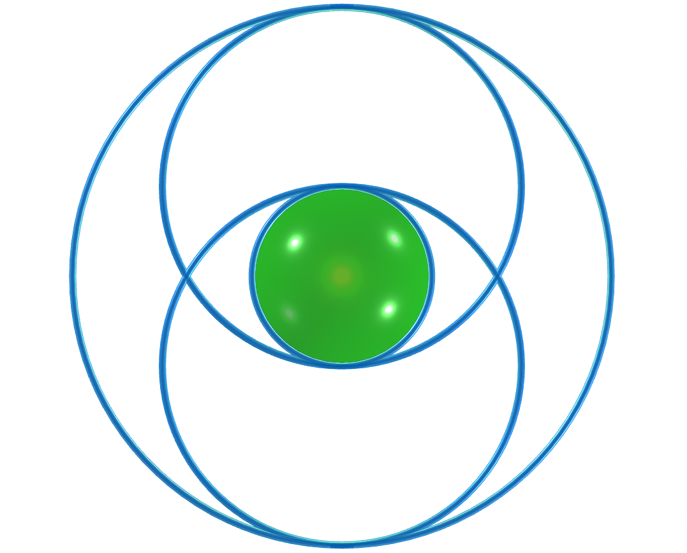</a>
    Trata-se de uma forma geométrica criada pela interseção de dois círculos idênticos, onde o centro de cada círculo fica no perímetro do outro. A vesica piscis é usada em Diagramas de Venn e selos emblemáticos e possui significados simbólicos como o "peixe de Jesus", a intrincada Triquetra que aparece na arte Celta, o triângulo de Reuleaux e a Mandorla que simboliza a união dos opostos e a interseção dos reinos terrestre e celestial.
    

<h4>2. Vesica Piscis 3D</h4>
<a href="../vr/VesicaPiscis3d.htm" target="_blank" title="modelo 3D" class="fotoA">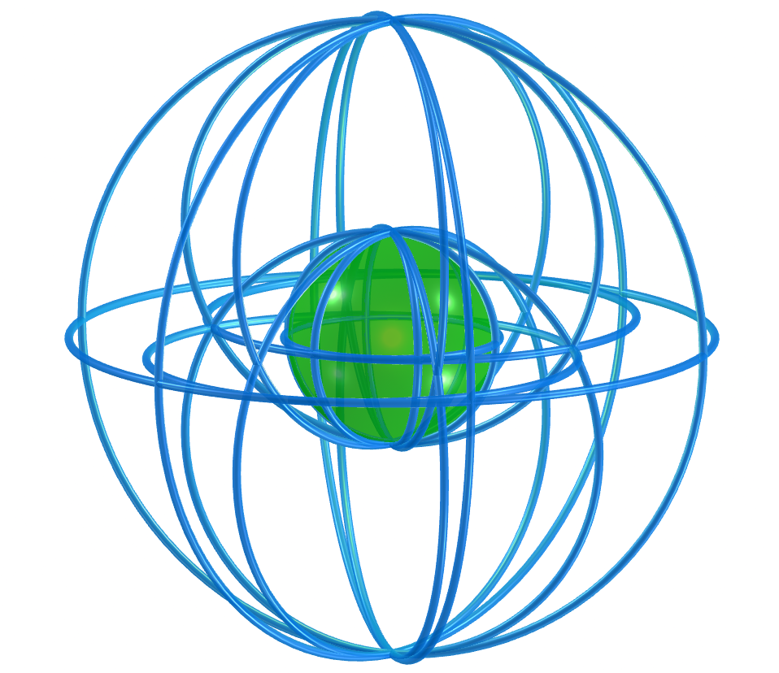</a>
    Nesta representação em 3D temos o modelo com 8 círculos em torno do menor círculo. Estes círculos representam seções planas das esferas que simbolizam a extensão da Vesica Piscis para 3 dimensões.
    

<h4>3. Semente da vida</h4>

    A Geometria Sagrada está centrada no símbolo composto por 7 círculos entrelaçados, denominado Semente da Vida. Trata-se de uma representação que significa os 7 dias em que o mundo foi criado, e que aparece em muitas construções e em textos religiosos. Cada círculo sobreposto significa um ciclo ou uma célula interligando processos vitais.
    

<h4>4. Semente da vida 3D v1</h4>

    Este símbolo tem sido usado com reverência e seu design confere uma sensação de proteção. Muitos usam como joias ou em decoração acreditando que traz positividade, afastando coisas negativas. Nesta representação temos o modelo em 3D construído com 3 rotações em torno de um dos modelos.
    

<h4>5. Semente da vida 3D v2</h4>

    Este símbolo aparece também em algumas tapeçarias e ruínas de templos antigos, significando o design do universo. Nesta representação temos o modelo em 3D construído com os círculos formando 2 calotas esféricas.
    

<h4>6. Semente da vida 3D v3</h4>

    Cada círculo sobreposto deste símbolo significa um ciclo ou uma célula interligando processos vitais. Nesta representação temos o modelo em 3D construído com 6 círculos rotacionados em torno de eixos que passam pelo círculo central.
    

<h4>7. Ovo da vida</h4>

    É considerado como o estágio central na sequência tranformadora da evolução e está associado às noções de renascimento e fertilidade. O Ovo da Vida é uma evolução da Semente da Vida: adicionando-se 6 círculos à Semente fundamental temos o símbolo do Ovo da Vida.
    

<h4>8. Ovo da vida 3D</h4>
<a href="../vr/EggOfLife3d.htm" target="_blank" title="modelo 3D" class="fotoA">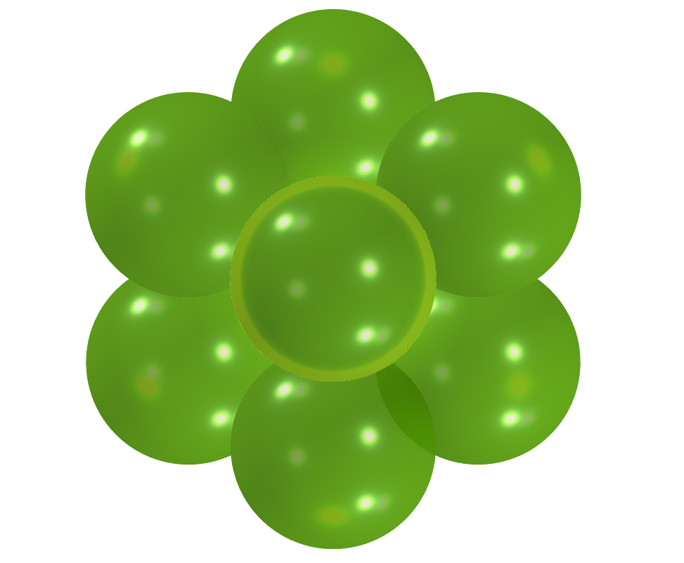</a>
    Analisando-se outra dimensão em sua formação, o Ovo da Vida pode ser visualizado por meio das oito esferas tangentes do Cubo de Metatron. Esta conexão mostra a versatilidade e as relações entrelaçadas dos símbolos geométricos sagrados.
    

<h4>9. Flor da vida</h4>

    O símbolo da Flor da Vida é construído com 19 círculos entrelaçados, envoltos por um círculo maior. Trata-se de uma representação muito conhecida que aparece nas pirâmides do Egito e em construções da Grécia, China, Inglaterra, Tibete e Israel. Acredita-se que a Flor da Vida seja a representação do projeto cósmico, o qual codifica o design de cada estrutura atômica.
    

<h4>10. Flor da vida 3D</h4>

    Dentro do design do símbolo da Flor da Vida encontram-se outros padrões da Geometria Sagrada: o Ovo da Vida, a Semente da Vida e a Árvore da Vida. Nesta representação temos o modelo em 3D construído com 3 rotações em torno de um dos modelos.
    

<a href="#p1" class="topo">voltar ao topo</a>

<h4>11. Flor da vida v2</h4>

    O símbolo da Flor da Vida pode ser extendido e construído com 37 círculos entrelaçados, envoltos por um círculo maior. Vários círculos deste símbolo se estendem para além da fronteira, e outro símbolo da Geometria Sagrada surge desta versão extendida: o Fruto da Vida.
    

<h4>12. Flor da vida 3D v2</h4>
<a href="../vr/FlowerOfLife3d_v2.htm" target="_blank" title="modelo 3D" class="fotoA">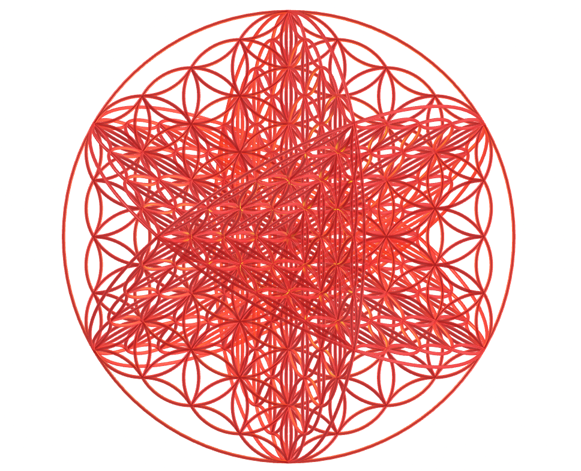</a>
    Dentro do design do símbolo da Flor da Vida encontram-se outros padrões da Geometria Sagrada: o Ovo da Vida, a Semente da Vida e a Árvore da Vida. Nesta representação temos o modelo em 3D construído com 3 rotações em torno de um dos modelos.
    

<h4>13. Árvore da vida</h4>

    O símbolo da Árvore da Vida representa uma conexão com tudo, incluindo as coisas que não podemos ver, lembrando que não estamos sozinhos no universo. As 10 esferas deste símbolo são chamadas de "Sephiroth", significam emanação e estão conectadas por caminhos diferentes. A Sephira da base representa o mundo material e a Sephira do topo representa a consciência cósmica. As demais Sephiras representam as qualidades da alma e são divididas em três pilares: severidade, suavidade e misericórdia.
    

<h4>14. Fruto da vida</h4>
<a href="../vr/FruitOfLife.htm" target="_blank" title="modelo 3D" class="fotoA">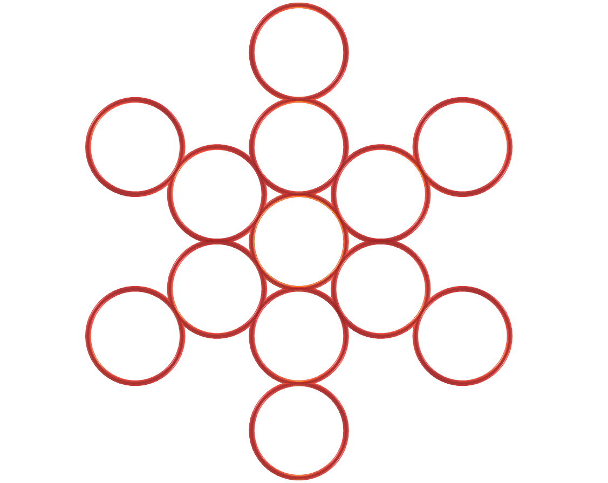</a>
    O símbolo do Fruto da Vida é formado por 13 esferas interligadas e pode ser considerado como um dos mais poderosos da Geometria Sagrada. Ele aparece de forma oculta dentro do símbolo da Flor da Vida e pode ser usado para criar as 78 linhas do símbolo do Cubo de Metatron.
    

<h4>15. Fruto da vida 3D</h4>
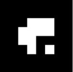
    As 13 esferas do símbolo do Fruto da Vida simbolizam aspectos femininos da criação, que fornecem a base para os 78 raios masculinos da criação. É considerada uma interação harmoniosa que dá origem à existência. Nesta representação temos o símbolo do Fruto da Vida em 3D.
    

<h4>16. Espiral áurea</h4>
<a href="../vr/GoldenSpiral.htm" target="_blank" title="modelo 3D" class="fotoA">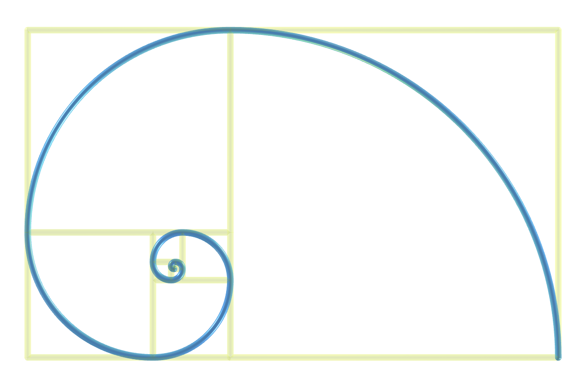</a>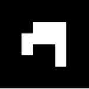
    Definimos que os números <b>a</b> e <b>b</b> estão na proporção áurea quando <b>(a + b) / a = a / b = &Phi;</b>. Colocando-se esta razão em duas dimensões, podemos construir os retângulos (ou triângulos) áureos, onde seus lados estão na proporção áurea. Esta proporção não é apenas uma noção matemática, mas também um símbolo de beleza, harmonia e perfeição na arte, na ciência e na natureza. Este termo foi introduzido por Leonardo da Vinci como uma proporção de "corpo perfeito ideal" e aparece em pétalas de diversas flores, arranjos das sementes de girassóis, padrões de pinhas e no brócolis romanesco.
    

<h4>17. Cubo de Metatron</h4>

    O Metatron é um arcanjo serafim da tradição medieval islâmica, judaica e cristã. As representações artísticas quase sempre retratam o Arcanjo Metatron segurando ou próximo a um cubo misterioso. A construção do Cubo de Metatron envolve os 13 círculos abrigados dentro de um círculo maior. As linhas que unem os centros destes círculos definem o Cubo de Metraton.
    

<h4>18. Cubo de Metatron 3D</h4>

    Dentro da forma geométrica definida pelo Cubo de Metraton podemos encontrar os cinco sólidos platônicos, posicionando o Cubo de Metatron como uma ponte fundamental que transforma realidades bidimensionais em reinos tridimensionais. Nesta representação temos o cubo de Metraton em 3D.
    

<h4>19. Grade da vida</h4>

    O símbolo da Grade da Vida, também denominado tetraedro 64, contrapõe o Tetraedro Estrelado com a Flor da Vida. Temos 64 tetraedros que formam o símbolo da Grade da Vida, que pode ser sobreposto ao símbolo da Flor da Vida, com os círculos simbolizando a vastidão do espaço e as linhas interligadas indicando onde o espaço converge com o tempo.
    

<h4>20. Grade da vida 3D</h4>

    Grande parte do fascínio do símbolo da Grade da Vida vem do número 64, que surge recorrentemente na natureza, nas construções e no misticismo. Alguns exemplos que podemos citar são: na computação, onde o número de 64 bits de memória é essencial; nos jogos clássicos de xadrez ou damas, que possuem 64 casas em seus tabuleiros; ou em textos sagrados do Hinduísmo, que faz referência a 64 tantras. Neste exemplo, temos a Grade da Vida modelada em 3D.
    

<a href="#p1" class="topo">voltar ao topo</a>

<h4>21. Toro</h4>
<a href="../vr/Torus.htm" target="_blank" title="modelo 3D" class="fotoA">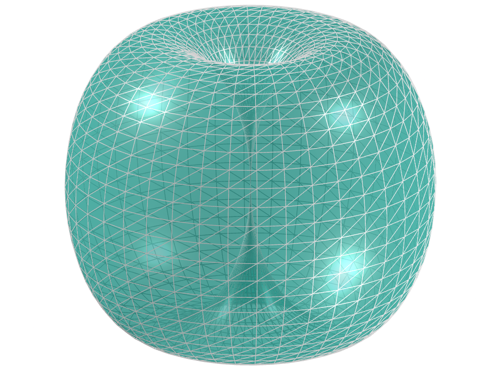</a>
    A estrutura de um toro, semelhante a um vórtice, é considerada como a forma inicial que emana do padrão Gênesis. A representação do toro na Geometria Sagrada reflete o fluxo de energia em espiral. Este fluxo não é unidirecional, oscilando na superfície do toro e espiralando dentro de seu núcleo.
    

<h4>22. Toro anelado</h4>

    O toro anelado representa a forma clássica de donut, que incorpora continuidade e totalidade. Este símbolo representa os ciclos da vida, que mantêm a sua forma e vitalidade independentemente de onde começam ou terminam. 
    

<h4>23. Toro fuso</h4>

    O toro fuso representa uma força invisível que atua em extremidades opostas. Trata-se de um símbolo poderoso de equilíbrio, tensão e dualidade, que representa o que existe no universo e dentro de nós mesmos.
    

<h4>24. Estrela Merkaba</h4>
<a href="../vr/Merkaba.htm" target="_blank" title="modelo 3D" class="fotoA">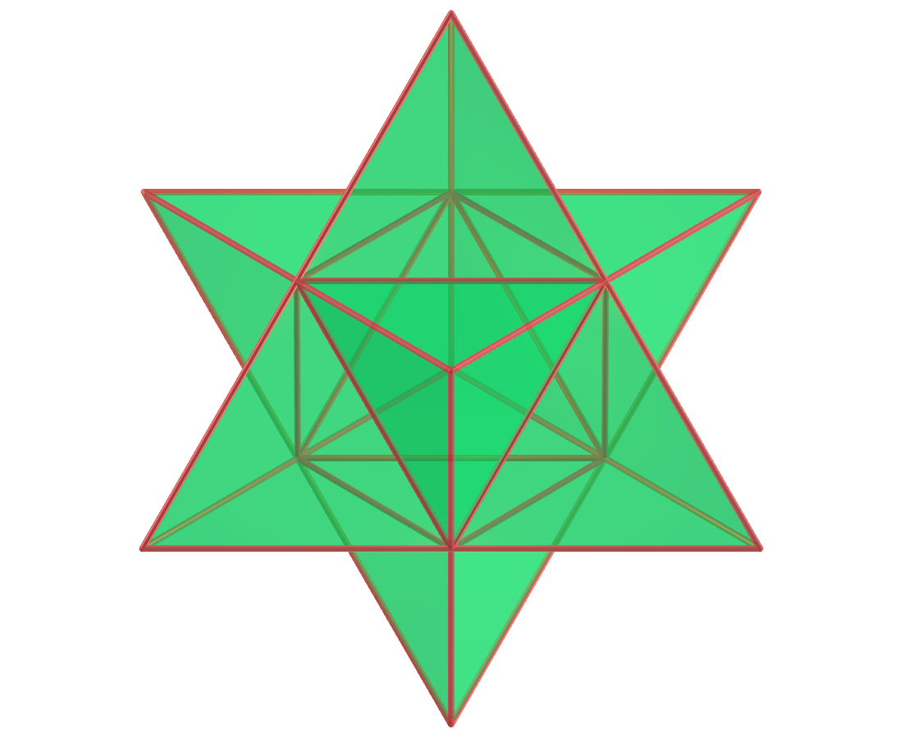</a>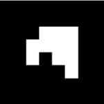
    O símbolo da estrela Merkaba ou Tetraedro estrelado ou Estrela de Davi tem o significado traduzido como "luz, espírito e corpo". Trata-se da fusão de 2 tetraedros idênticos que são interligados por meio de rotações em direções opostas. A interseção destes tetraedros origina um campo de energia que irradia imenso poder. Neste exemplo, temos a estrela Merkaba modelada em 3D.
    

<h4>25. Vector Equilibrium</h4>

    O Vector Equilibrium é considerado como refência inicial da matemática energética e a pulsação zero do equilíbrio vetorial. Trata-se da estrutura subjacente do Toro, considerada a forma geométrica capaz de transformar energia em matéria. 
    

<h4>26. Vector Equilibrium 3D</h4>
<a href="../vr/VectorEquilibrium1.htm" target="_blank" title="modelo 3D" class="fotoA">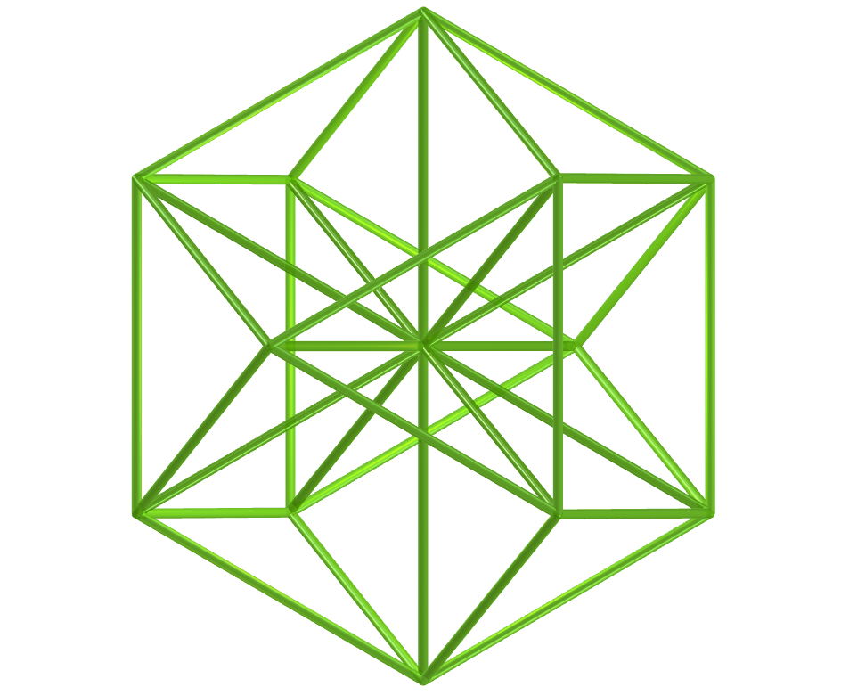</a>
    As linhas de energia do Vector Equilibrium têm comprimento e força iguais e pode ser considerada a única forma geométrica que possui todas as forças iguais e equilibradas. Nesta representação temos o Vector Equilibrium modelado em 3D, que representa um conjunto formado pelas arestas e diagonais principais do cuboctaedro de Arquimedes.
    

<h4>27. Vector Equilibrium 3D v2</h4>

    De acordo com Buckminster Fuller, o Vector Equilibrium é a forma mais próxima que jamais conheceremos de Deus e da eternidade. Nesta representação temos o Vector Equilibrium modelado em 3D, que representa um conjunto formado pelas diagonais principais e pelos círculos circunscritos às seções hexagonais do cuboctaedro de Arquimedes.
    

<h4>28. Vector Equilibrium 3D v3</h4>

    O Vector Equilibrium é considerado como a estrutura subjacente do Toro, também conhecida como a forma geométrica capaz de transformar energia em matéria. Nesta representação temos o modelo em 3D construído com 3 rotações em torno de um dos modelos.
    
 
 

<h4>29. Sri Yantra</h4>

    O Sri Yantra é um desenho geométrico que representa a união das energias masculinas e femininas do universo. É uma das formas mais complexas e poderosas da Geometria Sagrada. Este símbolo possui nove triângulos entrelaçados que cercam um ponto central e guia a mente para estados superiores de consciência. Focar no ponto central, chamado "bindu", ajuda a acessar uma conexão profunda com a energia universal. O "bindu" simboliza a origem do universo, o ponto de onde toda a criação emana, e ao redor do qual a realidade se organiza. A palavra "Sri" significa riqueza e prosperidade, e "Yantra" significa instrumento. 
    

<h4>30. Sri Yantra 3D</h4>
<a href="../vr/SriYantrav1.htm" target="_blank" title="modelo 3D" class="fotoA">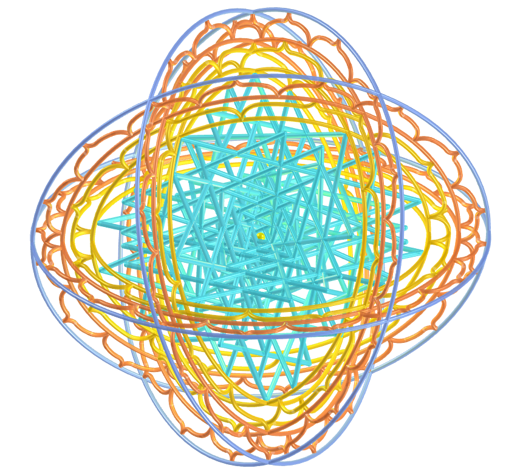</a>
    O Sri Yantra é constituído por quatro triângulos apontando para cima (energia masculina, Shiva) e cinco para baixo (energia feminina, Shakti). As intersecções entre os triângulos formam 43 triângulos menores, que espelham o cosmos. Cada triângulo menor está relacionado com uma inteligência ou arquétipo. O Sri Yantra é uma das formas mais complexas e poderosas da Geometria Sagrada. A palavra "Sri" significa riqueza e prosperidade, e "Yantra" significa instrumento. 
    

<a href="#p1" class="topo">voltar ao topo</a>

<h4>31. Triquetra</h4>

    A triquetra é um símbolo geométrico que representa a eternidade, a trindade e a unidade. É composta por três arcos entrelaçados, sem começo nem fim. A palavra triquetra vem do latim triquætra (três pontas). O símbolo é parecido com um tríscele (símbolo celta que representa os três mundos: o celestial, físico e espiritual). A triquetra está presente em muitas culturas e tradições. 
    

<h4>32. Triquetra 3D</h4>

    A triquetra é usada no cristianismo, na magia e de maneira geral no ocultismo. Este símbolo está associado a conceitos de trindade, como a vida, morte e renascimento, ou a terra, mar e céu. A triquetra representa o infinito nas três dimensões e pode ser encontrada em muitas obras de arte, monumentos, filmes, séries populares, pingentes, mandalas e quadros.
    
 

<h4>33. Lótus da Vida</h4>
<a href="../vr/LotusOfLife.htm" target="_blank" title="modelo 3D" class="fotoA">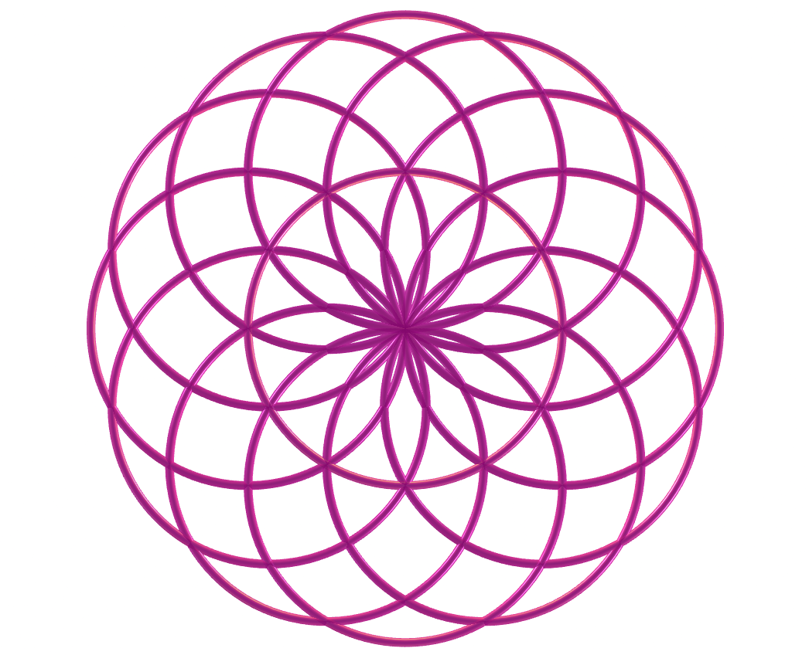</a>
    O Lótus da Vida é um símbolo da Geometria Sagrada, derivado dos símbolos da Semente da Vida e da Flor da vida. Este símbolo contém 12 pétalas, e pode ser obtido rotacionando-se um símbolo da Semente da Vida em torno do centro com um ângulo de 30&ordm;. O centro do Lótus representa o ponto zero ou centro da vida e da criação. Deste ponto central, toda a vida (representada pelas pétalas) brota e toda a vida está conectada a este ponto. Acredita-se que ao contemplar ou meditar usando-se o Lótus da Vida, podemos sentir uma sensação de paz, tranquilidade e iluminação.
    
 

<h4>34. Lótus da Vida 3D</h4>
<a href="../vr/LotusOfLife3dv1.htm" target="_blank" title="modelo 3D" class="fotoA">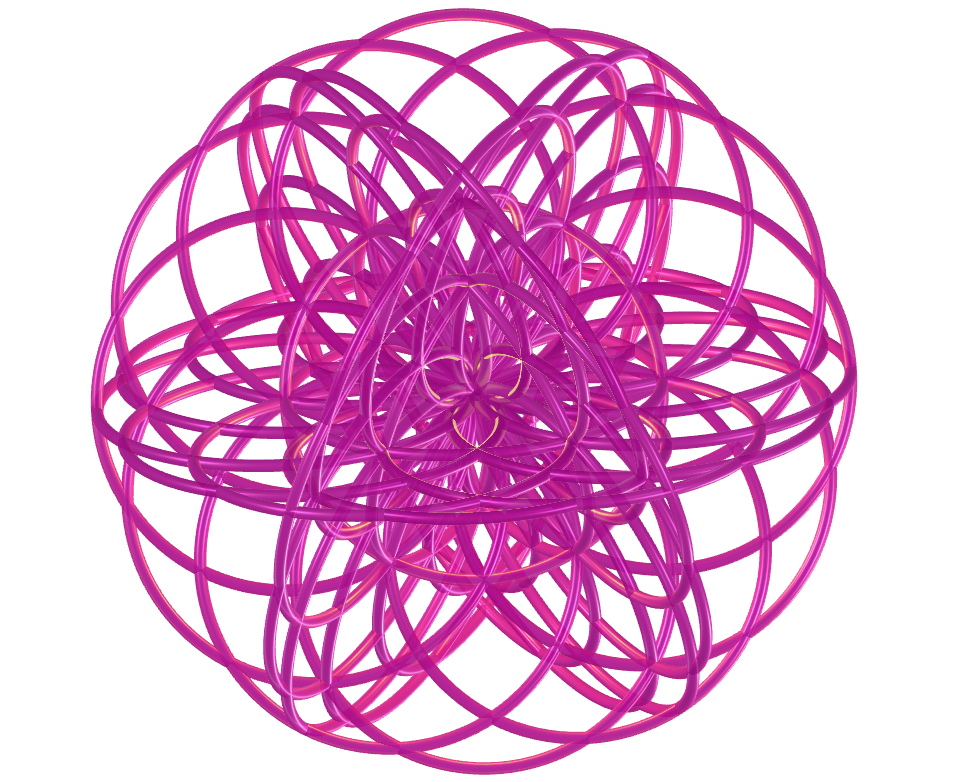</a>
    Acredita-se que ao contemplar ou meditar usando-se o Lótus da Vida, podemos sentir uma sensação de paz, tranquilidade e iluminação. Este símbolo contém 12 pétalas, e pode ser obtido rotacionando-se um símbolo da Semente da Vida em torno do centro com um ângulo de 30&ordm;. O centro do Lótus representa o ponto zero ou centro da vida e da criação. Deste ponto central, toda a vida (representada pelas pétalas) brota e toda a vida está conectada a este ponto. 
    
 

<h4>35. Lótus da Vida 3D v2</h4>
<a href="../vr/LotusOfLife3dv2.htm" target="_blank" title="modelo 3D" class="fotoA">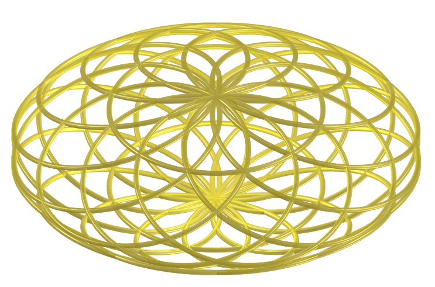</a>
    Este símbolo contém 12 pétalas, e pode ser obtido rotacionando-se um símbolo da Semente da Vida em torno do centro com um ângulo de 30&ordm;. O centro do Lótus representa o ponto zero ou centro da vida e da criação. Deste ponto central, toda a vida (representada pelas pétalas) brota e toda a vida está conectada a este ponto. Acredita-se que ao contemplar ou meditar usando-se o Lótus da Vida, podemos sentir uma sensação de paz, tranquilidade e iluminação.
    
 

<h4>36. Lótus da Vida 3D v3</h4>

    O centro do Lótus representa o ponto zero ou centro da vida e da criação. Deste ponto central, toda a vida (representada pelas pétalas) brota e toda a vida está conectada a este ponto. Acredita-se que ao contemplar ou meditar usando-se o Lótus da Vida, podemos sentir uma sensação de paz, tranquilidade e iluminação. Este símbolo contém 12 pétalas, e pode ser obtido rotacionando-se um símbolo da Semente da Vida em torno do centro com um ângulo de 30&ordm;.
    
 

<h4>37. Hexagrama Unicursal</h4>

    O hexagrama unicursal é uma estrela de seis pontas que pode ser desenhada em uma linha contínua. É um símbolo da Geometria Sagrada que significa unidade, fluxo contínuo de energia e de vida, além da interconexão de tudo. O hexagrama unicursal é frequentemente representado com suas linhas se cruzando para formar um nó. Este símbolo pode ser desenhado dentro de um círculo com as pontas se tocando. Trata-se de um exemplo de uma forma discutida na obra "Hexagrammum Mysticum" de Blaise Pascal (1639).
    
 

<h4>38. O Lírio</h4>
<a href="../vr/Lily.htm" target="_blank" title="modelo 3D" class="fotoA">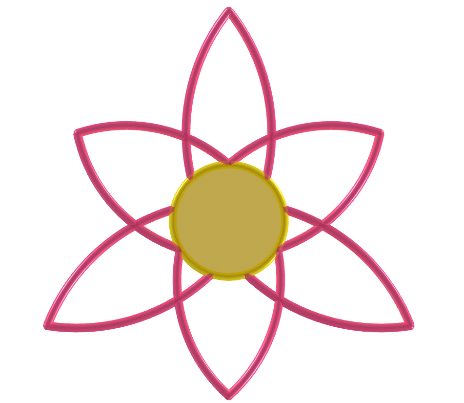</a>
    O Lírio tem sido usado na Geometria Sagrada para simbolizar pureza, fertilidade, maternidade e sexualidade. As pétalas e os estames do lírio criam uma geometria orgânica que pode ser vista em mandalas. O símbolo do Lírio representa a flor homônima, colocada dentro de um triângulo, com suas pétalas estendendo-se em direção a três pontos. Outro triângulo forma um ângulo de 60&ordm; em relação ao primeiro triângulo, e é formado por três pétalas menores.
    
 

<h4>39. O Lírio 3D</h4>
<a href="../vr/Lilyv1.htm" target="_blank" title="modelo 3D" class="fotoA">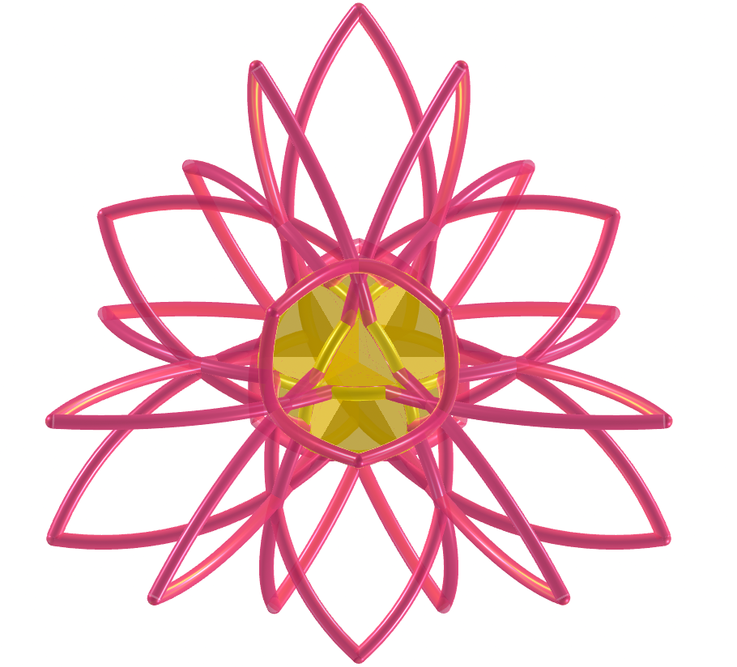</a>
    O símbolo do Lírio representa a flor homônima, colocada dentro de um triângulo, com suas pétalas estendendo-se em direção a três pontos. Outro triângulo forma um ângulo de 60&ordm; em relação ao primeiro triângulo, e é formado por três pétalas menores. O Lírio tem sido usado na Geometria Sagrada para simbolizar pureza, fertilidade, maternidade e sexualidade. As pétalas e os estames do lírio criam uma geometria orgânica que pode ser vista em mandalas.
    

<h4>40. Retângulos Áureos</h4>

    Na Geometria Sagrada, três retângulos áureos interligados representam o cosmos e a união de forças. O símbolo formado por três retângulos dourados interligados pode ser construído de duas maneiras. Podemos definir os lados de um retângulo áureo como duas arestas opostas e as respectivas diagonais perpendiculares de um icosaedro. A segunda maneira de construir este símbolo está na escolha das linhas com proporções áureas que aparecem no símbolo da Flor da Vida.
    

<a href="#p1" class="topo">voltar ao topo</a>

 

<h4>41. Retângulos Áureos v2</h4>

    O símbolo formado por três retângulos dourados interligados pode ser construído de duas maneiras. Podemos definir os lados de um retângulo áureo como duas arestas opostas e as respectivas diagonais perpendiculares de um icosaedro. A segunda maneira de construir este símbolo está na escolha das linhas com proporções áureas que aparecem no símbolo da Flor da Vida. Na Geometria Sagrada, três retângulos áureos interligados representam o cosmos e a união de forças.
     
<h4>42. Merkaba curvada</h4>

    A Merkaba é um símbolo geométrico sagrado que representa a união das energias masculina e feminina e a integração dos reinos terrestre e cósmico. É composta por dois tetraedros que giram em direções opostas, formando uma estrela tridimensional. O símbolo com a substituição de arestas por arcos que passam pelos vértices dos tetraedros representa a Merkaba curvada. A estrutura geométrica e a simetria da Merkaba capturaram a imaginação dos interessados ​​em Geometria Sagrada.
    
 

<h4>43. Merkaba curvada 3D</h4>

    O símbolo com a substituição de arestas por arcos que passam pelos vértices dos tetraedros representa a Merkaba curvada. A estrutura geométrica e a simetria da Merkaba capturaram a imaginação dos interessados ​​em Geometria Sagrada. A Merkaba é um símbolo geométrico sagrado que representa a união das energias masculina e feminina e a integração dos reinos terrestre e cósmico. É composta por dois tetraedros que giram em direções opostas, formando uma estrela tridimensional.
    
 

<h4>44. Merkaba curvada v2</h4>

    A Merkaba é um símbolo geométrico sagrado que representa a união das energias masculina e feminina e a integração dos reinos terrestre e cósmico. É composta por dois tetraedros que giram em direções opostas, formando uma estrela tridimensional. O símbolo com a substituição de arestas por arcos que passam pelos vértices dos tetraedros representa a Merkaba curvada. A estrutura geométrica e a simetria da Merkaba capturaram a imaginação dos interessados ​​em Geometria Sagrada.
    
 

<h4>45. Merkaba curvada 3D v2</h4>

    O símbolo com a substituição de arestas por arcos que passam pelos vértices dos tetraedros representa a Merkaba curvada. A estrutura geométrica e a simetria da Merkaba capturaram a imaginação dos interessados ​​em Geometria Sagrada. A Merkaba é um símbolo geométrico sagrado que representa a união das energias masculina e feminina e a integração dos reinos terrestre e cósmico. É composta por dois tetraedros que giram em direções opostas, formando uma estrela tridimensional.
    
 

<h4>46. Merkaba curvada 3D v3</h4>
<a href="../vr/CurvedMerkabav4.htm" target="_blank" title="modelo 3D" class="fotoA">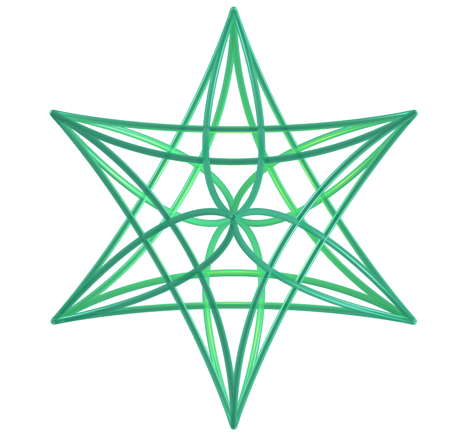</a>
    A estrutura geométrica e a simetria da Merkaba capturaram a imaginação dos interessados ​​em Geometria Sagrada. A Merkaba é um símbolo geométrico sagrado que representa a união das energias masculina e feminina e a integração dos reinos terrestre e cósmico. É composta por dois tetraedros que giram em direções opostas, formando uma estrela tridimensional. O símbolo com a substituição de arestas por arcos que passam pelos vértices dos tetraedros representa a Merkaba curvada.
    
 

<h4>47. Merkaba curvada 3D v4</h4>

    A Merkaba é um símbolo geométrico sagrado que representa a união das energias masculina e feminina e a integração dos reinos terrestre e cósmico. É composta por dois tetraedros que giram em direções opostas, formando uma estrela tridimensional. O símbolo com a substituição de arestas por arcos que passam pelos vértices dos tetraedros representa a Merkaba curvada. A estrutura geométrica e a simetria da Merkaba capturaram a imaginação dos interessados ​​em Geometria Sagrada.
    
 

<h4>48. Cubo de Metatron curvado</h4>

    O Cubo de Metatron é um símbolo geométrico sagrado que representa a estrutura da criação e o equilíbrio energético do universo. É composto por 13 círculos e linhas que conectam seus centros. O cubo recebeu o nome do Arcanjo Metatron, que se acredita supervisionar o fluxo de energia no cubo. O símbolo com a substituição de arestas por arcos que passam pelos vértices dos tetraedros representa o Cubo de Metatron curvado.
    
 

<h4>49. Cubo de Metatron curvado 3D</h4>
<a href="../vr/CurvedMetatronCubev1.htm" target="_blank" title="modelo 3D" class="fotoA">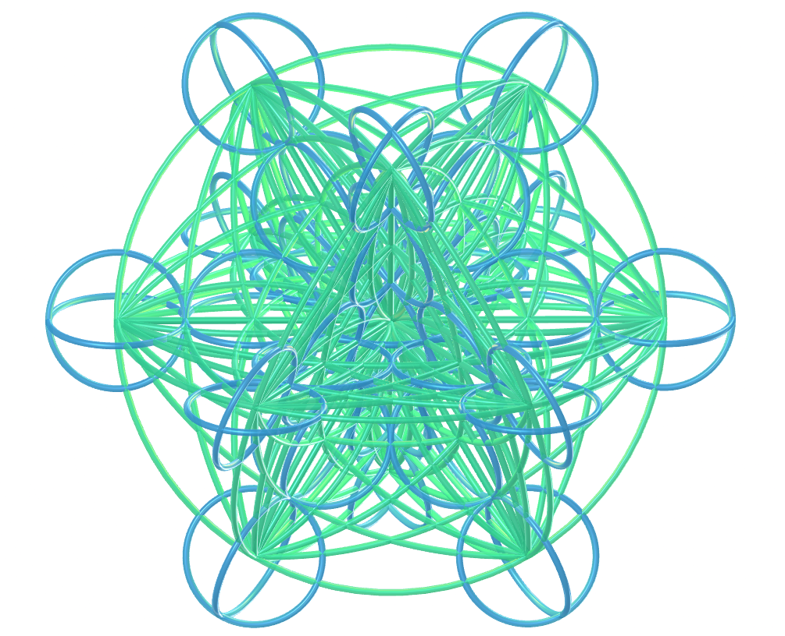</a>
    O símbolo com a substituição de arestas por arcos que passam pelos vértices dos tetraedros representa o Cubo de Metatron curvado. O Cubo de Metatron é um símbolo geométrico sagrado que representa a estrutura da criação e o equilíbrio energético do universo. É composto por 13 círculos e linhas que conectam seus centros. O cubo recebeu o nome do Arcanjo Metatron, que se acredita supervisionar o fluxo de energia no cubo. 
    
 

<h4>50. Cubo de Metatron curvado 3D v2</h4>

    O Cubo de Metatron é um símbolo geométrico sagrado que representa a estrutura da criação e o equilíbrio energético do universo. É composto por 13 círculos e linhas que conectam seus centros. O cubo recebeu o nome do Arcanjo Metatron, que se acredita supervisionar o fluxo de energia no cubo. O símbolo com a substituição de arestas por arcos que passam pelos vértices dos tetraedros representa o Cubo de Metatron curvado.
    
 
<a href="#p1" class="topo">voltar ao topo</a>

 

<h4>51. Pentagrama</h4>

    Na Geometria Sagrada, o pentagrama (estrela de cinco pontas) representa a união dos cinco elementos: ar, fogo, água, terra e espírito. Este símbolo também está ligado à proporção áurea e é considerado um símbolo de equilíbrio, harmonia e maestria espiritual. Acredita-se que a proporção áurea represente uma proporção divina e uma relação harmoniosa entre as diferentes partes de um todo. O pentagrama e o hexagrama têm sido usados ​​em várias práticas religiosas e espirituais, representando harmonia, equilíbrio e a união dos opostos.
    
 

 <h4>52. Hexagrama</h4>
<a href="../vr/Hexagram.htm" target="_blank" title="modelo 3D" class="fotoA">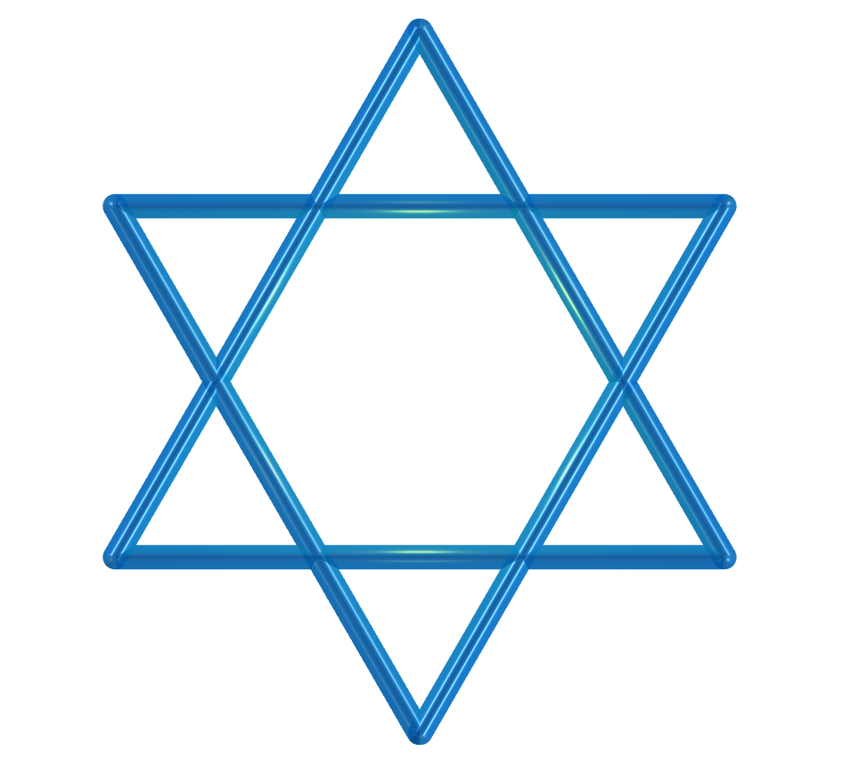</a>
    Na Geometria Sagrada, um hexagrama (estrela de seis pontas) simboliza a união dos opostos e o equilíbrio cósmico. É formado por dois triângulos equiláteros entrelaçados, um apontando para cima e o outro para baixo, frequentemente representando o masculino e o feminino, ou a terra e o céu, em equilíbrio harmonioso. O hexagrama é encontrado em várias tradições religiosas, incluindo judaica, islâmica e indiana (hindu, budista, jainista). O pentagrama e o hexagrama têm sido usados ​​em diversas práticas religiosas e espirituais, representando harmonia, equilíbrio e a união dos opostos.
    
 

<h4>53. Grade Heptagrâmica</h4>
<a href="../vr/GridHeptagram.htm" target="_blank" title="modelo 3D" class="fotoA">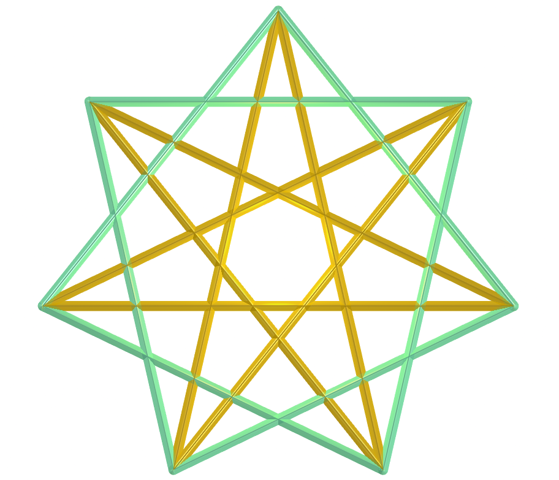</a>
    O heptagrama ou estrela de sete pontas, possui muitos significados sagrados em vários sistemas de crenças, incluindo Cristianismo, judaísmo, islamismo, alquimia e paganismo. No Cristianismo, o heptagrama simboliza os sete dias da criação, a perfeição, Deus, além de ser considerado um símbolo tradicional para afastar o mal. No judaísmo, o heptagrama representa a sétima esfera da Árvore da Vida do judaísmo cabalístico. Ao considerarmos as combinações de 3 em 3 e 2 em 2 vértices, criamos a Grade Heptagrâmica.
    
 

<h4>54. Grade Octogrâmica</h4>

    Na Geometria Sagrada, o octógono e o octograma em forma de estrela simbolizam a união do círculo e do quadrado, que representam o céu e a terra, respectivamente. Acredita-se que essas formas equilibram e unificam as duas entidades. O octógono simboliza proteção, boa sorte e renascimento. A estrela de oito pontas simboliza entidades celestes como a lua, o sol, planetas, estrelas e cometas. Considerando as combinações de vértices 3 por 3 e 2 por 2, criamos a Grade do Octograma.
    
 

<h4>55. Grade Eneagrâmica</h4>
<a href="../vr/GridEnneagram.htm" target="_blank" title="modelo 3D" class="fotoA">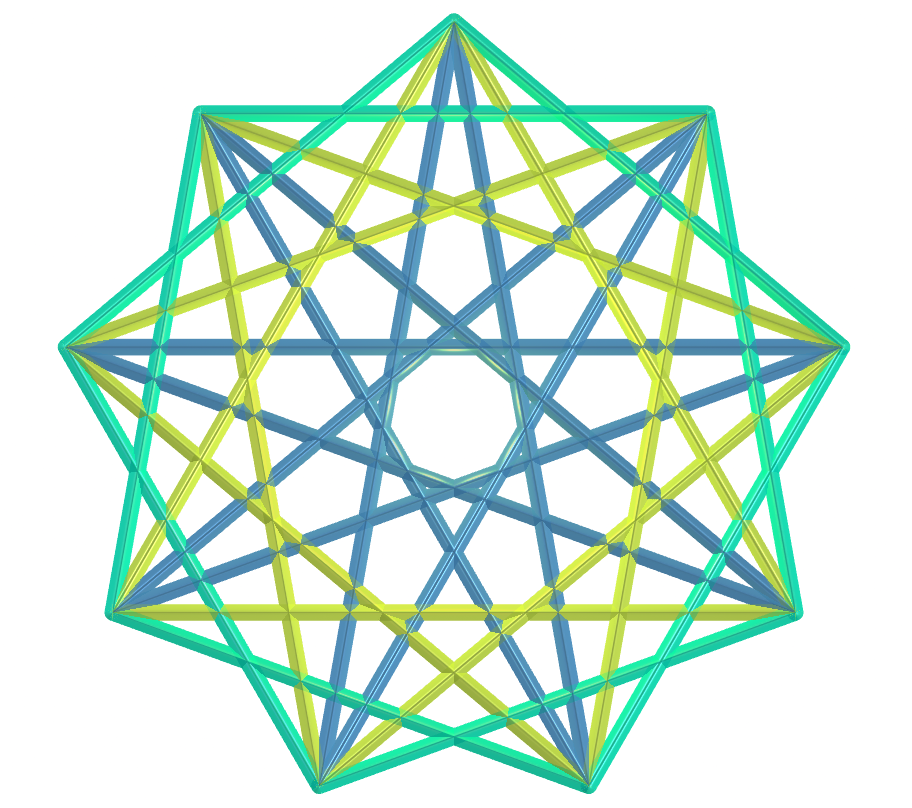</a>
    O eneagrama é um símbolo frequentemente considerado Geometria Sagrada, pois integra formas e leis geométricas à ideia de tipos de personalidade. Formado por três triângulos sobrepostos, pode representar uma trindade de trindades, um símbolo de santidade ou plenitude espiritual. Podemos usar um eneagrama também como símbolo da totalidade universal. O eneagrama é usado em crescimento pessoal, terapia, espiritualidade, educação e negócios. Ao considerarmos as combinações de 4 em 4, 3 em 3 e 2 em 2 vértices, criamos a Grade Eneagrâmica.
    
 

<h4>56. Grade Decagrâmica</h4>
<a href="../vr/GridDecagram.htm" target="_blank" title="modelo 3D" class="fotoA">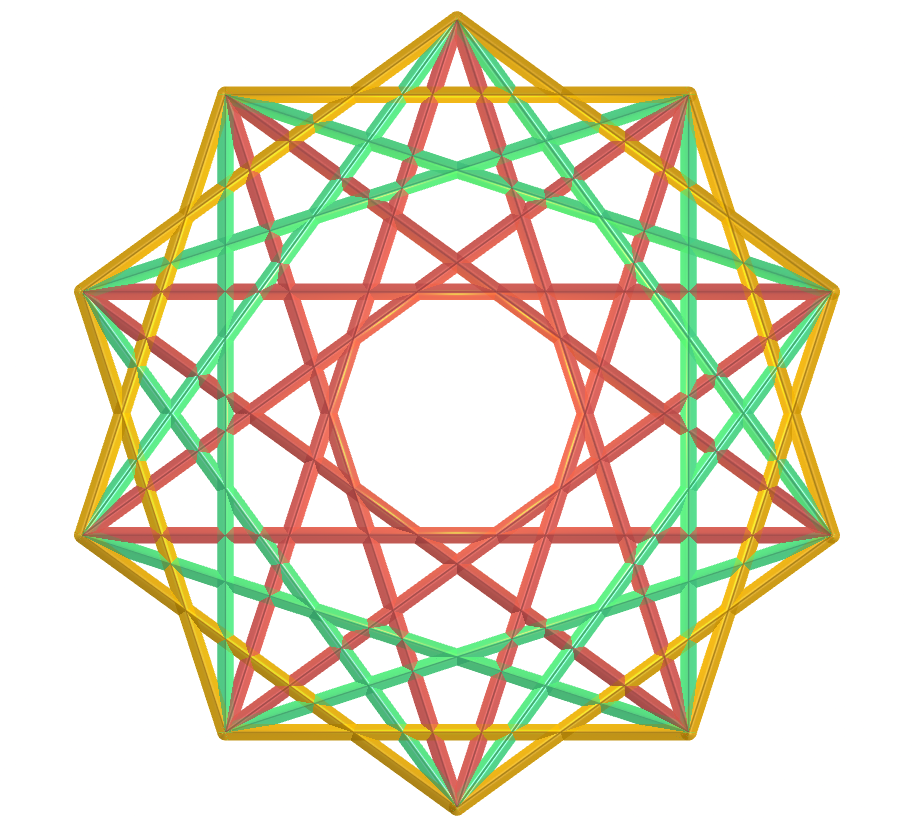</a>
    Na Geometria Sagrada, o decagrama ou estrela de 10 pontas, simboliza a união dos opostos, novos começos e as dez Sephirot da Cabala. É composto por dois pentagramas sobrepostos. Formas geométricas na Geometria Sagrada, como o decágono, incorporam princípios de harmonia matemática, proporção e simetria. Esses princípios frequentemente refletem a ordem e o equilíbrio do universo. Ao considerarmos as combinações de 4 em 4, 3 em 3 e 2 em 2 vértices, criamos a Grade Decagrâmica.
    

<h4>57. Grade Undecagrâmica</h4>

     O undecagrama, também chamado hendecagrama, é um símbolo que tem sido usado em joias, colares e outros itens, e pode ser associado a vários significados simbólicos, incluindo equilíbrio, verdade e o arcanjo Uriel. Neste símbolo, podemos visualizar pentagramas sobrepostos a hexagramas. Embora não seja tão proeminente quanto outras formas como o hexágono ou o triângulo, os onze lados únicos do hendecágono podem representar uma sensação de completude ou interconexão, com o número 11 frequentemente associado à iluminação e à orientação divina. Ao considerarmos as combinações de 5 em 5, 4 em 4, 3 em 3 e 2 em 2 vértices, criamos a Grade Undecagrâmica.
    
 

<h4>58. Grade Dodecagrâmica</h4>

    Na Geometria Sagrada, o dodecagrama ou estrela de 12 pontas, simboliza a criação, o equilíbrio, a harmonia e a natureza cíclica da existência. Este símbolo tem sido usado em diversos sistemas de crenças, incluindo o judaísmo e o cristianismo. No Judaísmo, o dodecagrama simboliza as 12 tribos de Israel. No Cristianismo, o dodecagrama simboliza os 12 discípulos. Ao considerarmos as combinações de 5 em 5, 4 em 4, 3 em 3 e 2 em 2 vértices, criamos a Grade Dodecagrâmica.
    
 

<h4>59. Grade Dodecagrâmica 3D</h4>

    Este símbolo tem sido usado em diversos sistemas de crenças, incluindo o judaísmo e o cristianismo. No Judaísmo, o dodecagrama simboliza as 12 tribos de Israel. No Cristianismo, o dodecagrama simboliza os 12 discípulos. Ao considerarmos as combinações de 5 em 5, 4 em 4, 3 em 3 e 2 em 2 vértices, criamos a Grade Dodecagrâmica. Na Geometria Sagrada, o dodecagrama ou estrela de 12 pontas, simboliza a criação, o equilíbrio, a harmonia e a natureza cíclica da existência.
    
 

<h4>60. Pentagrama Fractal</h4>
<a href="../vr/Pentagram2.htm" target="_blank" title="modelo 3D" class="fotoA">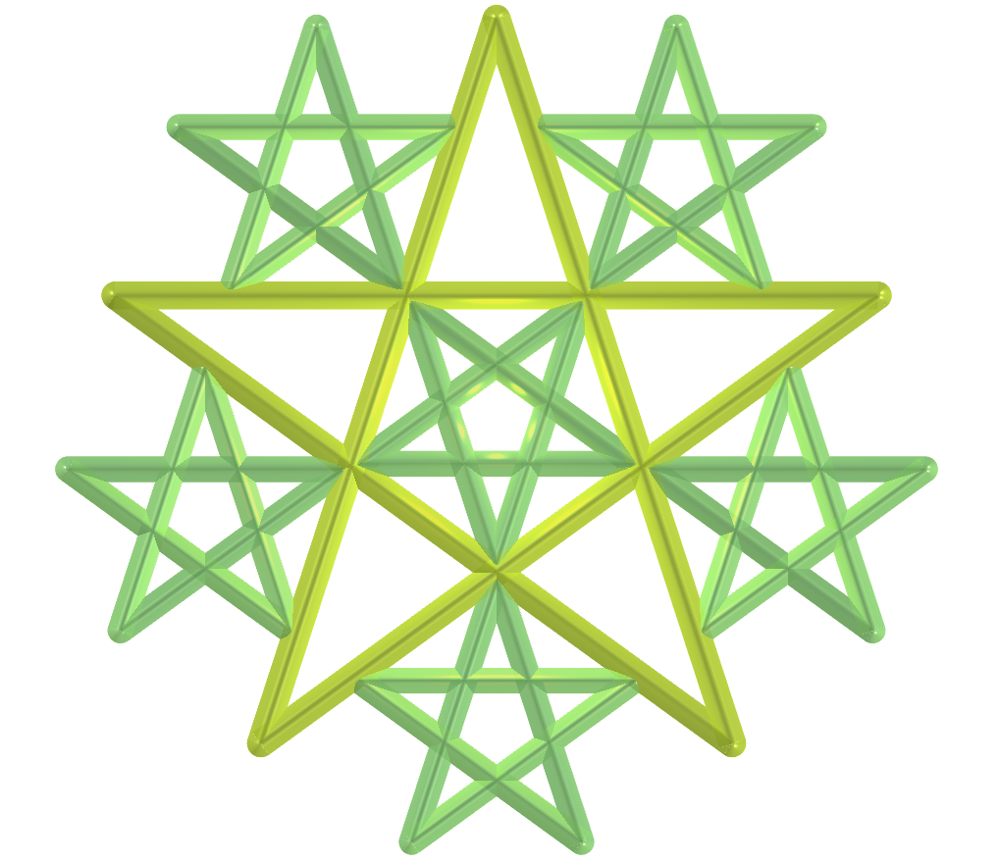</a>
    Na Geometria Sagrada, o pentagrama (estrela de cinco pontas) representa a união dos cinco elementos: ar, fogo, água, terra e espírito. Este símbolo também está ligado à proporção áurea e é considerado um símbolo de equilíbrio, harmonia e maestria espiritual. Acredita-se que a proporção áurea represente uma proporção divina e uma relação harmoniosa entre as diferentes partes de um todo. O pentagrama e o hexagrama têm sido usados ​​em várias práticas religiosas e espirituais, representando harmonia, equilíbrio e a união dos opostos.
    
 
<a href="#p1" class="topo">voltar ao topo</a>

 

<h4>61. Pentagrama Fractal v2</h4>
<a href="../vr/Pentagram3.htm" target="_blank" title="modelo 3D" class="fotoA">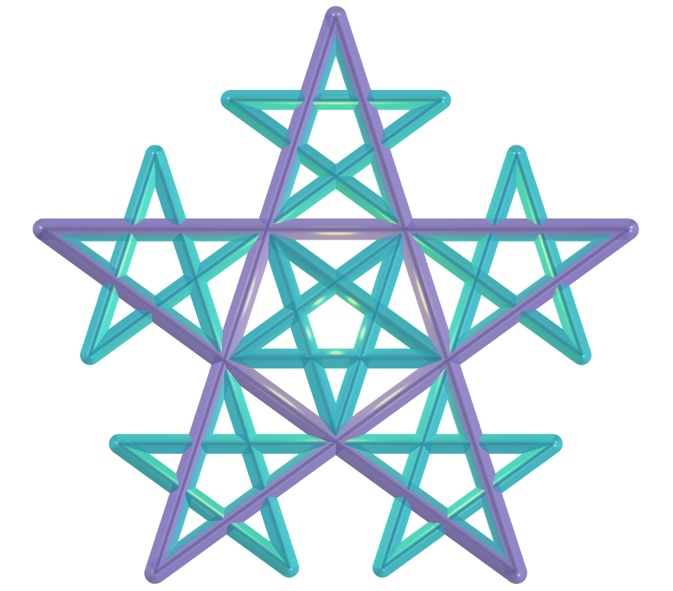</a>
    Acredita-se que a proporção áurea represente uma proporção divina e uma relação harmoniosa entre as diferentes partes de um todo. O pentagrama e o hexagrama têm sido usados ​​em várias práticas religiosas e espirituais, representando harmonia, equilíbrio e a união dos opostos. Na Geometria Sagrada, o pentagrama (estrela de cinco pontas) representa a união dos cinco elementos: ar, fogo, água, terra e espírito. Este símbolo também está ligado à proporção áurea e é considerado um símbolo de equilíbrio, harmonia e maestria espiritual.
    
 

 <h4>62. Pentagrama Fractal v3</h4>
<a href="../vr/Pentagram3a.htm" target="_blank" title="modelo 3D" class="fotoA">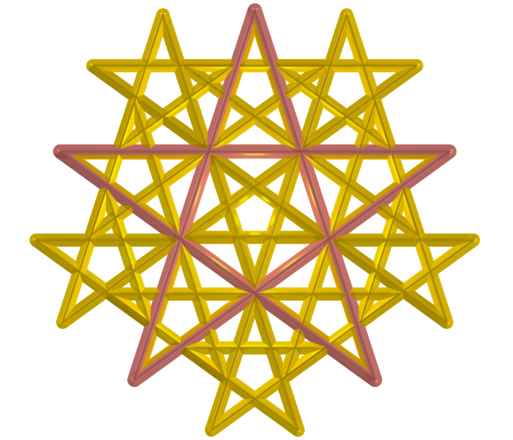</a>
    O pentagrama e o hexagrama têm sido usados ​​em várias práticas religiosas e espirituais, representando harmonia, equilíbrio e a união dos opostos. Na Geometria Sagrada, o pentagrama (estrela de cinco pontas) representa a união dos cinco elementos: ar, fogo, água, terra e espírito. Este símbolo também está ligado à proporção áurea e é considerado um símbolo de equilíbrio, harmonia e maestria espiritual. Acredita-se que a proporção áurea represente uma proporção divina e uma relação harmoniosa entre as diferentes partes de um todo.
    
 

<h4>63. Pentagrama</h4>
<a href="../vr/Pentagram4.htm" target="_blank" title="modelo 3D" class="fotoA">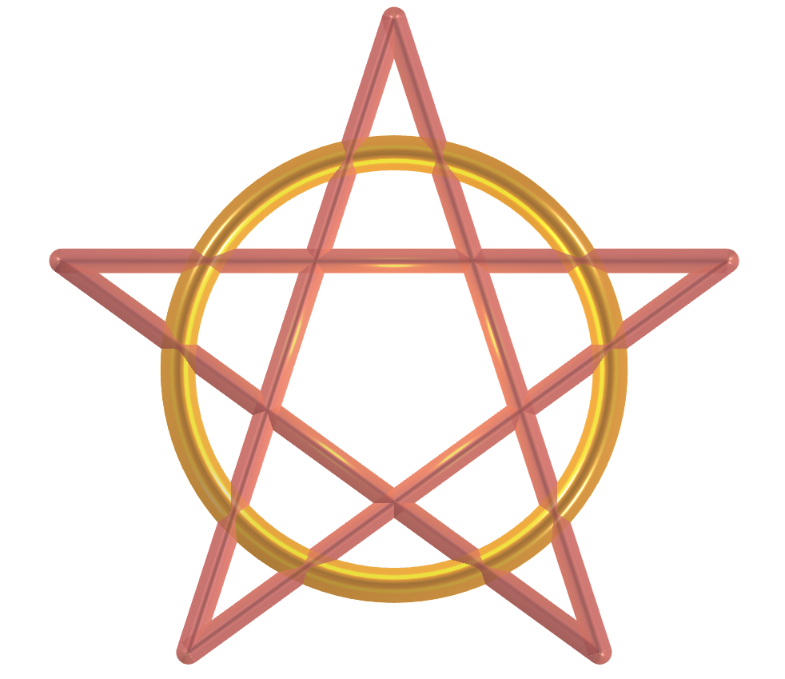</a>
    Na Geometria Sagrada, o pentagrama (estrela de cinco pontas) representa a união dos cinco elementos: ar, fogo, água, terra e espírito. Este símbolo também está ligado à proporção áurea e é considerado um símbolo de equilíbrio, harmonia e maestria espiritual. Acredita-se que a proporção áurea represente uma proporção divina e uma relação harmoniosa entre as diferentes partes de um todo. O pentagrama e o hexagrama têm sido usados ​​em várias práticas religiosas e espirituais, representando harmonia, equilíbrio e a união dos opostos.
    
 

<h4>64. Pentagrama e a Espiral Áurea</h4>

    Definimos que os números <b>a</b> e <b>b</b> estão na proporção áurea quando <b>(a + b) / a = a / b = &Phi;</b>. Colocando-se esta razão em duas dimensões, podemos construir os triângulos (ou retângulos) áureos, onde seus lados estão na proporção áurea. Este termo foi introduzido por Leonardo da Vinci como uma proporção de "corpo perfeito ideal" e aparece em pétalas de diversas flores, arranjos das sementes de girassóis, padrões de pinhas e no brócolis romanesco. Esta proporção não é apenas uma noção matemática, mas também um símbolo de beleza, harmonia e perfeição na arte, na ciência e na natureza.
    
 

<h4>65. Pentagrama e a Espiral Áurea</h4>
<a href="../vr/Pentagram5.htm" target="_blank" title="modelo 3D" class="fotoA">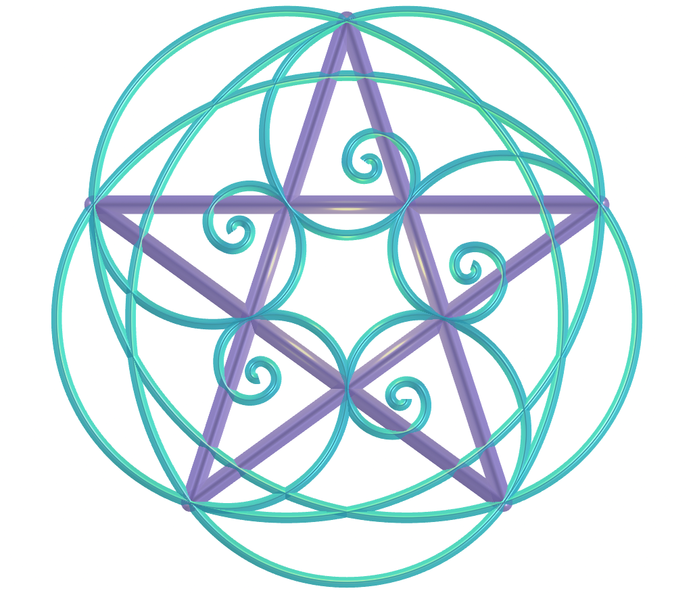</a>
    Acredita-se que a proporção áurea represente uma proporção divina e uma relação harmoniosa entre as diferentes partes de um todo. O pentagrama e o hexagrama têm sido usados ​​em várias práticas religiosas e espirituais, representando harmonia, equilíbrio e a união dos opostos. Na Geometria Sagrada, o pentagrama (estrela de cinco pontas) representa a união dos cinco elementos: ar, fogo, água, terra e espírito. Este símbolo também está ligado à proporção áurea e é considerado um símbolo de equilíbrio, harmonia e maestria espiritual.
    

<h4>66. Pentagrama e a Espiral Áurea v2</h4>

    Na Geometria Sagrada, o pentagrama (estrela de cinco pontas) representa a união dos cinco elementos: ar, fogo, água, terra e espírito. Este símbolo também está ligado à proporção áurea e é considerado um símbolo de equilíbrio, harmonia e maestria espiritual. Acredita-se que a proporção áurea represente uma proporção divina e uma relação harmoniosa entre as diferentes partes de um todo. O pentagrama e o hexagrama têm sido usados ​​em várias práticas religiosas e espirituais, representando harmonia, equilíbrio e a união dos opostos.
    

<h4>67. Pentagrama Fractal e a Espiral Áurea</h4>

    O pentagrama e o hexagrama têm sido usados ​​em várias práticas religiosas e espirituais, representando harmonia, equilíbrio e a união dos opostos. Na Geometria Sagrada, o pentagrama (estrela de cinco pontas) representa a união dos cinco elementos: ar, fogo, água, terra e espírito. Este símbolo também está ligado à proporção áurea e é considerado um símbolo de equilíbrio, harmonia e maestria espiritual. Acredita-se que a proporção áurea represente uma proporção divina e uma relação harmoniosa entre as diferentes partes de um todo.
    
 

 <h4>68. Pentagrama Fractal e a Espiral Áurea v2</h4>

    Este símbolo também está ligado à proporção áurea e é considerado um símbolo de equilíbrio, harmonia e maestria espiritual. Acredita-se que a proporção áurea represente uma proporção divina e uma relação harmoniosa entre as diferentes partes de um todo. O pentagrama e o hexagrama têm sido usados ​​em várias práticas religiosas e espirituais, representando harmonia, equilíbrio e a união dos opostos. Na Geometria Sagrada, o pentagrama (estrela de cinco pontas) representa a união dos cinco elementos: ar, fogo, água, terra e espírito.
    
 

<h4>69. Pentagrama curvado</h4>
<a href="../vr/Pentagram7.htm" target="_blank" title="modelo 3D" class="fotoA">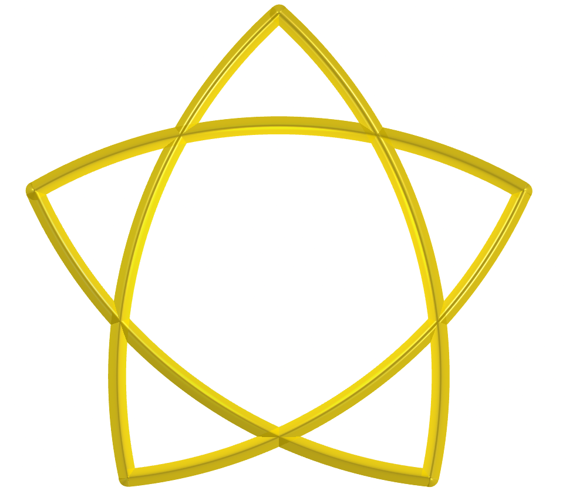</a>
    Na Geometria Sagrada, o pentagrama (estrela de cinco pontas) representa a união dos cinco elementos: ar, fogo, água, terra e espírito. Este símbolo também está ligado à proporção áurea e é considerado um símbolo de equilíbrio, harmonia e maestria espiritual. Acredita-se que a proporção áurea represente uma proporção divina e uma relação harmoniosa entre as diferentes partes de um todo. O pentagrama e o hexagrama têm sido usados ​​em várias práticas religiosas e espirituais, representando harmonia, equilíbrio e a união dos opostos.
    
 

<h4>70. Pentagrama</h4>

    Este símbolo também está ligado à proporção áurea e é considerado um símbolo de equilíbrio, harmonia e maestria espiritual. Acredita-se que a proporção áurea represente uma proporção divina e uma relação harmoniosa entre as diferentes partes de um todo. O pentagrama e o hexagrama têm sido usados ​​em várias práticas religiosas e espirituais, representando harmonia, equilíbrio e a união dos opostos. Na Geometria Sagrada, o pentagrama (estrela de cinco pontas) representa a união dos cinco elementos: ar, fogo, água, terra e espírito.
    
 
<a href="#p1" class="topo">voltar ao topo</a>

 

<h4>71. Pentagrama Fractal v3</h4>

    Acredita-se que a proporção áurea represente uma proporção divina e uma relação harmoniosa entre as diferentes partes de um todo. O pentagrama e o hexagrama têm sido usados ​​em várias práticas religiosas e espirituais, representando harmonia, equilíbrio e a união dos opostos. Na Geometria Sagrada, o pentagrama (estrela de cinco pontas) representa a união dos cinco elementos: ar, fogo, água, terra e espírito. Este símbolo também está ligado à proporção áurea e é considerado um símbolo de equilíbrio, harmonia e maestria espiritual.
    
 

<h4>72. Pentagrama Fractal v4</h4>
<a href="../vr/Pentagram10.htm" target="_blank" title="modelo 3D" class="fotoA">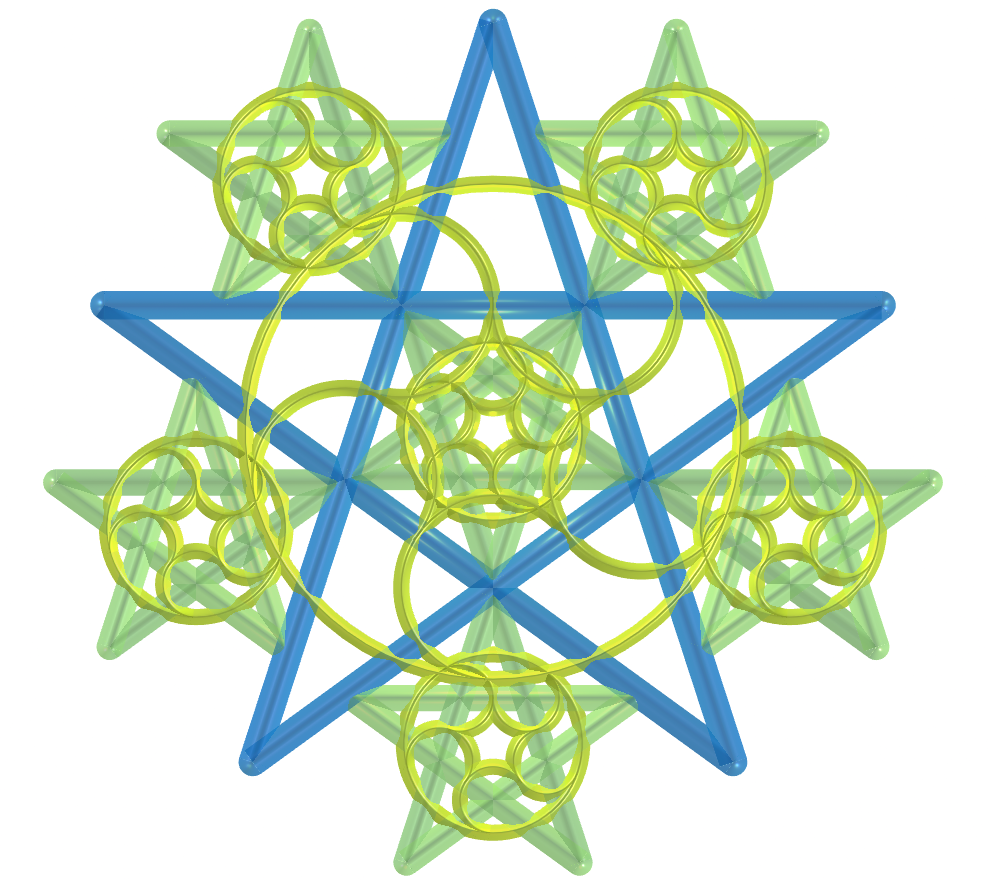</a>
    O pentagrama e o hexagrama têm sido usados ​​em várias práticas religiosas e espirituais, representando harmonia, equilíbrio e a união dos opostos. Na Geometria Sagrada, o pentagrama (estrela de cinco pontas) representa a união dos cinco elementos: ar, fogo, água, terra e espírito. Este símbolo também está ligado à proporção áurea e é considerado um símbolo de equilíbrio, harmonia e maestria espiritual. Acredita-se que a proporção áurea represente uma proporção divina e uma relação harmoniosa entre as diferentes partes de um todo.
    
 

<h4>73. Flor de Vênus</h4>

    A Flor de Vênus, também conhecida como Rosa de Vênus ou Pentagrama de Vênus, é um símbolo da Geometria Sagrada determinado pelas órbitas dos planetas Vênus e Terra ao redor do Sol. Este padrão, observável ao longo de um período de 8 anos, assemelha-se visualmente a uma rosa de cinco pétalas e está associado ao amor, à beleza e à harmonia. A Flor de Vênus é um símbolo do amor, da beleza e da interconexão do cosmos. Diz-se que cada pétala representa uma etapa no caminho para o amor que tudo abrange.
    

<h4>74. Flor de Vênus v1</h4>
<a href="../vr/VenusFlowerv1.htm" target="_blank" title="modelo 3D" class="fotoA">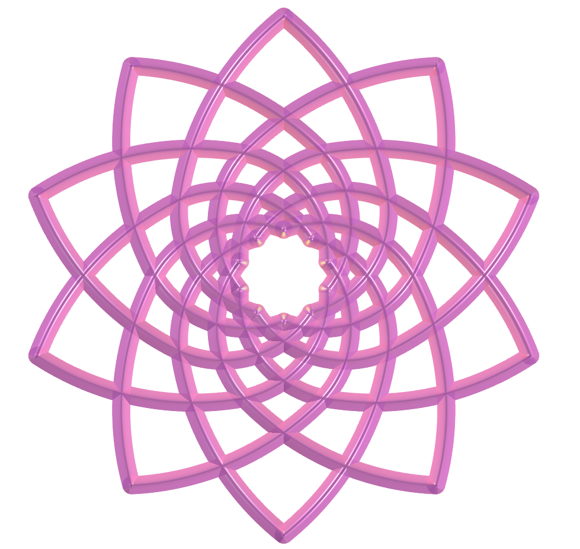</a>
    Diz-se que cada pétala representa uma etapa no caminho para o amor que tudo abrange. A Flor de Vênus, também conhecida como Rosa de Vênus ou Pentagrama de Vênus, é um símbolo da Geometria Sagrada determinado pelas órbitas dos planetas Vênus e Terra ao redor do Sol. Este padrão, observável ao longo de um período de 8 anos, assemelha-se visualmente a uma rosa de cinco pétalas e está associado ao amor, à beleza e à harmonia. A Flor de Vênus é um símbolo do amor, da beleza e da interconexão do cosmos. 
    
 

<h4>75. Flor de Vênus v2</h4>

    Este padrão, observável ao longo de um período de 8 anos, assemelha-se visualmente a uma rosa de cinco pétalas e está associado ao amor, à beleza e à harmonia. A Flor de Vênus é um símbolo do amor, da beleza e da interconexão do cosmos. Diz-se que cada pétala representa uma etapa no caminho para o amor que tudo abrange. A Flor de Vênus, também conhecida como Rosa de Vênus ou Pentagrama de Vênus, é um símbolo da Geometria Sagrada determinado pelas órbitas dos planetas Vênus e Terra ao redor do Sol.
    
 

<h4>76. Pentagrama</h4>

    Acredita-se que a proporção áurea represente uma proporção divina e uma relação harmoniosa entre as diferentes partes de um todo. O pentagrama e o hexagrama têm sido usados ​​em várias práticas religiosas e espirituais, representando harmonia, equilíbrio e a união dos opostos. Na Geometria Sagrada, o pentagrama (estrela de cinco pontas) representa a união dos cinco elementos: ar, fogo, água, terra e espírito. Este símbolo também está ligado à proporção áurea e é considerado um símbolo de equilíbrio, harmonia e maestria espiritual.
    
 

<h4>77. Triângulos</h4>

    Na Geometria Sagrada, os triângulos representam equilíbrio, harmonia e a intersecção de três princípios. Os triângulos voltados para cima simbolizam a elevação da consciência, enquanto os triângulos invertidos representam a energia feminina e a reprodução. Acredita-se que os triângulos personificam a criação divina e o equilíbrio, frequentemente associados ao conceito taoísta de unidade que se desdobra em dualidade. Este símbolo mostra uma espiral feita com triângulos equiláteros, formando uma espécie de hiperbolóide.
    
 

<h4>78. Quadrados</h4>

    Na Geometria Sagrada, o quadrado é considerado uma forma fundamental associada à estabilidade, à ancoragem e aos quatro elementos da natureza. O quadrado representa a natureza fixa da matéria e os fundamentos da realidade física. Os quatro lados de um quadrado são frequentemente associados aos quatro pontos cardeais, às quatro estações e aos quatro elementos Aristotélicos (terra, água, ar e fogo). Este símbolo representa uma espiral composta por quadrados, formando uma espécie de hiperboloide.
    
 

<h4>79. Pentágonos</h4>

    Na Geometria Sagrada, os pentágonos, particularmente o pentagrama (a estrela formada pela conexão das diagonais de um pentágono), simbolizam a simetria quíntupla e frequentemente representam harmonia, unidade e a interconexão das coisas. Os pentágonos também são associados à proporção áurea e à sequência de Fibonacci, consideradas princípios fundamentais da natureza e do universo. Este símbolo representa uma espiral composta de pentágonos regulares, formando uma espécie de hiperboloide.
    
 

<h4>80. Hexágonos</h4>

    Na Geometria Sagrada, os hexágonos são sempre vistos como símbolos de equilíbrio, harmonia e do potencial da vida. Sua forma simétrica, com seis lados e ângulos iguais, representa estabilidade e equilíbrio. Os hexágonos também são associados à Flor da Vida e à estrela de seis pontas (Merkabah), ambos símbolos de interconexão e criação divina. Este símbolo representa uma espiral composta de hexágonos regulares, formando uma espécie de hiperboloide.
    
 
<a href="#p1" class="topo">voltar ao topo</a>

 

<h4>81. Heptágonos</h4>

    Na Geometria Sagrada, os heptágonos são associados a conceitos como os sete chakras, os sete dias da semana ou os sete céus, dependendo da interpretação. Os heptagramas (estrelas de 7 pontas formadas pela extensão dos lados de um heptágono) também têm significado simbólico, com diferentes tipos de triângulos e proporções relacionadas aos seus ângulos. Este símbolo representa uma espiral composta de heptágonos regulares, formando uma espécie de hiperboloide.
    
 

<h4>82. Octógonos</h4>
<a href="../vr/Octagons.htm" target="_blank" title="modelo 3D" class="fotoA">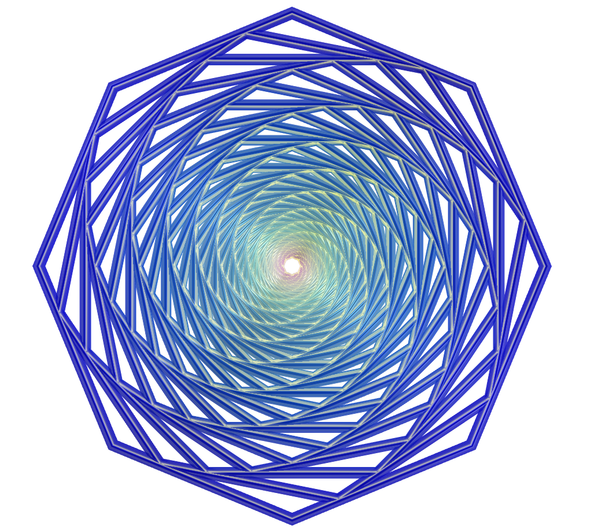</a>
    Na Geometria Sagrada, o octógono é sempre visto como um símbolo de unidade e equilíbrio, surgindo da combinação do círculo (que representa o céu) e do quadrado (que representa a terra). Acredita-se que o octógono conecta e harmoniza esses dois elementos. O octógono também possui vários significados simbólicos em diferentes culturas e religiões, incluindo completude, boa sorte e proteção. Este símbolo representa uma espiral composta por octógonos regulares, formando uma espécie de hiperboloide.
    
 

<h4>83. Eneágonos</h4>
<a href="../vr/Enneagons.htm" target="_blank" title="modelo 3D" class="fotoA">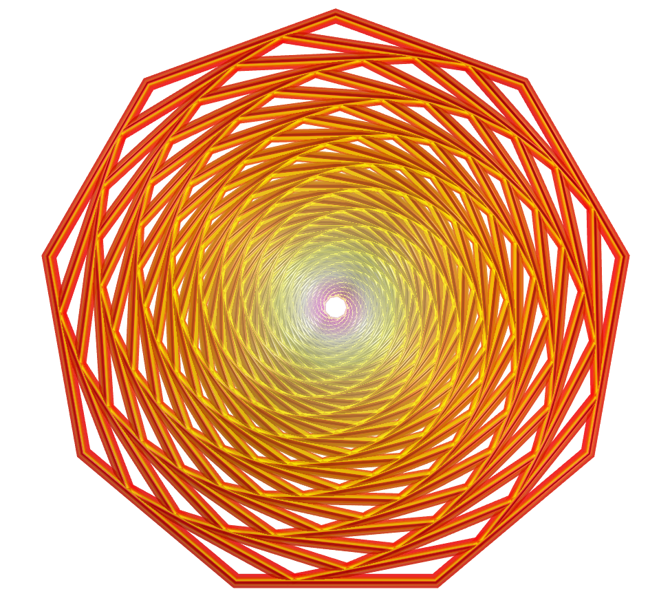</a>
    Na Geometria Sagrada, um eneágono é uma forma geométrica que simboliza unidade, completude, equilíbrio e a culminância de um ciclo. Também pode ser representado como uma estrela de nove pontas, conhecida como eneagrama. O eneágono, juntamente com outras formas, como o octograma centralizado, é usado em diversas interpretações simbólicas e espirituais dentro da Geometria Sagrada. Este símbolo representa uma espiral composta de eneágonos regulares, formando uma espécie de hiperboloide.
    
 

<h4>84. Decágonos</h4>
<a href="../vr/Decagons.htm" target="_blank" title="modelo 3D" class="fotoA">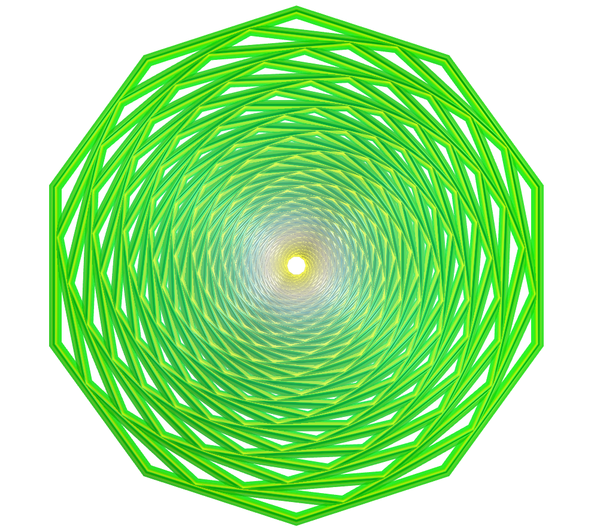</a>
    Na Geometria Sagrada, um decágono simboliza equilíbrio, harmonia e a interconexão do universo. É uma forma mais complexa do que algumas outras, como o pentágono, oferecendo uma paisagem simbólica mais rica. Os dez lados do decágono podem representar os dez mandamentos, os dez reinos da alma ou os dez dedos das mãos e dos pés da forma humana, sugerindo uma conexão entre os mundos espiritual e físico. Este símbolo representa uma espiral composta de decágonos regulares, formando uma espécie de hiperboloide.
    

<h4>85. Hipercubo</h4>

    Um hipercubo, também denominado como octácoro ou tesseracto, é uma forma geométrica que pode ser visualizada como um cubo que se estende para além da nossa realidade tridimensional. Na Geometria Sagrada, o hipercubo é visto como um símbolo da união da matéria e da energia, representando a quarta dimensão, a expansão da consciência e a conexão com dimensões além da nossa compreensão tridimensional. Um hipercubo é formado por oito cubos interligados e pode ser representado unindo os vértices de dois cubos paralelos.
    
 

<h4>86. Hipercubo 3D</h4>

    Na Geometria Sagrada, o hipercubo é visto como um símbolo da união da matéria e da energia, representando a quarta dimensão, a expansão da consciência e a conexão com dimensões além da nossa compreensão tridimensional. Um hipercubo é formado por oito cubos interligados e pode ser representado unindo os vértices de dois cubos paralelos. Um hipercubo, também denominado como octácoro ou tesseracto, é uma forma geométrica que pode ser visualizada como um cubo que se estende para além da nossa realidade tridimensional.
    
 

<h4>87. Hipercubo 3D v1</h4>
<a href="../vr/Hypercubev2.htm" target="_blank" title="modelo 3D" class="fotoA">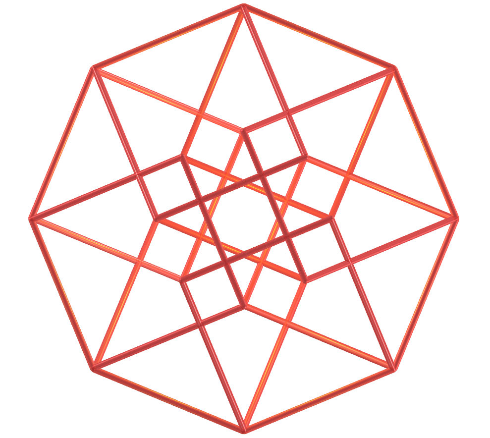</a>
    Um hipercubo é formado por oito cubos interligados e pode ser representado unindo os vértices de dois cubos paralelos. Um hipercubo, também denominado como octácoro ou tesseracto, é uma forma geométrica que pode ser visualizada como um cubo que se estende para além da nossa realidade tridimensional. Na Geometria Sagrada, o hipercubo é visto como um símbolo da união da matéria e da energia, representando a quarta dimensão, a expansão da consciência e a conexão com dimensões além da nossa compreensão tridimensional.
    
 

<h4>88. Hipercubo 3D v2</h4>

    Um hipercubo, também denominado como octácoro ou tesseracto, é uma forma geométrica que pode ser visualizada como um cubo que se estende para além da nossa realidade tridimensional. Na Geometria Sagrada, o hipercubo é visto como um símbolo da união da matéria e da energia, representando a quarta dimensão, a expansão da consciência e a conexão com dimensões além da nossa compreensão tridimensional. Um hipercubo é formado por oito cubos interligados e pode ser representado unindo os vértices de dois cubos paralelos.
    

<h4>89. Retângulos e Espirais Áureos</h4>
<a href="../vr/GoldenRectangles2.htm" target="_blank" title="modelo 3D" class="fotoA">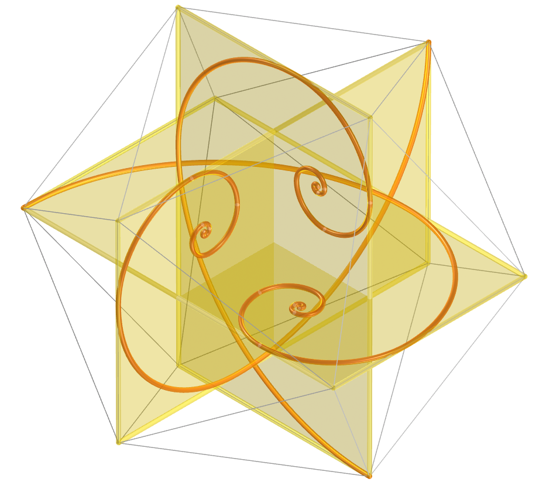</a>
    O símbolo formado por três retângulos dourados interligados pode ser construído de duas maneiras. Podemos definir os lados de um retângulo áureo como duas arestas opostas e as respectivas diagonais perpendiculares de um icosaedro. A segunda maneira de construir este símbolo está na escolha das linhas com proporções áureas que aparecem no símbolo da Flor da Vida. Na Geometria Sagrada, três retângulos áureos interligados representam o cosmos e a união de forças.
     
 

<h4>90. Retângulos e Espirais Áureos v2</h4>
<a href="../vr/GoldenRectangles3.htm" target="_blank" title="modelo 3D" class="fotoA">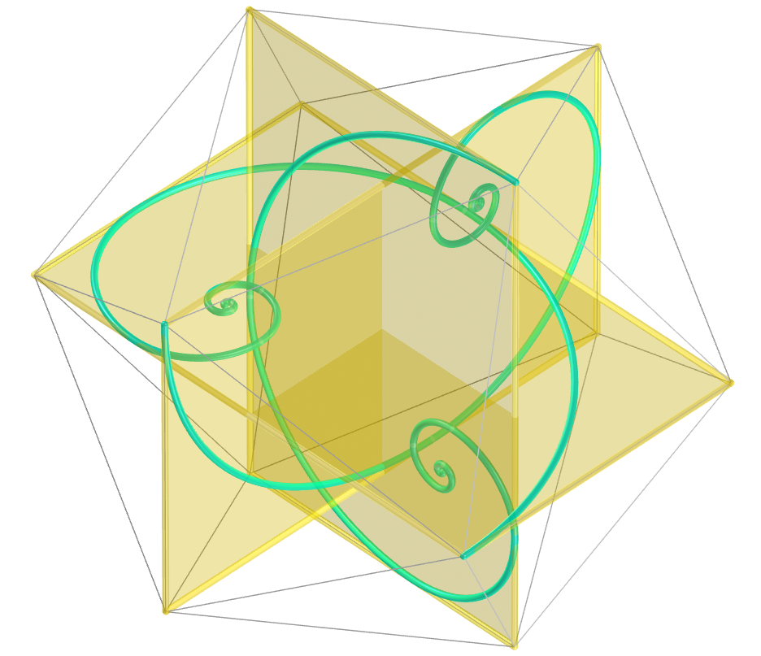</a>
    Na Geometria Sagrada, três retângulos áureos interligados representam o cosmos e a união de forças. O símbolo formado por três retângulos dourados interligados pode ser construído de duas maneiras. Podemos definir os lados de um retângulo áureo como duas arestas opostas e as respectivas diagonais perpendiculares de um icosaedro. A segunda maneira de construir este símbolo está na escolha das linhas com proporções áureas que aparecem no símbolo da Flor da Vida.
    

<a href="#p1" class="topo">voltar ao topo</a>

<h4>91. Pentágonos</h4>
<a href="../vr/Pentagonal.htm" target="_blank" title="modelo 3D" class="fotoA">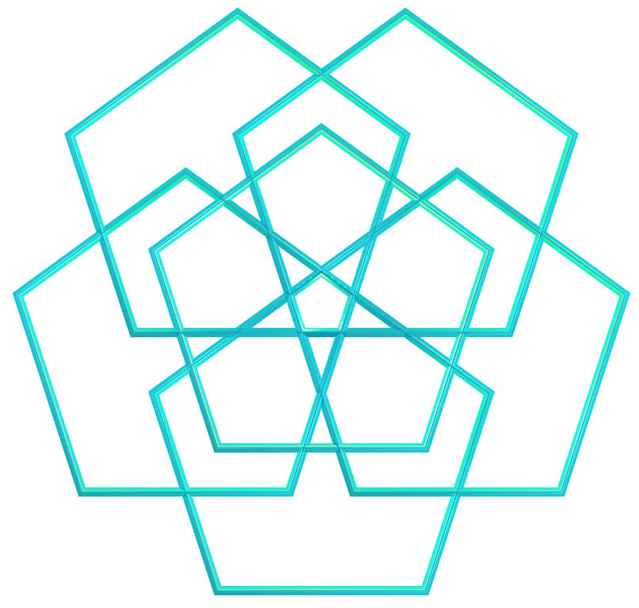</a>
    Na Geometria Sagrada, os pentágonos, particularmente o pentagrama (a estrela formada pela conexão das diagonais de um pentágono), simbolizam a simetria quíntupla e frequentemente representam harmonia, unidade e a interconexão das coisas. Os pentágonos também são associados à proporção áurea e à sequência de Fibonacci, consideradas princípios fundamentais da natureza e do universo. Este símbolo representa um padrão de pentágonos regulares, formando uma espécia de Flor da Vida.
    
 

<h4>92. Hexágonos</h4>
<a href="../vr/Hexagonal.htm" target="_blank" title="modelo 3D" class="fotoA">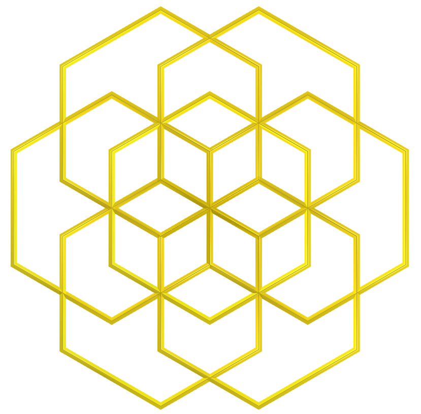</a>
    Na Geometria Sagrada, os hexágonos são sempre vistos como símbolos de equilíbrio, harmonia e do potencial da vida. Sua forma simétrica, com seis lados e ângulos iguais, representa estabilidade e equilíbrio. Os hexágonos também são associados à Flor da Vida e à estrela de seis pontas (Merkabah), ambos símbolos de interconexão e criação divina. Este símbolo representa um padrão de hexágonos regulares, formando uma espécia de Flor da Vida.
    
 
<a href="#p1" class="topo">voltar ao topo</a>

 

<h4>93. Heptágonos</h4>
<a href="../vr/Heptagonal.htm" target="_blank" title="modelo 3D" class="fotoA">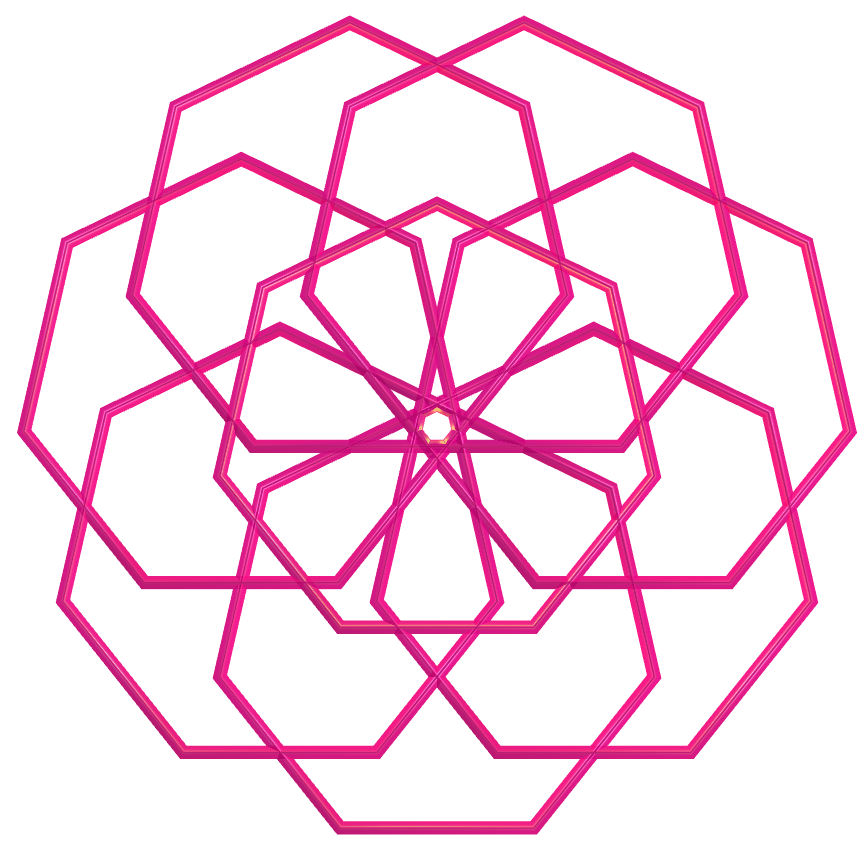</a>
    Na Geometria Sagrada, os heptágonos são associados a conceitos como os sete chakras, os sete dias da semana ou os sete céus, dependendo da interpretação. Os heptagramas (estrelas de 7 pontas formadas pela extensão dos lados de um heptágono) também têm significado simbólico, com diferentes tipos de triângulos e proporções relacionadas aos seus ângulos. Este símbolo representa um padrão de heptágonos regulares, formando uma espécia de Flor da Vida.
    
 

<h4>94. Octógonos</h4>
<a href="../vr/Octagonal.htm" target="_blank" title="modelo 3D" class="fotoA">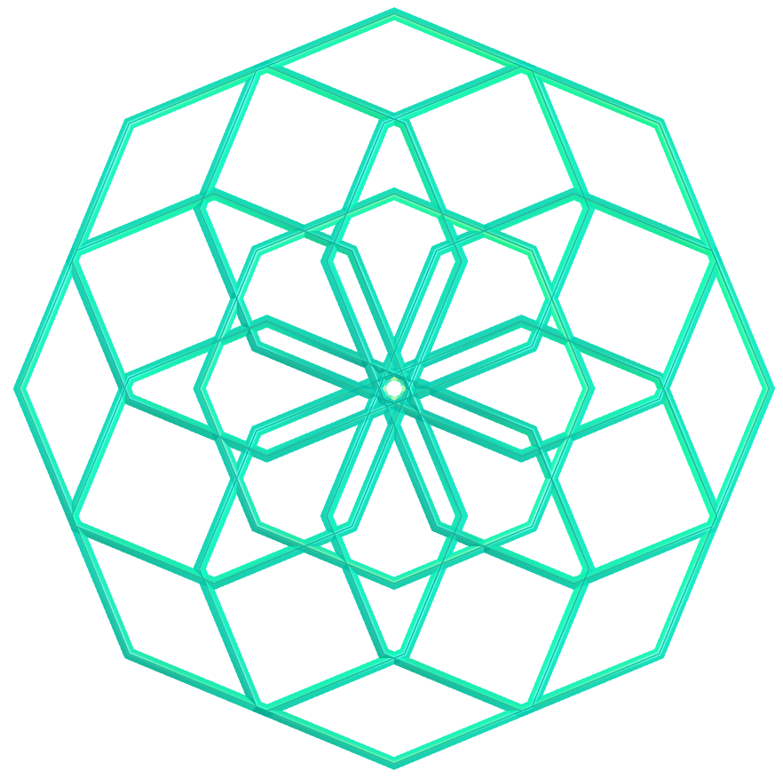</a>
    Na Geometria Sagrada, o octógono é sempre visto como um símbolo de unidade e equilíbrio, surgindo da combinação do círculo (que representa o céu) e do quadrado (que representa a terra). Acredita-se que o octógono conecta e harmoniza esses dois elementos. O octógono também possui vários significados simbólicos em diferentes culturas e religiões, incluindo completude, boa sorte e proteção. Este símbolo representa um padrão de octógonos regulares, formando uma espécia de Flor da Vida.
    
 

<h4>95. Eneágonos</h4>
<a href="../vr/Enneagonal.htm" target="_blank" title="modelo 3D" class="fotoA">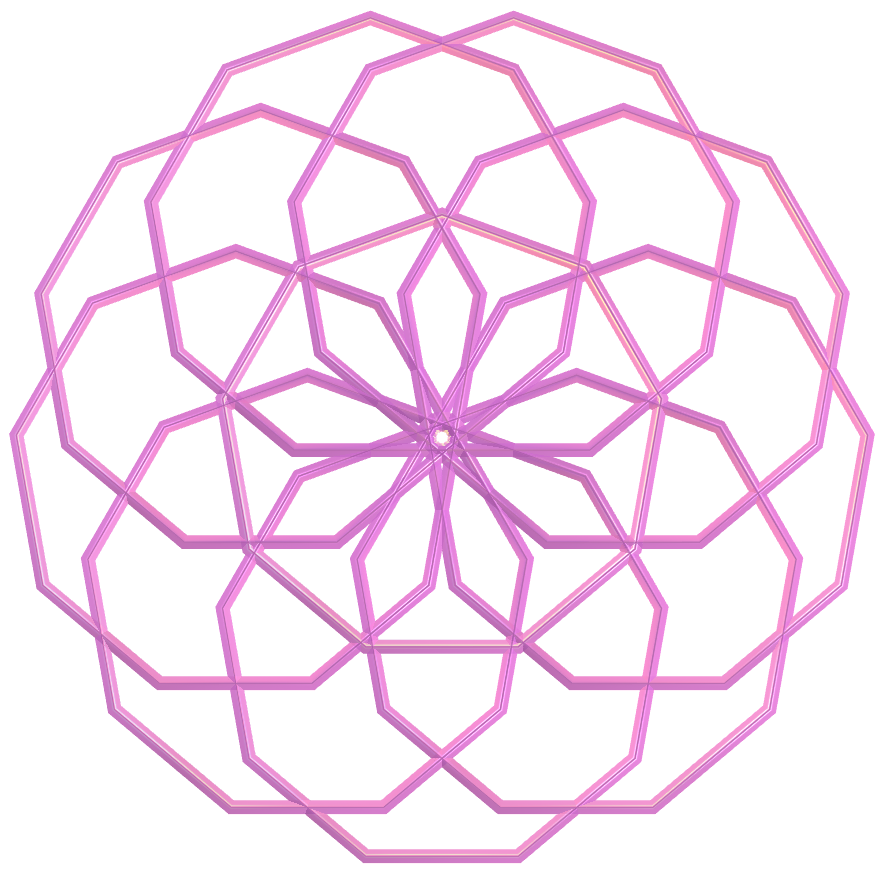</a>
    Na Geometria Sagrada, um eneágono é uma forma geométrica que simboliza unidade, completude, equilíbrio e a culminância de um ciclo. Também pode ser representado como uma estrela de nove pontas, conhecida como eneagrama. O eneágono, juntamente com outras formas, como o octograma centralizado, é usado em diversas interpretações simbólicas e espirituais dentro da Geometria Sagrada. Este símbolo representa um padrão de eneágonos regulares, formando uma espécia de Flor da Vida.
    
 

<h4>96. Decágonos</h4>
<a href="../vr/Decagonal.htm" target="_blank" title="modelo 3D" class="fotoA">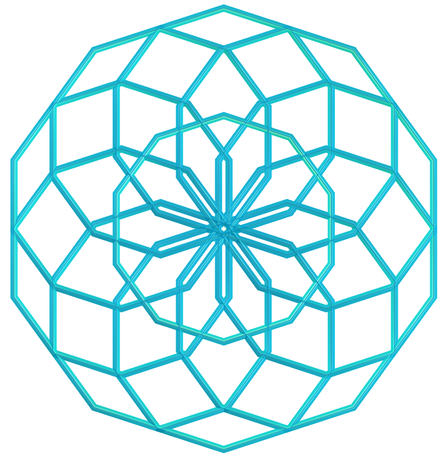</a>
    Na Geometria Sagrada, um decágono simboliza equilíbrio, harmonia e a interconexão do universo. É uma forma mais complexa do que algumas outras, como o pentágono, oferecendo uma paisagem simbólica mais rica. Os dez lados do decágono podem representar os dez mandamentos, os dez reinos da alma ou os dez dedos das mãos e dos pés da forma humana, sugerindo uma conexão entre os mundos espiritual e físico. Este símbolo representa um padrão de decágonos regulares, formando uma espécia de Flor da Vida.
    
 

<h4>97. Pentágonos</h4>
<a href="../vr/Pentagonal1.htm" target="_blank" title="modelo 3D" class="fotoA">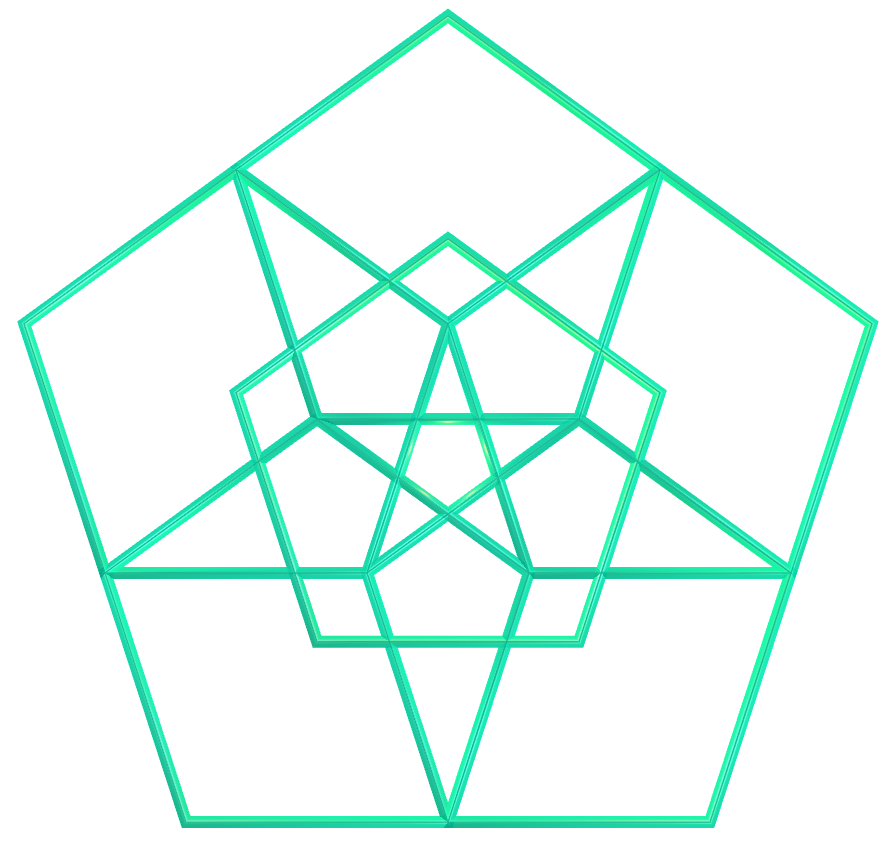</a>
    Na Geometria Sagrada, os pentágonos, particularmente o pentagrama (a estrela formada pela conexão das diagonais de um pentágono), simbolizam a simetria quíntupla e frequentemente representam harmonia, unidade e a interconexão das coisas. Os pentágonos também são associados à proporção áurea e à sequência de Fibonacci, consideradas princípios fundamentais da natureza e do universo. Este símbolo representa um padrão de pentágonos regulares, formando uma espécia de Flor da Vida.
    
 

<h4>98. Hexágonos</h4>
<a href="../vr/Hexagonal1.htm" target="_blank" title="modelo 3D" class="fotoA">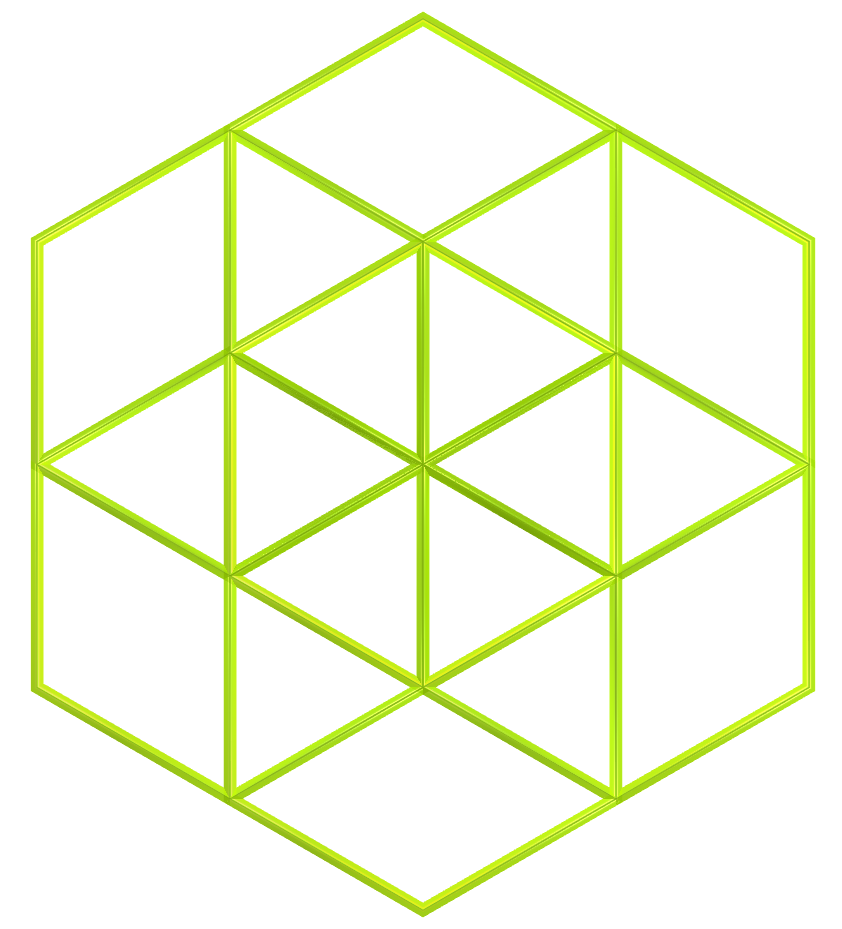</a>
    Na Geometria Sagrada, os hexágonos são sempre vistos como símbolos de equilíbrio, harmonia e do potencial da vida. Sua forma simétrica, com seis lados e ângulos iguais, representa estabilidade e equilíbrio. Os hexágonos também são associados à Flor da Vida e à estrela de seis pontas (Merkabah), ambos símbolos de interconexão e criação divina. Este símbolo representa um padrão de hexágonos regulares, formando uma espécia de Flor da Vida.
    
 
<a href="#p1" class="topo">voltar ao topo</a>

 

<h4>99. Heptágonos</h4>
<a href="../vr/Heptagonal1.htm" target="_blank" title="modelo 3D" class="fotoA">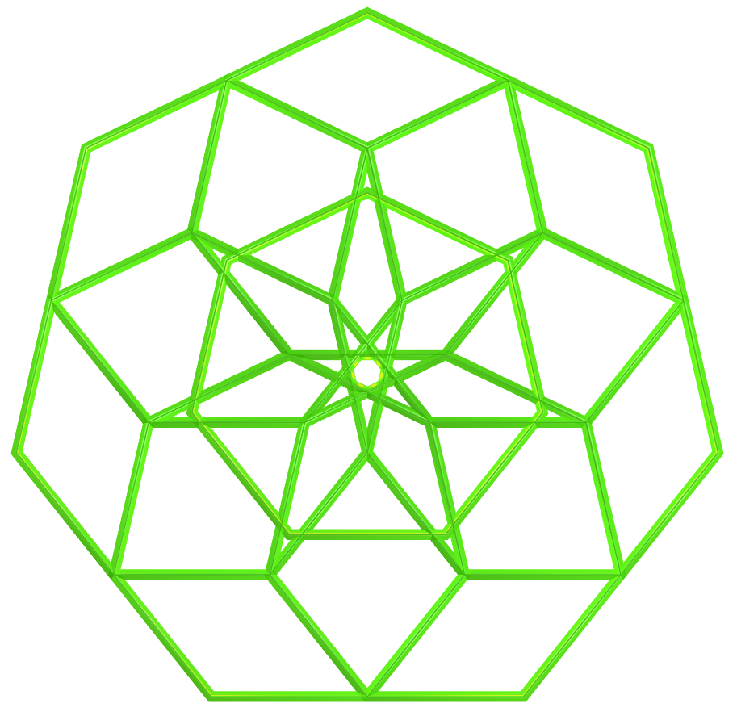</a>
    Na Geometria Sagrada, os heptágonos são associados a conceitos como os sete chakras, os sete dias da semana ou os sete céus, dependendo da interpretação. Os heptagramas (estrelas de 7 pontas formadas pela extensão dos lados de um heptágono) também têm significado simbólico, com diferentes tipos de triângulos e proporções relacionadas aos seus ângulos. Este símbolo representa um padrão de heptágonos regulares, formando uma espécia de Flor da Vida.
    
 

<h4>100. Octógonos</h4>
<a href="../vr/Octagonal1.htm" target="_blank" title="modelo 3D" class="fotoA">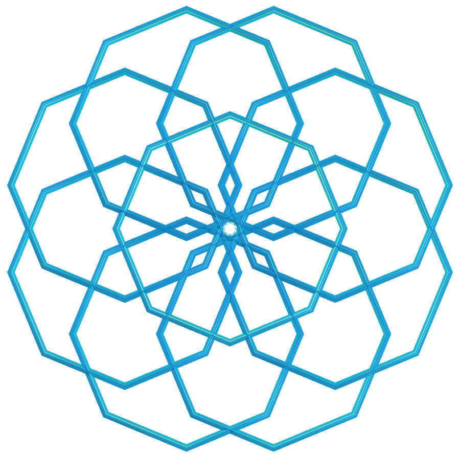</a>
    Na Geometria Sagrada, o octógono é sempre visto como um símbolo de unidade e equilíbrio, surgindo da combinação do círculo (que representa o céu) e do quadrado (que representa a terra). Acredita-se que o octógono conecta e harmoniza esses dois elementos. O octógono também possui vários significados simbólicos em diferentes culturas e religiões, incluindo completude, boa sorte e proteção. Este símbolo representa um padrão de octógonos regulares, formando uma espécia de Flor da Vida.
    
 

 
<a href="#p1" class="topo">voltar ao topo</a>

<h4>101. Eneágonos</h4>
<a href="../vr/Enneagonal1.htm" target="_blank" title="modelo 3D" class="fotoA">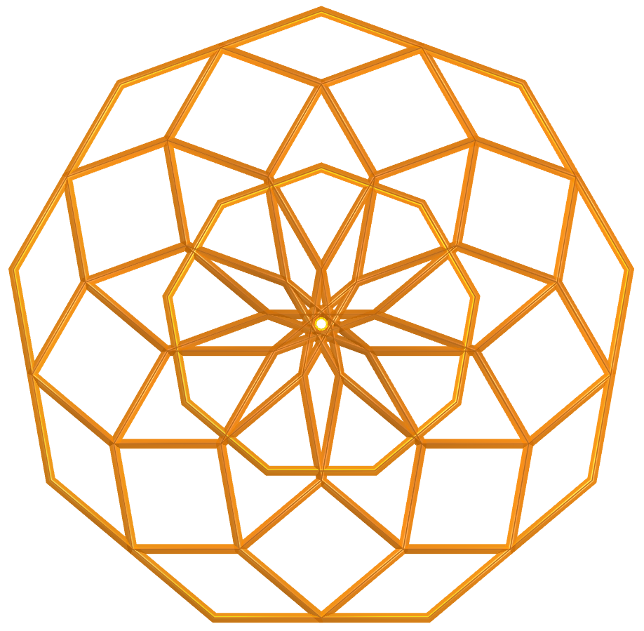</a>
    Na Geometria Sagrada, um eneágono é uma forma geométrica que simboliza unidade, completude, equilíbrio e a culminância de um ciclo. Também pode ser representado como uma estrela de nove pontas, conhecida como eneagrama. O eneágono, juntamente com outras formas, como o octograma centralizado, é usado em diversas interpretações simbólicas e espirituais dentro da Geometria Sagrada. Este símbolo representa um padrão de eneágonos regulares, formando uma espécia de Flor da Vida.
    
 

<h4>102. Decágonos</h4>
<a href="../vr/Decagonal1.htm" target="_blank" title="modelo 3D" class="fotoA">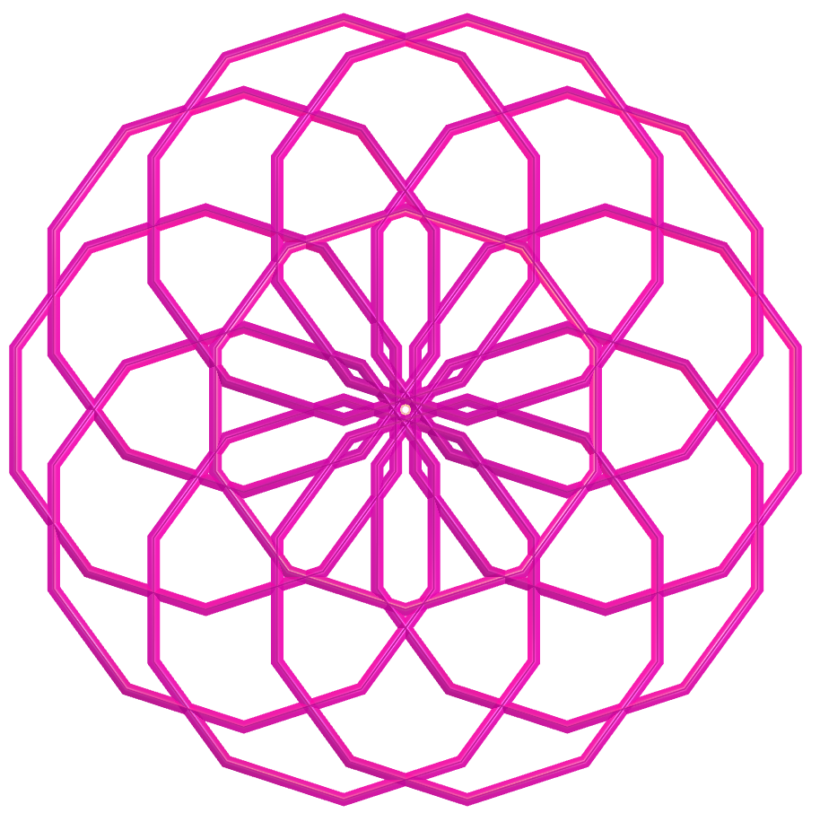</a>
    Na Geometria Sagrada, um decágono simboliza equilíbrio, harmonia e a interconexão do universo. É uma forma mais complexa do que algumas outras, como o pentágono, oferecendo uma paisagem simbólica mais rica. Os dez lados do decágono podem representar os dez mandamentos, os dez reinos da alma ou os dez dedos das mãos e dos pés da forma humana, sugerindo uma conexão entre os mundos espiritual e físico. Este símbolo representa um padrão de decágonos regulares, formando uma espécia de Flor da Vida.
    
 
<a href="#p1" class="topo">voltar ao topo</a>

  Sacred Geometry - Visualization of symbols with Augmented Reality and Virtual Reality de <a xmlns:cc="http://creativecommons.org/ns#" href="https://paulohscwb.github.io/SacredGeometry/symbols/pt-br/" property="cc:attributionName" rel="cc:attributionURL">Paulo Henrique Siqueira</a> está licenciado com uma Licença <a rel="license" href="http://creativecommons.org/licenses/by-nc-nd/4.0/">Creative Commons Atribuição-NãoComercial-SemDerivações 4.0 Internacional</a>.

<h4>Como citar este trabalho:</h4> 

Siqueira, P.H., "Sacred Geometry: Visualization of symbols with Augmented Reality and Virtual Reality". Disponível em: <https://paulohscwb.github.io/SacredGeometry/symbols/pt-br/>, Maio de 2024.

  <b>Referências:</b>
 Pardesco. "Sacred Geometry Art, Symbols & Meanings". <a href="https://pardesco.com/blogs/news/sacred-geometry-art-symbols-meanings" target="_blank">https://pardesco.com/blogs/news/sacred-geometry-art-symbols-meanings</a>
 Weisstein, Eric W. "Platonic Solid" From MathWorld-A Wolfram Web Resource. <a href="http://mathworld.wolfram.com/PlatonicSolid.html" target="_blank">http://mathworld.wolfram.com/PlatonicSolid.html</a>
 Weisstein, Eric W. "Polyhedra" From MathWorld-A Wolfram Web Resource. <a href="https://mathworld.wolfram.com/topics/Polyhedra.html" target="_blank">https://mathworld.wolfram.com/topics/Polyhedra.html</a>
 Solar System Scope. "Solar Textures: Stars and Milky Way". <a href="https://www.solarsystemscope.com/textures/" target="_blank">https://www.solarsystemscope.com/textures/</a>
 McCooey, D. I. "Visual Polyhedra". <a href="http://dmccooey.com/polyhedra/" target="_blank">http://dmccooey.com/polyhedra/</a>
